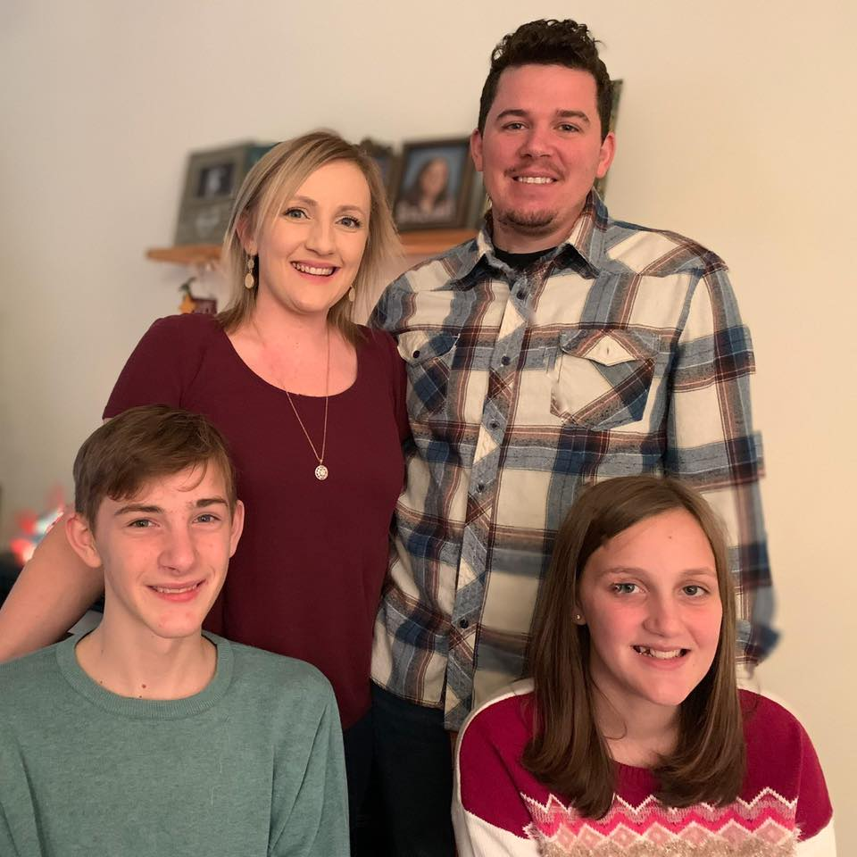

## My grandfather had the heart of a lion

and a permanent ban from the Atlanta Zoo.

I first started working on diesels when I was **18**. I got super lucky and landed a mechanic trainee job at Southeastern Freight Lines. I worked there for 6 years and ended up at the City of Clearwater working on Fire apparatus and heavy equipment since 2012.

I am **ASE master certified** in trucks and have a brake certification in automotive. In addition, I am an Emergency Vehicle Technician (EVT) Level 2 and certified EVT shop manager. I also have other certifications in Engine repair, bearings, CNG, and water pumps.

As for my faults, my wife tells me I have two main problems; 1. I don't listen when she talks, 2. ... Something else..😕

I have been so blessed to have the experience and exposure through my career. God has opened many doors and gave me the ability to **help others** on their journey. I want to share the lessons I have learned being a diesel mechanic, **learning from older/better mechanics than me**, and managing a small shop.

So, with that goal in mind, I’ve set up this website to support my tool 🔧 addiction while writing about something I am passionate about. My aim is to pass on some **tips and advice** that I have picked up over the years of wrenching and offer it to you in the form of a helpful, informative, and entertaining diesel website. I also like to be able to provide mechanics of all levels from around the world a place to interact.

* I place Google Ads on this site to generate some coin which makes it possible to keep this site moving and grooving. They’re not there to take advantage of you but rather a way to support the site, so thanks for understanding.

I also offer advertising space to diesel related companies so please show your support by **checking these guys out**. They can be recognized as banner ads and (occasionally) links.

All of the links, products, and companies I recommend on this site are trustworthy and reliable, otherwise, I wouldn’t put them up. If for some reason you do have problems with any of them **please email me** so I can contact the company and if needed, remove the link.

I really do hope you enjoy what I’ve put together here. If you have any questions, suggestions, complaints, or compliments – fire ’em up! I would love to know how I can improve this site. And if you really have enjoyed browsing through it, please tell me – either job me a line on the [contact page](/contact/) or email yeahthisguyrighthere@gmail.com

Keep wrenching,

Johnathan Coker

## the fam

