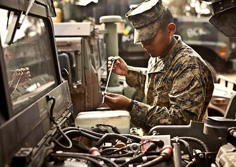

Diesel mechanics are in huge demand. With this demand the wages have been steadily rising. Now is a great time to get into the industry. This article will show you a few paths to becoming a diesel mechanic.

_Do you need school to be a diesel mechanic?_

**You do not need school to be a diesel mechanic. Technical School is helpful and can give you a head start in your career, but most diesel mechanics did not attend a formal tech school. While they are becoming popular, they are not the only way to become a diesel mechanic.**

### Let's take a look at the most common ways to become a diesel mechanic

When I first started in the diesel world, I had no idea the amount of knowledge I needed to have to be a great mechanic. I only knew that it looked like fun and I enjoyed taking stuff apart **_(with an emphasis on apart not putting back together)_** but, there was no way for me to know the _best way_ to make it happen. That is why I am going to lay it all out there for you! How do you go from bag-boy to diesel tech, waiter to wrencher, zoo keeper to grease monkey...alright that's enough of that. Let's dive in.

# There are many paths

There are lots of roads to becoming a diesel mechanic and I am going to lay some of the out there for you.

## The school path

A very common question these days is _Do you have to go to school to be a diesel mechanic_. The answer, _NO_. Technical school is one path. I have not seen many diesel jobs that are requiring school. Most are looking at experience. But that doesn't mean school is a bad option. _It's not_. For a lot of people school is a great option. Especially when you are younger and do not already have family responsibilities and are able to support yourself with part time work. There are some great schools out there! Maybe you are even thinking of one right now.

I know when I think of schools Lincoln Tech Diesel College always comes to mind. School is a great way to prepare for a future diesel mechanic job. They are going to teach you the latest in technology and the older stuff that you will likely be working on daily. You will have experienced teachers and one on one training that will enable you to focus on becoming a knowledgeable mechanic. You will learn all about the parts, how thing work and will be able to become skilled in diagnostics. You be able to make friends who can help you when you are stuck with a difficult challenge and later in life network to find positions.

# The breakdown

_Diesel Mechanic Schools Overview_

- Total Schools:
  279
- Average Acceptance Rate:
  68%
- Average Tuition Cost:
  \$3,935
- Average Classroom Size:
  19 Students
- Average Length: 18 months

But, will school land you a job? Will it prepare you and make you qualified for that job? Well the answer...maybe 😅. It really depends on you and your ability to sell yourself in an interview. Not in an arrogant "I'm so smart and can fix all the things" sell yourself way but, a confident and **good attitude** towards challenges way. You can learn and be the top of your class in your tech school, finish all the assignments early, be the teacher's pet and never get a job if your attitude stinks. Just because the job says minimum 2 year's experience **(which almost all of them do)** doesn't mean the shop won't take a chance on a guy just out of school who was a pleasure to interview and had a great attitude. Having been on both sides of the interview table I can tell you _experience means more than school but, attitude trumps both!_ Having a great attitude can make all the difference.

**It is not our abilities that show what we truly are… it is our choices. – Dumbledore**

Overall, I think school is a good route if you have the time and the right attitude. A lot of times these schools will even help with job placement but, these companies can often be in the location of the school so, if you travel for school that's out for you. So, go to school! Get started. Time is only wasting away if this is the right option for you.

## The trainee/apprenticeship path

Another great way to break into a diesel mechanic position is to find a mechanic trainee or apprenticeship spot. A lot of companies and local governments are making special job classes for this now because there are so many vacancies. This is a good route for the self-starters out there.

# What is an apprenticeship

In general, an apprenticeship is working under skilled supervisors and carrying out a variety of tasks while obtaining hands-on knowledge about the trade.

In most cases, an apprenticeship is a paid position, where the apprentice will do those tasks that he or she is suited or **that the skilled mechanic doesn't want to do** 😆 all while being instructed by their supervisors.

# The experience

This is how I started. I was in the trucking industry and was working on the dock driving a fork-lift. I had a new wife and baby on the way so, school would have been tough. I needed that green stuff. I just waited until the shop had an opening and went down and talked to the shop manager and away I went. It was not a bump free path. There are lots of holes to fill when you are trained this way.

The struggle is real for the mechanic trainee. Once you are taught something you are then expected to know that thing for eternity. In many cases there are evaluations on a monthly basis and your skills are put to the test on jobs by yourself. There is a certain amount of stress that goes with all this and can be difficult if you have a hard time under pressure. But it also depends on the culture of the particular shop you get a job in.

Most mechanics do not double as teachers. Some will even resent having to teach you. I heard a lot of "that's not in my job description" talk when I was in it but, worse for those I seen walk through it after me. It can depend on your attitude also. You have to be very humble and never assume or think you know more than the mechanic. You have to be a teachable person. If you are a corrector or do not like to take advice oh boy maybe not the path for you. One of the most important things if you find yourself in this role is to follow the steps instructed to you. _If your boss says, "do it this way" Don't try to find a better way!_ Do it his way. Later when your experienced you can try those things. Whether or not you can handle this well will be a major factor in your success with this path.

# The breakdown

- Great employers offer this (Cummins, Cat, Trucking Companies, Local Governments)
- Fast door into Diesel mechanics
- Get paid while you learn
- Average apprenticeship pays around \$17 an hour
- Can be stressful

## The military path

Want to learn and make a difference for your country? The military is a great way to get started in or make a career in diesel mechanics. There are many benefits to this path. Let's take a look.

- **The ASVAB.** The military is also more likely to place you in this job if you are apt to mechanics. That is a great thing. The ASVAB can point out if you have the abilities needed to succeed in mechanics and help avoid the headache of learning after all the training that you hate it.

- **You get unparalleled training and apprenticeship.** The military offers great training Depending on your unit you may not be exposed the _latest_ technology but, you will learn the fundamentals.

- **Get paid.** While it is not much (Not near what it should be). You are paid while you learn.

- **Military preference.**All employers will give preference to someone with military experience. I think the degree of preference varies by the hiring manager but, you should always be considered over someone with comparable experience.

-**Things to remember.** This is at least a four year commitment. You can make an entire career out of being in the military with lots of benefits. The "real" world is not often the same as military work. It is easy to get used to the uncompromising rules and regs of the military. The laxness of some shops can be frustrating for someone who has been used to the military way.

---

## Is it worth it

# Diesel mechanic outlook

Info from [US labor bureau](https://www.bls.gov/ooh/installation-maintenance-and-repair/diesel-service-technicians-and-mechanics.htm#tab-5) Employment of diesel service technicians and mechanics is projected to grow 9 percent from 2016 to 2026

# Average pay breakdown

- Local government, excluding education and hospitals \$54,490
- Wholesale trade 47,650
- Automotive repair and maintenance 45,010
- Truck transportation 42,630

_The median annual wage for diesel service technicians and mechanics was \$46,360_

In My experience this is pretty close. Maybe higher Depending on where you live and the certifications you have. Benefits like health insurance, time off, holidays, uniforms, tool allowance, 401k will vary greatly depending on your employer. Always keep this in mind when looking. If you are young these things might not seem important but, I guarantee you they are. Weigh these things when considering a position.

## "The secret of getting ahead is getting started." - **_Mark Twain_**

No matter what path you take there will be challenges. How you handle those challenges will determine whether or not you will succeed in becoming a diesel mechanic. You can do it! And one of these paths can get you there. The only question you need to ask yourself is which would suit me and my situation. Being a diesel mechanic is rewarding and often a fun job. I hope each one you take the steps to becoming great techs in the future. Good luck!
