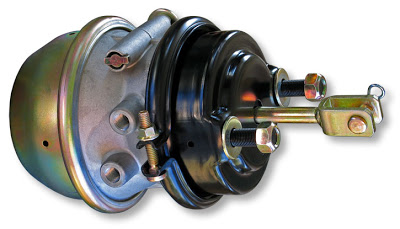

After a few hours looking for a slow air leak you can begin to wonder, are air brakes better? If you are new to Diesels or heavy truck or maybe you are moving over from car or equipment mechanics they can be confusing and you can begin to wonder if they are worth it. Let's answer that. 

**Yes, especially is heavy applications. Hydraulic brakes simply cannot supply the energy needed to stop large equipment. That is not the only reason. There are other benefits to using air brake over other types. Let's look at those**

## 1. Safety 

One of the biggest benefit of air brakes is they cannot fail. Unlike hydraulic brakes, air brake do not use a fluid for compression. The supply of air is unlimited, so the brake system can never run out of fluid. Minor leaks do not result in brake failures.

If someone cuts your brake lines on your car the brake fluid drains out and you **have no brakes**. 

Unlike hydraulic brakes, air brakes when there is a leak the brakes apply. When there is no air the brakes are fully applied. That way there is no chance of a run away heavy vehicle. That is not to say it **can't** happen. It is just unlikely because if a line were to brake and leak all the air our the brakes apply. Not always what you want but, safer than losing all brakes. That is the logic behind this. 🛑 *Stop* is better than *can't stop* 🛑 

Air brakes are also effective even with a considerable leak, so an air brake system can be designed with sufficient **fail-safe** capacity to stop the vehicle safely even when leaking.

## 2. Maintenance

You may not know it but, air brakes also have a great advantage in the area of maintenance. There are several reasons for this. 

- First, air line couplings are easier to attach and detach than hydraulic lines. You can snatch one off into no time and the best part there is no mess. Hydraulic fluid is a mess. It gets everywhere and everything and then your at home having a sandwich. What's that taste? You guessed it, hydraulic fluid(I prefer a 2015 DOT 3 🍷).

- Second, the risk of air getting into hydraulic fluid is eliminated, as is the need to bleed brakes when they are serviced. Pumping brakes alone if a tough gig. Can be seriously frustrating and take quite a bit of time. Have a friend helping? Worse 😆. With air brakes depending on whether your drum or disc set up you just run the adjustment all the way down and then back it off per the manufacture specs. Simple.

- Third, air brake circuits on trailers can be easily attached and removed. This takes away that pain point of trailer brakes. It's no trouble to add a trailer and have the same superior braking power unlike hydraulic where they are often electric or non-existent. 

Damage will happen no matter what braking technology you have. With air brakes we see that not only are the repairs more strait forward with less mess but, also, regular maintenance is easier. 

