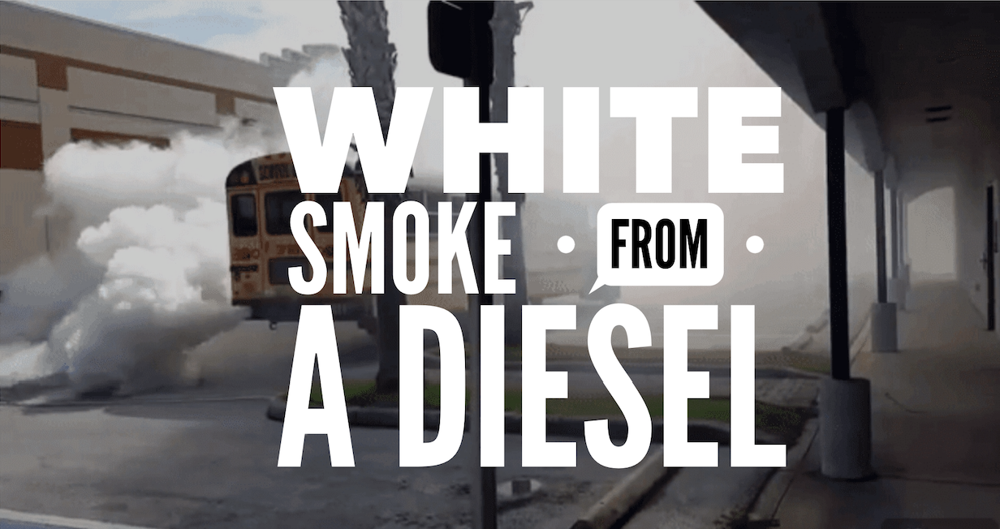

So, you have some white smoke billowing out of your exhaust. What is the cause? Maybe you are like me and have to look it up every time. No shame here. The answer is quite simple, but the solution might not be. Let's look into this issue and figure out what's going on.

_What causes white smoke from a diesel?_

**There are three causes of white smoke from a diesel engine. The problem is either raw diesel fuel passing through the exhaust completely unburned or water/coolant entering the combustion chamber or the temperature in the combustion chamber is too low.**

Now, let's look at three scenarios. What is wrong really depends on the **"type"** of white smoke you have. Let's break down the different ways white smoke presents itself and where to go from there. Here is how to read the smoke...

`youtube: https://youtube.com/embed/BC9rDgSMUe0`

## 1. White smoke on a cold start, and then it disappears as the engine warms up

This is very common. It will often happen at [startup in cold weather](/the-complete-guide-to-starting-a-diesel-in-cold-weather/) with lower compression engines. As you start running the engine at idle (around 650 or 750 rpm), you will achieve a more effective compression ratio, and the smoke clears. White smoke has a lot to do with the temperature in the combustion chamber.

**_If the smoke is really just a puff, there is not much to worry about. Especially if it has been sitting, it could just be built up condensation._**

If it lasts a few minutes after the engine is started and there is a **rich diesel smell, 👃** they may be some cause for concern. Some of the likely causes include,

- Faulty injectors - stuck open.
- Worn piston rings or cylinder glazing
- If equipped with glow plugs, could be faulty plugs or module.

Remember, if you have an older engine with really low compression and bad timing or low injection pressure, you are more likely to have white smoke. I wrote an article about [signs and symptoms of a worn out diesel engine](/10-signs-and-symptoms-of-a-worn-out-diesel-engine/) and if you need some tools to fix these issues check out my [complete tool guide for diesel techs](/the-tool-guide-for-new-diesel-mechanics/)

## 2. A thick cloud a white smoke

Red alert 🚨 This is the danger zone. Water or coolant can cause white smoke from a diesel engine as well. This is a symptom of a bad problem. Your engine is getting coolant or water in the combustion chamber. This is caused by a compromised part of the engine that has the flow of coolant in it.

If you know anything about compressing water, you know this is not going to end well. Spoiler - water does not compress. So, if you have this problem, be careful running it for any period of time. Once you are sure it's water or coolant, stop and fix it.

This will be a steady stream of smoke after starting up. Usually, you will see the smoke will be a "thick" cloud (Like in the picture at the top of the page). It will also be noted by a sweet 🍫 smell. Some likely causes include,

- Blown head gasket
- Cracked block or head
- Contaminated fuel - [See my article on how long fuel lasts](/storing-diesel-fuel/)
- leaking Oil cooler (Through most of the time, the oil passes into the coolant)

**Remember, significant damage will occur if you run the engine with water in the combustion chamber.** When you see this occurring your best bet is to be towed to a garage wear the problem can be diagnosed and made.

## 3. Continuous "light" white smoke

To run correctly, a diesel engine needs precise timing of the injector pump and proper pressure. Any decrease in the pressure or delay in delivering the fuel to the combustion chamber will cause incomplete combustion, and you will have white smoke.

This is a steady stream of _lighter_ white smoke. It can even be random but often "puff." Some likely causes include,

- A clogged fuel filter
- Low pressure in the fuel pump (Air in the fuel)
- Faulty or damaged injectors
- Incorrect injection timing (Worn timing gear or damaged crankshaft keyway).
- Low cylinder compression (caused by leaking or broken valves, piston ring sticking, cylinder ring wear, or cylinder glaze)

## **_Important note for modern diesel engines_**

**Modern diesel engines are designed to deliberately over-fuel the engine (or just one cylinder) for brief periods to create heat to burn carbon off of the Diesel Particulate Filter or DPF. If this over-fueling operation is not operating properly, it can cause white smoke and damage to the engine.**

---

## Summing up

White smoke can be difficult to diagnose but, if you follow the signs and look at the simple things first, you can get to your answer fairly quickly. As with any repair, be careful to think about what's going on before you act. The damages that can occur from the problems denoted by white smoke can be catastrophic, but you can likely avoid even more costly repairs if you can catch it early. Looking for a complete diesel smoke guide? If you want to understand more, go here 👉 [Diesel Smoke Diagnosis Guide - White, Grey, Black, Blue](/diesel-smoke-guide).

## Want to get your ASE Certification but Hate reading? 📕

You can actually listen to the study guides now with [Audible](https://amzn.to/2K3v96s) Click [Here](https://amzn.to/2K3v96s) to listen to the study guide for free! Courtesy of learn diesels and Amazon. You can literally sign up, study, pass, and then cancel before the free trial ends.

Here is a link to the [ASE Audio Study Guide Audible Audible Audiobook](https://amzn.to/32EcKDy) if you already have an Audible account.

## Related Questions

### Can bad fuel cause white smoke?

Yes. If the [fuel is contaminated](/storing-diesel-fuel) with water or some other foreign material, it may produce white smoke. The best way to test the fuel is to pull the filter and empty the fuel from it into a clear glass or container. Wait a few minutes and see if there is any separation. The water will rise to the top and bubble up in the diesel.

### Can air in fuel cause white smoke?

Yes. This is another common cause of white smoke. Check all the lines and injector supply lines to see if there is anything loose. Air can pass through any lost connections. Especially in today's high-pressure systems, you need to make sure that it's all tight and sealed.

