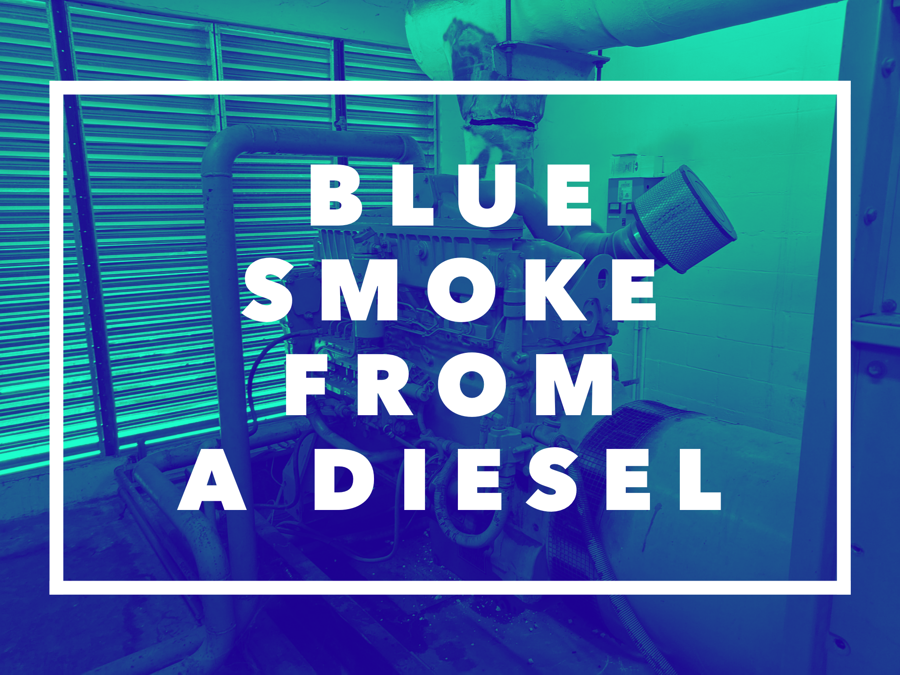
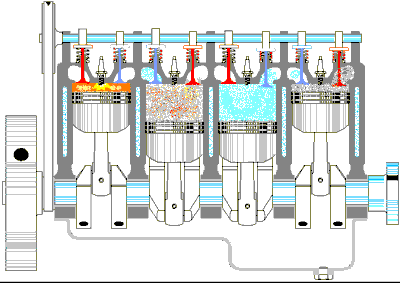

So, you have some blue smoke billowing out of your exhaust. Well you think it's blue. It looks like a blue haze? 😕 What is the cause? Maybe you are like me and have to look it up every time. No shame here. This is the complete guide to blue smoke from a diesel.   

Why would a diesel have blue smoke? **Blue smoke only occurs for one reason, excess lubricating oil within the engine cylinders during combustion. When this oil is burnt it will come out of the exhaust as blue smoke.**

 Your burning oil. That part is simple. Understanding all the different reasons you can have oil in the cylinders is not. Here are the things it could be and what to look for... 

## 1. Is it really blue?

Spotting blue smoke can be difficult if you don't know what to look for. The "blue" color is often faint. You should be able to see a blue haze to an overall "grey" kind of smoke. You can often smell 👃 the difference. Oil smoke has a distinct smell, like an asphalt parking lot or roofing tar on a hot day. If it is blue, I should say that ***blue smoke should not be happening at anytime.*** It is evidence of a problem and should be investigated. 

I have seen some dismiss it as normal. **No amount of blue smoke is normal.** A new engine may burn oil without any evidence of blue smoke because of the good compression it can burn oil cleanly. However, it is not acceptable for any engine to burn large amounts of lubricating oil.

A great thing to do as a preventive for your diesel engine is a oil and fuel additive. Check out [This stuff (link to amazon)](https://amzn.to/30RdaDo) it is the best in my opinion. 

Let's take a closer look at what blue smoke could really mean and where to start the hunt fot the issue. 

###Blue Smoke is caused by engine burning lubricating oil but, that oil can enter the combustion chamber from several sources 

- **Worn valve guides or seals** - They can be letting oil pass through to the cylinder. 

- **Cylinder wear** - A worn cylinder will allow enough space for the oil to pass by the rings whether the rings are worn or not. 

- **Piston ring wear** - Again, creating a gap allowing oil to get into the combustion chamber. 

- **Cylinder glaze** - When the cylinder is glazed the rings cannot do their job of wiping the oil on the way back down and oil will pass by.

- **Leaking turbocharger seals** - which are allowing oil into the intake and/or exhaust system Excess engine oil in the sump, which is getting splashed up into the bores.

- **Restricted turbocharger drain** - If the oil has nowhere to go it will pass into the intake. 

- **Incorrect oil** - Oil that is too thin will get past rings or valves guides

- **Fuel dilution of the oil** - A good way to check for this is just to pull the dip stick. If you have an injector stuck open and it is leaking fuel into the crankcase it will dilute the oil and cause it to pass by and be burnt. This may be caused by faulty injector pump and/or lift pump.

- **Too much oil in the crankcase** - You overfilled it. Too much oil is not a good thing. If you have overfilled it simply remove the extra oil.

- **Clogged oil drain lines in head** - If the head is clogged and the oil does not have a place to go it will likely make its way out the exhaust. 

- **High crankcase pressure** - Too much pressure in the crankcase. Check the old crankcase breather. Keep an eye out for clogs or debris in the tube.

***If blue smoke is only happening on a cold start, it is likely that it is a piston/cylinder problem.***  

With so many different causes of blue some it can be a daunting task to begin to diagnose the issue. I decided to give you a little nudge in the right direction. Take a look at the list to follow. 

##Do the easy things first

A lot of times less experienced mechanics can jump to the **worst-case scenario** when most of the time the problem is something much less complicated. I learned an acronym that has really helped me in my career. It is KISS. **Keep It Simple Stupid.**  Most of the time the answer is right in front of you. When you are approaching a seemingly difficult diagnosis remember to look at the simplest explanation first.

1. Check the oil 

Make sure the level is correct and there is no smell 👃 of fuel in the oil. Make sure it's not "thin". Dripping like water off the dip-stick. You could have just put too much oil in the engine! wouldn't take be a relief? Or there can be fuel in the oil causing it to pass by. 

2. Remove the intake CAC hose from the turbo

It is the tube from the turbo charger to the intercooler. Look for signs of oil. It will be wet or have some residue in the inside of the pipe. It is good also to look beyond the CAC pipe into the intercooler itself and over to the EGR and intake hoses continuing to inspect for that **slick** oil residue. 

3. Check the crankcase breather for obstructions.

Look at the blow-by tube and breather filter element (if equipped). Sometimes there can be an obstruction or it can get clogged causing all kinds of issues in you crankcase. 

4. Perform a cylinder compression check to isolate the source.

Now you are in the more advanced inspection. This will require more time and you will be able to pin point which cylinder is allowing oil to pass by. If you have got to this point things can get hairy and expensive. Remember to always have the maintenance manual to find disassembly instructions for your specific engine. these can be extremely useful if you don't have it down to a science. Nothing wrong with looking at the instructions guys. 

****

##Summing up

Blue smoke can be difficult to diagnose but, if you follow the signs and look at the simple things first you can get to your answer fairly quickly. As with any repair be careful to think about what's going on before you act. The damages that can occur from the problems denoted by blue smoke can be catastrophic but, if you can catch it early you can likely avoid even more costly repairs.  

***See something I missed? Help me make it better, comment below. Thanks!***