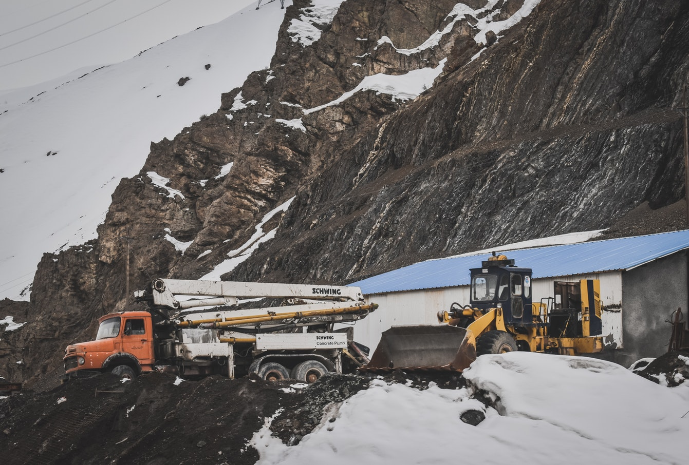
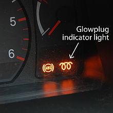
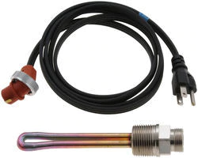
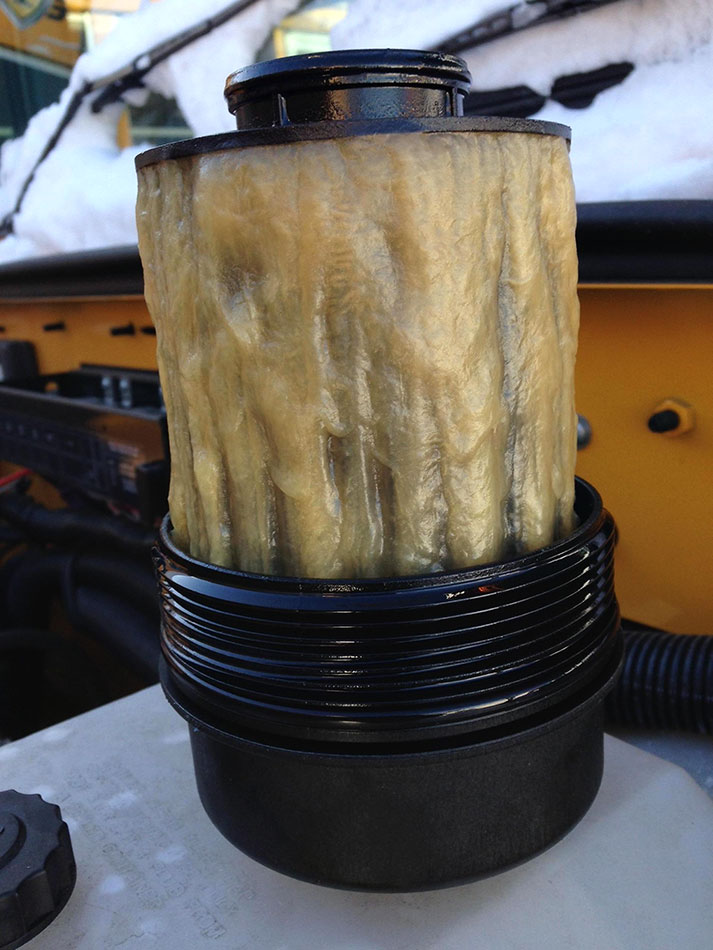

Modern Diesel engines have solved a lot of issues over the years. The newest Diesel engines are much better than the older ones but, all diesels do not like cold weather. That's why I have put together this guide for the cold mechanic shivering in his bay right now.

Why are Diesel engines harder to start in cold weather?

**When the internal components of a diesel engine become very cold, cranking the engine is more difficult because diesel engines depend on high temperatures in order to create combustion.**

Now let's look into how to start a diesel in the cold. The following is the best advice I could compile on starting a diesel in cold weather.

## 7 Easy Tips for starting a diesel in the cold

## 1. Start with the Batteries......get it? 😆

Listen, your batteries are super important. Batteries can lose 35 percent at 32°F and as much as 60 percent at 0°F. If you bought your truck in 2010 and you have never replaced the batteries....**replace the batteries** If you have one battery that is 3 years old and one that's 8 years old....**replace the batteries**

If you are having any trouble starting in the warm weather, forget it when there is a cold snap. You will be dead in the water. Do yourself a favor and go ahead and replace both batteries. You can't expect 9 or 10-year-old batteries to do the job. Go ahead and bite the bullet and get new batteries.

For our friends in the extreme cold, you may need to look further. In some cases, it will be necessary to buy a **battery with a larger capacity**. The other option would install a battery warmer. these come in two varieties, the "hot plate" warmer that sits under the batteries and cooks them. or the "blanket" warmer which wraps around them keeping them snug as a bug.

## 2. Wait to start your engines

One thing to remember in cold weather starts is the glow plugs. **_Not all diesel engines have glow plugs_** If equipped, when you first enter the vehicle, turn the key over to the start position without cranking the truck. Your vehicle should have an indicator that notes **wait to start** or have an image like the one in the image below.

Do not attempt to start the vehicle until the indicator lamp has turned off. The glow plugs or intake heater must heat up the air in or on the way to the combustion chamber in order to create the correct temperature for Diesel to burn and combust. That is why when you do not wait and try to crank it the engine takes longer to start and when it does it runs terrible.

## 3. Plug in the block heater

The cord dangling from the front of your truck or hidden someone in your grill is not for decoration. You need to plug the truck in cold weather if your Diesel is equipped with a block heater. All you need is a 110v plugin and you're good to go.

The block heater keeps the block at a good operating temperature by heating the coolant causing it to circulate through the block and warm everything up nice and toasty.

Some manufactures actually install the heater but do not provide the plug. Consult your dealer to see if your model included a block heater and if so, make sure and plug that thing in when it's cold out.

If your vehicle did not come standard with a block heater there are aftermarket options. I have installed many block heaters after the fact on several different types of vehicles. Most of the tie the engine manufacture will install a plug where one would be around the thermostat. Have a look to see where it would go and find a good one to install.

If you do plan to buy a block heater remember to look at the recommended wattage for your region. You don't need one built for the arctic circle if you are in 20 degrees. No sense in paying a super high electric bill when you just need a little heat.

## 4. What About Fuel Filter

Alright, we have made it to the most overlooked on this shortlist. This is not just a wintertime issue, but the fuel filter is crucial in getting your truck started in cold weather. Some of you are thinking about how long ago it was since you changed your fuel filter. If you have not changed your fuel filter since all the beetles were alive you are going to have some bad problems.

When your fuel filter is old and dirty several things happen. One, the fuel is hard to pull through the filter. Two, there is water in the filter. This may be the most important. why? You guessed it. Water freezes. So, you have a frozen fuel filter and your fuel is not going to be delivered to the engine and you will not be starting. So, check the filter!

## 5. Check the fuel

If you are having issues starting and all the three things above are good you could have gelled fuel.

Diesel fuel can become gelled when the diesel starts to turn into a solid when the temperature drops. The fuel will start to gel and clog at 10 to 15 degrees. this will clog the tank and fuel filters.

You should watch the fuel at any temperature below 32 degrees as it will begin the process of gelling. **You Need A Fuel Additive** if you are in these kinds of weather conditions. Make sure you are preventative or you are going to have a mess until it warms up.

Here is the fuel additive I recommend [Lucas Extreme Cold Weather Diesel Fuel Treatment (Link to Amazon)](https://amzn.to/2Nz4P24) Lucas Extreme Cold Temperature Fuel Treatment with Anti-Gel was developed to eliminate fuel gelling problems in all types of diesel fuels, even bio-diesel. It contains all the important additives in regular fuel treatment to increase fuel mileage and performance. Complies with the federal low sulfur content requirements for use in diesel fuel. Try it out if you are in a really cold area. Don't wait and end up with with this 🔽

## 6. Make sure you have the right diesel

Unknown to many there are two different grades of diesel fuel. #1 and #2. #2 Diesel is what you find commonly used across our country and the world. You use #2 diesel in regular driving conditions

## #1 Diesel is made for colder climates. It is a thinner fuel and will not gel up as easy as #2

### When should you add #1 Diesel

When the temperature dips below 30F for long periods of time is a great time to consider adding #1 diesel to your mix. #2 Clouds at 14 degrees F. It is a great idea to [start blending about 15 Degrees above the cloud point.](https://www.cenex.com/about/cenex-information/cenexperts-blog-page/fuel-efficiency/cold-weather-diesel-problems)

Once you start seeing temperatures below 30F for extended periods of time, go ahead and begin the blend.

**Don't forget** additives drop the cloud point for every 10% of the tank by about 3 degrees. If you have treated your fuel be aware of this. Check out my article on [storing diesel.]()

## 7. Do not mix fuel additives into winterized diesel

You do not need to double treat your fuel. If your fuel is already winterized do not add any more products. You can damage the high-pressure fuel system. Be sure and ask or write down when you treat your fuel.

## Caution: Don't do this

**Do Not Use Stater Fluid** to get the engine going on a cold day. I don't care how bad you want to get that truck down the road. Never do this. Ether, otherwise known as **_starting fluid_** (or silicon) Has a lower flash point and can cause explosions, damage, and harm to the person injecting it. Deaths have happened with the use of ether. Please take note and use extreme caution when even handling it. Ether won't help you run for long when a unit has bad fuel anyway.

---

## Summing up

Listen, it gets cold out there. My best advice is preparation is better than a reaction to a problem. Go ahead and take the actions needed to prevent disaster if you know it's getting cold out there. Stay Warm!
