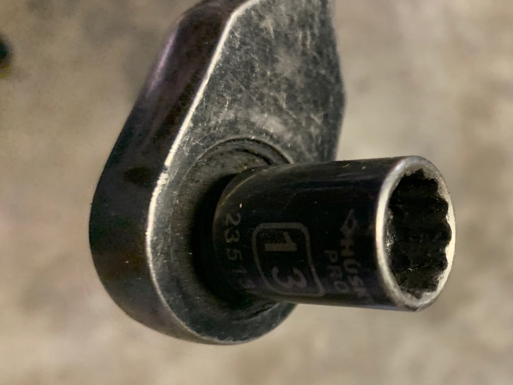

I have seen many articles with lists out there on the best tools to have as a diesel tech or heavy equipment mechanic. I had a guy on r/dieselmechanic on Reddit asking, "What tools do I need to get started as a diesel mechanic." I wanted to write you guys a list and give you some great resources to get you going in your new job.

What tools do I need to be a heavy equipment or diesel mechanic? **I have surveyed Reddit** [**(here is the post)**](https://www.reddit.com/r/Diesel/comments/kkw3re/new_diesel_the_tool_list/) **and compiled a complete list with 18 categories and those related tools for you to use. Feel free to print this out and use it as a checklist for getting started.**

**_This list is not meant to be exhaustive. It is meant to give you a good idea of what you need to get started. You don't have to start with a complete set but, you need the essentials._** Borrowing tools is not a good route to take.

I have listed a few of the tools I recommend in the list they are links to amazon. Scroll past the list to see more about buying tips and the best bang for the buck.

### Want to print the list? [Click Here to download the PDF](/toolguide)

## Here is a complete list of tools for the new diesel mechanic

### Toolbox or Cart Standard size

You don't need anything crazy. Most mechanics would tell you that you can get away with a cart. This is the [Tool Cart I own](https://amzn.to/3rbmwYJ).

If you are wanting to spend the money for a tool chest consider finding one online or looking around swap meets and what-not. check out my article about the [best boxes online for under 2k.](/5-best-toolboxes-for-mechancis-under-2k/)

### Ratchets

- 1/4", 3/8”, 1/2” **One of the most important tools** [**See my article about ratchets**](/the-best-ratchet-for-professional-mechanics/)
- long handle flex head 3/8" ratchet
- 1/2 breaker bar

### 1/4" Drive Socket Set Standard

(SAE) & Metric - **Deep and Shallow**

- 3/16” - 5/8” 6 point and 12 point
- 5mm - 15mm 6 point and 12 point
- 3" & 6" Extensions

### 3/8" Drive Sockets Standard

(SAE) & Metric - **Deep, Shallow, and Impact**

- 5/16” - 1” 6 point and 12 point
- 7mm - 20mm 6 point and 12 point
- 3", 6", 12", 24" Extensions
- Swivel/universal joint sockets

### 1/2 Drive Sockets Standard

(SAE) & Metric **Deep, shallow and Impact**

- 3/8” - 1 1/4” 6 point
- 10mm - 27mm 6 point
- 3", 6" & 12" Extensions - [Here is a full Gearwrench set.](https://amzn.to/2Eooykg)

### Socket Adapters

- 1/4” to 3/8”
- 3/8” to 1/4”
- 3/8” to 1/2”
- 1/2” to 3/8”
- 1/2” to 3/4”
- 3/4” to 1/2” [The set I have](https://amzn.to/2RgetJo)

### Feeler Gauges

- Standard 0.0015 - 0.0035 thousandths - Metric 0.04 - 0.88 thousandths

### Hammers 🔨

- Dead blow, Ball Peen, 5-pound sledge hammer

### Chisels, Punches, and Drill bits

- 6" brass or aluminum punch
- Standard drill bit set

### Air or Battery Tools

- Impact Guns - 3/8”, 1/2 - **Air or electric**
- 90 Degree die grinder
- Air hammer
- Cordless drill

### DVOM - Digital Multimeter

- Digital readout and Auto ranging Don't buy a cheap one if you can avoid it. The really cheap ones are never accurate. [Check out this klein](https://amzn.to/2W5xZeW)

### Pliers

- Needle nose, adjustable, vise grips, Snap-ring, Slip lock-type Here is a nice set of Vise-Grip brand
- Small pipe wrench - For stubborn bolts

### Pry-Bars

- 12”, 2’, 3’ Craftsman makes a set has a strike head for a great price
- Brake anchor spring pliers/installer
- Lady's foot

### Screw Drivers

- Flathead & Philips #2 stubby, #2 regular, #1 regular.
- I also recommend torques drivers.

### Allens and Torque Bit Drivers

- T10, T15, T20, T25 (T25 is the most used. Get 2), T27, T30, T40, T45
- Allen Wrenches Standard and Metric - 3/32” - 3/8” - 3mm - 17mm

### Electrical Tools

- Hand held torch
- Wire cutters
- Wire stripping tool. Look at these [auto wire strippers](https://amzn.to/33d7KnM) _best tool ever_,
- Soldering gun
- Crimping tool
- 12v test light
- [Power Probe III](https://amzn.to/32bL71J) but it's not required, but awesome to have

### Wrenches Standard and Metric 🔧

- 5/16” - 2” (Usually sets stop at 1 1/4" I suggest grabbing cheap larger wrenches) 8mm - 22mm - 8” & 12"
- Adjustable wrench - Small and large
- Ratchet Wrenches (I prefer GearWrench)
- Line wrenches - When you can afford them.
- Crow's feet - They are awesome.

### Safety Equipment

- Safety glasses
- Leather gloves
- Face Shield
- Safety toed shoes
- **Check with your employer they often provide some of these things**

### Mechanic Accessories

- Inspection Mirror
- Gasket Scraper
- Pick Set
- Truck tire pressure gauge (0-150 PSI), Tire tread depth gauge (1/32")
- Small and Large oil filter wrench - Davco makes great ones cheap
- Magnet with extendable handle
- 12' Tape measure
- Bottle of white out, Pocket calculator,
- **A _good flash light_**
- Creeper
- Paint pen
- Labels and colored zip ties - used for labeling lines when you remove them

## 6 Tool Buying Tips For Mechanics

Let me offer some advice on tool buying. Here are just a few suggestions when you start to collect all these items.

### 1. Stay off the tool truck 🚚

The first piece of advice I want to give you is to stay off the tool truck. While it sounds like a good deal, **it is not**. The prices on the truck are typically **300%** more than other tool providers. That is not a typo, boys.

These trucks prey on new guys and the fake status that you get with their brands. You don't need a certain brand tool to be a professional. You need tools that work.

We could argue quality, but I have a set of Husky pro hand tools that have lasted **13 years.** I have worked on OTR and heavy equipment with them. Do I have a busted a few sockets? Yes. Only the ones I really used a lot. My 13mm socket went first. At about 5 years in, I had to get another. Do you know what I did? I got a free one. Yep, Husky has a lifetime warranty as well.

They also take advantage of the mechanic with poor credit or can't buy this complete list at one time. I have always called the tool truck a **rolling Rent-A-Center** because they pay by the week format. Don't put yourself in that position. Writing off a portion of your paycheck is not a great way to start financially, and there are better ways.

If you can't afford to buy all the tools at once, buy as much as you can and try to get by until you get paid again. If your shop requires you to have a certain number of tools and you just can't do it. Look into the family or a retail credit card at a Loews or home depot. You would come out way cheaper even if you had to pay some interest.

### 2. Brand Isn't Everything

An experienced mechanic will roll his eyes at the guy with just has to have the Brand name tools. They know what I know. I have broken just as many Snap-on sockets as S&K or Craftsman. Now I will say that I prefer certain tools over others. I would **never recommend** a professional mechanic use Harbor Freight or even Craftsman Ratchets.

A Ratchets is something that you literally use every day and have a close relationship with. You should get a nice one. That doesn't mean you need one from the tool truck. [My favorite Ratchets is GearWrench](/the-best-ratchet-for-professional-mechanics/). You don't have to pay 200 bucks to get a nice ratchet, contrary to the tool man says.

### 3. Growing with time

No decent employers expect you to shell out thousands on your first day. That said, you need a good base and then set aside some amount per month to reinvest in your tools.

Your tools help you earn that living and are an important part of keeping up and making your job much easier. You will find that paying a little more and getting a special tool for your job can make certain jobs **much easier.**

It is a great idea to have a plan for your next couple of years in tool purchasing. If you are intentional, you can get pretty much everything you would want in a couple of years without having to eat Roman and owe the tool, man.

Set aside an amount that you decide and then spend it as soon as you have enough to buy the next tool on your list. (Or it will get gone.) Best if it is in cash.

Over time you will build up a great set of tools. If you are budgeting for it, you will be surprised just how fast you will amass all the tools you can possibly need.

### 4. Don't Forget About The Shop Tools

Before you buy a dial indicator, make sure that it is not in the shop tools. Shop tools are the tools that the shop itself provides. Not all shops provide the same things but, most provide the larger or more expensive items and have them for all the techs to share.

My shop always provided the dial indicator, toque wenches, huge sockets (over 2"), tire bars, 3/4 impact gun, Drills, Creepers, etc. **_Not all employers provide the same things._**

During your interview, this is a great question to ask. Check out what is there before you buy things that they already provide and, in some cases, require you to use. i.e., At one job, we were required to use their toque wrenches because they had them calibrated regularly.

### 5. Look Online and elsewhere

With the resources for online shopping today, there is no good reason to pay the retail stores' mark-up. Do your research. Read reviews. Ask more experienced mechanics what they think. You will find that you can get pretty much everything you need from Amazon or others.

**I do recommend a few tools on here but, do your own research. Tools are a personal thing. You need to find what works best for you.**

Look on swap sites like craigslist and garage sells. You might find a retired mechanic or a window looking to get rid of a whole set for cheap. You can find some great deals and get a lot of tools at once like this.

I once bought a box from someone for 50 bucks, and it was loaded with great stuff. It had brass punches and some high-end wrenches. You never know what you can find out there! Take a look.

### 6. Don't Borrow A Tool More Than Twice

If you need a tool it's cool to ask your buddy to borrow it... right? Well, not always and definitely not often. It is a good rule of thumb that if you have to borrow it twice, you likely need to buy the tool in question. I have an article on the [21 tips for diesel techs](/21-tips-every-diesel-mechanic-wish-they'd-learned-sooner/) that wish they had learned sooner.

A great idea submitted on Reddit by u/loopsbruder was whenever you need to borrow a tool for a job, **write it down**, then put a tally mark next to it whenever you need to use that tool again. Then, when you go shopping (or the Snap-On guy shows up), **buy the tools** with the most tally marks first.

## Toolbox Set-up and Maintenance For Mechanics

Once you have invested all that money into your tools, you need a plan to take care of them and organize them. You need to keep your tools in great condition, so they work great. Ever tried to open a pair of rusted pliers? No fun. Likewise, when your favorite ratchet is missing, you are not a happy camper. 🏕️

### Cleaning Your Tools

Every day you need a few minutes after you are finished with work or finished with a job and before you wash your hands to clean your tools up and put them back into their specified spot in your box.

Most companies allow this time in a work order or give you a few minutes after each day to do this.

Cleaning your tools helps them last longer and a more pleasant experience the next time you need to use them. Also, this practice ensures that you have all your tools. While you are cleaning, you may notice that you don't have a tool you used on the last job and locate it. That is why I suggest **cleaning up your tools as a part of each job.** That way, you can keep up with your tools and make sure you haven't left a tool on a vehicle or piece of equipment.

Oiling your tools can also give them more life, especially in air tools. Make sure you use a good air tool oil each time you use your impacts, die grinders, etc., to have them work for a good amount of time. You want to get your use for what you spend and enjoy the full power they have from new to old.

### Tool & Socket Dividers

There is a lot you can do to prevent your tools from unnecessary wear or damage. **One of the best things you can get is tool racks or dividers.** Having your toolbox set up logically and ergonomically will be extremely helpful in your day to day work.

You need these to quickly identify the needed socket size and have a place to put it back after you have cleaned it. Also, when you are cleaning up will notice a lot faster if something is missing.

It is very easy to misplace a socket or something small. Having a divider or socket rack and a specific place for each tool will make seeing that something is missing extremely easy. [Here are the ones I bought on Amazon](https://amzn.to/2Rrx8lD)

There are many different options when it comes to tool organization. I prefer socket stands because of the ease of use. Just a glance and I know right where to grab. There are other types, but I find they take up more space and are not easy to use.

## PPE (Personal Protective Equipment)

Most companies, for the benefit of safety, provide PPE to their mechanics. It is important to use what works for you. I know some of the equipment my company provided was not right for me. So, finding the right safety glasses, gloves, and shoes can be huge if it makes you more likely to use them more.

### Safety Glasses

There are a lot of cheap options when it comes to safety glasses. Most companies are going to opt for the cheaper options. That makes things rough on us. So, finding the right pair for you can make all the difference.

Buying a nicer pair has some great benefits. The better brands have better anti-fogging, which is a big deal when you’re working hard. It is tough to keep a pair of glasses on when your sweating and they get fogged up. Invest in a good pair you won't regret it.

### Gloves

Most shops I have worked gave the old leather gloves out. Not the best. I have always opted for better mechanics gloves. It takes talent to screw a nut onto a bolt with the cheaper ones, and I just don’t have it. I suggest getting a decent pair. Your hands and your sanity will thank you.

### Face Shield

Some shops supply a face shield for you. If yours does not, I recommend getting one. You wear this over your safety glasses when you are grinding and spraying brake clean under a vehicle.

You may think, "Man..I'm too cool for one of those". To that, I say, yep, you are. I cannot tell you the number of times I have an eye full of brake clean laying on a creeper. Not a fun experience. Wear the shield. 🛡️

### Silicone Wedding Band

Learn from my first-hand ✋experience. Learn from my mistakes. They have some great silicone wedding bands on Amazon, and they will save you a scar and trip to the ER. Find some [Here](https://amzn.to/2oH7Yo6). I made a [YouTube video](/youtube) on it if you want to see it.

### Safety Shoes

So important! After a long day, you will know that you had Wal-Mart shoes on. Hopefully, your company gives an allowance. If not, don't skimp here. Get a good pair of shoes.

You are on concrete all day, and you need a comfortable pair that will last. Non-slip is preferred, and maybe even look into a good insole.

**_Note: some companies require steel toes, and some just require safety toed. Make sure you ask, so you don't waste money on a pair you cannot wear._**

---

## Summing up

You don't need good tools to be a good mechanic, but, man, they make your life a lot easier. Be smart when you are first buying tools, and you will save a pile of money and be better for it. You don’t make much starting out. Don't spend it all on overpriced tools. Remember to budget some money to continue to grow your collection, and soon you will realize you have all you need.
