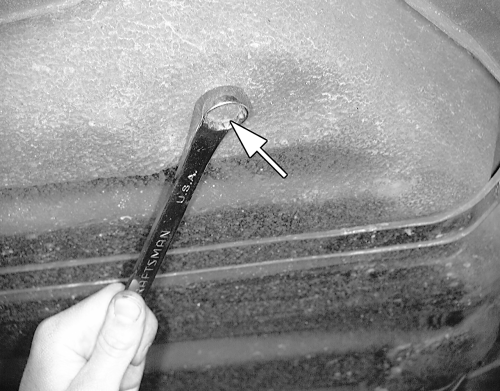
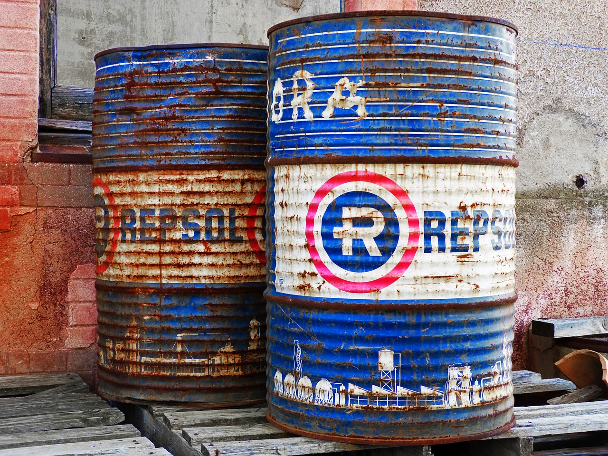

With the unpredictability of the fuel market and the rising cost of diesel people have been experimenting with alternative fuels in diesel engines for many years now. Your diesel is surprisingly versatile. There are several “fuels” it can operate on. **Not all are created equal through!** So, before you drop whatever you are thinking into your tank have a look at this article.

## Can a diesel engine run on gasoline?

**A diesel engine cannot run on clean gasoline**, but it can run on diesel mixed with gasoline. The main thing is that the amount of this gasoline does not exceed **one-tenth** of the total volume of fuel. If this proportion increases, the engine will lose power and eventually will stop working altogether. **_Running a diesel on any amount of gasoline is not recommended_**

What will happen if you pour gasoline into a diesel engine? **It all depends on the circumstances. The first of them - the amount of gasoline in the system. This determines whether you stall right at the gas station or not find out about this annoying fact at all.**

This is a bad situation. Gasoline gets poured into the tank of diesel vehicles often. It's not even that people at the pump are dumb. Today's society is unthinkable without cars. In most modern families, they have a need for more than one. In addition, in your personal garage, maybe you are hoping in and out of diesels as a part of you job. All this, plus the big hurry we are usually in, can lead to the situation indicated above.

So, if 1 gallon of gasoline were poured into an empty tank, and you tried to run the vehicle, you will need to flush the fuel system. Although, if you remembered this without starting the engine, and gasoline has not yet entered the system, you can simply fill the tank with diesel fuel without many major consequences. It is only necessary that in this particular example the volume of your tank be more than 10 gallons.

Some have said you might still see reduced engine power, more noise, and possibly a diagnostic warning from the emissions system that is detecting something other than diesel exhaust. It is also said that as little as **1% gasoline in a diesel engine can cause an 18-degree change in the flash point**. That means it is taking less heat to cause the explosion in the chamber which will result in noise and possibly damage over time.

### Just drain it

The second factor is the time whether or not you knew or realized that you had put gasoline in your tank. If you filled a full tank with gasoline and realized it, just hang up the filling gun, 😢 immediately dial the number of the tow truck and go to drain the gasoline into a safe place. Then that will be all the problems that you face.

If gasoline got into the system and the engine did not stall immediately, 🛑 **shut it down and do not run it again.** The remains are lines and components filled with a mixture of diesel and gasoline, be prepared for a possible replacement of fuel equipment. There is only one road - to the shop. The damage that can take place to diesel injectors, cylinders, hi-pressure fuel systems can be severe. Always carefully monitor what you pour into your tank in order not to run into an expensive repair.

## Can a diesel engine run on kerosene?

**Yes,** but continue reading. The fact is that until recently, when diesel with low sulfur content appeared on the markets, all its other varieties came from one source - refineries.

Heating oil or kerosene burns well in any diesel engine, but in many countries, it is forbidden to use it in vehicles that drive on public roads - a matter of vehicle tax. In addition to the red coloring additives, the composition of the heating oil is almost identical to diesel, which was produced before the appearance of diesel with low sulfur content. [46]

The only difference between heating oil and diesel fuel **is in the federal standards for ash.** In the United States, Canada, the United Kingdom, and some other countries, the use of colored (i.e. non-taxable) fuel in vehicles moving on public roads is prohibited. Naturally, when it comes to off-road vehicles (for example, tractors), Nobody can accuse you of fraud with taxes on fuel for public transport vehicles. The fuel used for stationary engines, such as generators and water irrigation pumps, is not taxed. They follow this rule differently, but the penalty for violation is significant, so it's better to act within the law.

With kerosene, the situation is different. This type of fuel does not have sufficient oiliness to be used in a diesel engine. I read that when burned, it emits more heat than a diesel, which means **it is dangerous for the fuel pump.** However, usually, the question of its use does not arise because,

💰**kerosene is more expensive than diesel fuel.**

If absolutely necessary, it is probably safer to mix kerosene with a diesel engine in the ratio of 1: 4, which should not cause engine wear.

## Can a diesel engine run on natural gas?

**Yes,** but, Unlike the situation with gasoline engines, the transfer of which to gaseous fuel (mainly LPG - liquefied petroleum gas) has long seen impossible in diesels. A standard diesel engine cannot operate on a gas fuel. For two reasons,

1. The gas ignition temperature is 300-320 degrees higher.

2. The high compression ratio of the diesel engine will cause detonation.

Therefore, to convert the engine to the gas engine mode on methane (CNG - compressed natural gas) or propane (LPG) - an engine modification is required. To reduce the degree of compression and, consequently, the transition to CNG will require the installation of a spacer under the cylinder head, which increases the volume of the combustion chamber.

You will also have to install other pistons and elongated connecting rods. The diesel fuel injection system is replaced by a gas one, and, of course, a **spark ignition system is required.** That’s right folks, diesels with spark plugs.

After these improvements, the engine will only work on a gaseous fuel, and a return to diesel mode is possible only by reversing the engine rework. Perhaps, in some cases, such a radical approach is justified. Full conversion, but propane can have the effect of reducing fuel costs by up to 35-40% fuel savings, and on CNG - up to 40-50%, depending on the price in a particular region.

However, inconvenience increases in proportion to the economy. When installing a propane cylinder to the place of a regular fuel tank, the vehicle mileage will decrease by approximately 30-40%, as fuel consumption increases with a factor of **1.2-1.4** in relation to diesel fuel.

In combination with the high cost of converting a diesel engine into the gas engine mode, this prevents the widespread use of this solution. In the case of conversion to CNG, the power reserve is significantly reduced, and the weight of the storage system significantly affects the maximum payload, since CNG is stored in a compressed state, under pressure of about 3300 psi. CNG cylinders are heavy, the roads (lighter composite ones are very expensive) and require frequent calibration, which also costs money.

The stock problem can be solved by installing even larger cylinders, but this means that even more fuel will be spent on the transportation of the fuel itself. Therefore, in practice, CNG has become accustomed only where a large stock of travel is not required - in urban transport and utilities.

All of these reasons forced the developers to look for a different, compromised version, which makes it possible to save on fuel without losing the benefits of a diesel engine in reserve, fuel availability at any gas station and, most importantly, without the need to radically redo the engine. Such a solution is a dual-fuel gas-diesel engine.

Dual-fuel CNG-diesel engines, with the possibility to refuel with gas, allow to save on diesel fuel and, moreover, feel free to go where there is no CNG station. Dual-fuel diesel CNG is a conventional diesel engine, which has installed additional devices for working with CNG. In the dual-fuel CNG-diesel mode, at the end of the compression stroke, a certain amount of diesel fuel is fed into the cylinders, which ignites the CNG-air mixture that entered the intake stroke. **The CNG-diesel engine can only work on diesel fuel but cannot work only on CNG.**

## Can a diesel engine run on used motor oil?

**Yes,** but if you ask about the experts in the field of diesel technology, it turns out that there is no consensus on this. Those who object to the use of oil motivate their position, first, by the fact that automakers, as a rule, do not allow the fuel used for modern diesel engines to be diluted with anything at all - not with additives, except for branded ones, in specially specified cases, neither with gasoline nor kerosene nor oil.

Second, any oil contains **heavy hydrocarbons** and resinous substances, as well as detergents, anti-foaming and other additives. The former, due to the insufficiently high temperature required for their complete combustion, form carbon deposits, the latter leave behind ash. There are less additives in the oil for two-stroke engines, which is why the ash content is less.

However, the difference in temperature increases the intensity of the formation of soot and reduces its burnout rate. Products with incomplete combustion of oil and ash-coke spray nozzles are deposited on the parts of the turbocharger, EGR valve, in the catalyst and the diesel particulate filter, which is very damaging for these units.

Do not forget that it is considered a carcinogenic substance because it contains polycyclic aromatic hydrocarbons (PAHs), so be careful when transporting it, cleaning and spilling it - avoid contact with skin.

Some results will be

- The engine will lose power
- fuel consumption will increase
- smoke will increase.

But there are experts who consider adding oil acceptable. There is no agreement among them. Some have nothing against the oil in the fuel for old engines with pin nozzles (vortex-chamber and pre-chamber diesel), but they have doubts regarding the diesel, the nozzles of which are equipped with multi-drop diffusers (direct injection). Others allow the addition of oil only in the winter period of operation, especially when diesel fuel was diluted with kerosene or gasoline. Finally, there are those who do not see anything problems in adding oil at any time of the year, regardless of the type of diesel.

## Can a diesel engine run on vegetable oil?

**Scientists have proven that a diesel engine can run on a mixture of vegetable oil and diesel fuel.** The first in this direction were distinguished German firms. At the moment, engines have already been developed that function on both diesel fuel and vegetable oil. A distinctive feature of such units is the need for initial warming up on diesel fuel with the subsequent transition to vegetable oil in automatic mode. The highest efficiency can be achieved by adding about 30% vegetable oil (by volume) to bio-diesel.

The original diesel was made in Germany by Rudolph Diesel and was actually made to run on **peanut oil**. This would have saved farmers the hassle of getting fuel. They could just grow their own.

## Related Questions

#### What does an EGR do?

To fulfill modern environmental standards, the diesel engines are tied with additional systems that improve the environment. This is an **EGR valve** and a **diesel particulate filter** designed to reduce the concentration of **nitrogen oxides**.

The EGR valve works as follows: part of the exhaust gases, the valve sends to the intake manifold, thereby reducing the temperature in the combustion chambers. As a result, the concentration of nitrogen oxides decreases, but there is also a negative. Unburned fuel and oil residues enter the intake manifold, providing enhanced carbon formation at the inlet and at the valves.

#### Do I need to use additives in a diesel?

There are many opinions here. It really depends on whether or not you want to invest in the upkeep of the engine. People who understand the essence of the process and want to save use additives. Additives in diesel can not only relieve a list of problems but also extend the life of the engine.
