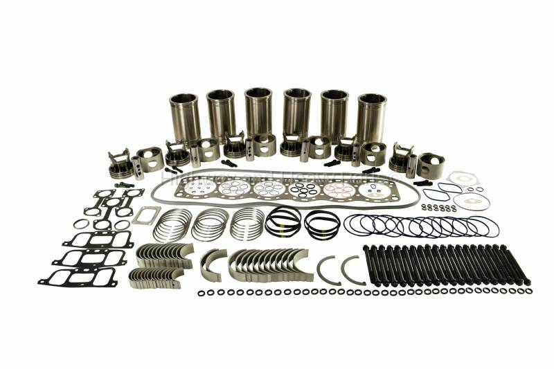
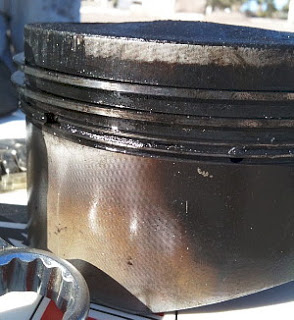
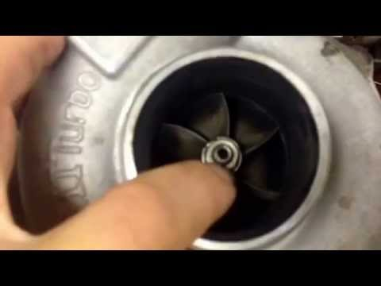

Your diesel engine is a work horse. It will go for a long time given the right maintenance has been done. I have seen motors with 2 million miles! So, knowing they can last a long time, what are some of the signs and symptoms that your engine is fixing to give up the ghost?

There are several signs and symptoms that your diesel engine is not going to last much longer. I have complied a list of 10 for you. Keep in mind that each symptom is evidence of a deeper problem and may not necessarily mean your diesel is done for. **_A complete diagnosis of the problem is needed to make an informed decision about your vehicle._**

## 1. Starting problems

When your truck is continually cranking and not starting up, this could be lots of things but, it can also be a sign of low-compression. Diesel engines rely on compression to start and run. It must have the proper combustion in order to run properly. **Diesel is all about the squeeze and achieving the right pressure to cause the explosion.** As your engine ages the component will wear and cause issues in the seal of the chamber. This means that a component in your combustion chamber is worn.

It could be a piston, rings, cylinder wall / liners, or valves. When this is the culprit, the problem will be worse after sitting or in colder or even hotter weather. If your diesel is not cranking up don’t jump to this conclusion! Do a proper diagnosis. After you have found that it is not any of the normal issues it is time to run compression test. Having issues starting? Check out this article I wrote on [Diesel starting issues](/the-complete-guide-to-starting-a-diesel-in-cold-weather/)

## 2. Blue Smoke

Blue smoke is no good. I wrote a full article will all the possible problems [Here](/the-causes-of-blue-smoke-from-a-diesel-and-what-to-look-for/). Blue smoke means that your engine is burning oil in some fashion. This is not necessarily from worn components, but this is a major one for older engines.

If you have found that the problem is not in the fuel system an engine component is malfunctioning. As the engine wears, you will see more and more constant blue smoke. The clearances over time just can’t be maintained on the cylinder walls and oil stays on the walls of the cylinder and the piston travels back down it leaves oil in the chamber and it gets burned along with the fuel.

Once again, a compression check is going to let you know where this problem is. If it is very old a complete in-frame may be needed.

## 3. Poor Fuel Economy

Diesel isn’t cheap! Spending a little extra at the pump these days? This may not just be a wallet problem. This could be sign of wear in the injectors or ring wear. If the injectors are worn out or malfunctioning, they need to repaired as soon as possible.

Leaking extra fuel into the chamber can cause all sorts of bad things to happen. When more fuel is added the balance is not achieved in the combustion chamber and the burn is not complete. That is when you see that extra fuel come out in the form of black smoke. When the rings are worn, they allow that extra fuel to slide down into the oil. You can see a misfire and/or a rough idle from this. These things can damage other components and possibly even cause a complete failure of the engine.

## 4. Loss of Engine Power

This is one people usually pick up on quickly. Something is usually said about the truck pulling a _greasy sting out of something_ 😆. Most will notice a change in the amount of power the vehicle has from take-off and how long it takes to get up to speed. Although, if you have been driving the vehicle for years this can sneak up on you.

Does your vehicle have the power it had when you first purchased it? Check out my [9-point checklist for diesel engines with low power](/9-point-checklist-for-diesel-engines-with-low-power) Over the years as the components wear you will lose some of that **get-up-and-go.** If you are looking at whether or not your engine is worn-out this one is important. As you lose compression and your turbo and related components wear down, you will see a significant drop in power.

## 5. Increased Oil Consumption

Making another pit-stop for oil top off? **Lookout!** Your engine might be on its way out. If you look around where you normally park and don’t see any signs of a leak and you looked around the engine and it is all dry it may be a compression issue. **_There are some ways that oil can escape through different components with no sign of leakage_** If your oil cooler goes out it will up the cooling system.

That being said, when an engine ages and all the parts wear down oil will begin to pass slowly being burned and escaping out of the exhaust. I have seen some so wore down that the exhaust drips with oil! Don’t be that guy. Keep an eye out when you have to add between oil changes.

## 6. Engine Noise

Do you remember how your diesel engine sounded when you drove it the first time? Has that [beautiful roaring](/why-diesels-are-so-noisey) been replaced with the sounds of beating and banging? Over time compression and combustion-timing issues can cause your engine to knock and make all sorts of unpleasant noises. There are really several places to look for the culprit of engine noise. **It is really depending on where the noise is coming from and what it sounds like.**

- Engine knocking can be caused by damaged liner seals, main bearing wear or a worn piston skirt.

- A clunking sound can be caused by main or rod bearing wear in older engines.

- You can get a different sound from leaking injectors that sounds like pinging.

- Over time the valve clearances lose their proper clearance so then you will have a tapping noise.

It is important to diagnose a unusual noise in your diesel quickly. Most of these issues are very severe and can cause major damage to other components as well. Keep an ear 👂out for something other than normal sounding operation.

## 7. Turbocharger System Failure

[All modern diesel engines have a turbocharger.](/do-all-diesels-have-turbos) That are a important part of the operation of the engine. You will definitely be able to tell if you’re having issues here.

Over time the turbo will wear down and the turbine itself will begin to _wobble_. This is not good considering it spins between 80,000 and 200,000 RPM. Even just a little wiggle over the allotted amount will cause a catastrophic failure. When the turbine fails it allows oil to pass into the intake cause instant thick black smoke.

Other issues from wear in the turbo system can include, clamps / hoses and the intercooler. When these wear down it causes leaks and will significantly diminish the value of the compressed air. All of these issues will cause a huge loss in power so that makes this easy to spot. Run a intercooler leak down test to check this and look for tighten those loose clamps.

During a usual inspection of the turbo you can remove the intake hose connected to the turbo and spin the turbine and see how much movement it has to the sides. There is a spec for this. You can tell if it has too much pretty easily.

## 8. Excessive Blow-by

That pipe sticking down under that truck is not meant for smoking. Well sort of. Some blow-by is normal for a diesel engine. This is because the combustion pressure when a diesel engine fires is just too great for the piston rings to hold completely.

That means that **some** exhaust makes it into the crankcase. When the blow-by is more than usual, it is a sign of bad things. It could mean that the pistons, rings, or cylinder walls are worn out and that is causing too much exhaust to get into the crankcase. A great way to test for this is to place the fill cap for the engine oil over the fill hole. See if there is enough pressure to blow it off the hole.

You will also see a ton of oil of the under carriage, transmission and other parts depending on the application. This is where the exhaust is carrying oil along for the ride. A compression check will be needed to find out where the problem is.

## 9. Rough Idle

At the stop light and you are just bouncing all over the place? Another sign of a worn-out diesel is a rough [idle](/8-idle-facts). There are several different types of rough idling.

- Hunting - This is when the engine is idling up and down in intervals. It is looking for something 🔍. It cannot find the proper amount of fuel and compression at the right time. It could be running on some oil from worn components. Getting that extra oil and causing a little higher rev and then calming back down.
- Just Rough – This can be from leaking injectors or poor timing. Fuel pump wear and several other things.
- Missing – Every round you just hear a slight hesitation. This can be caused by a malfunctioning injector. It also can be caused by improper valve and injector clearance.

## 10. Continues Running After You Turn It Off or “Run-away”

It is never good when you get up for work and the vehicle will not start. But what about when you get to work, and it won’t stop? Oh boy. Houston, we have a problem. This is known as [run-away](/run-away-diesels). It can be very dangerous. We have all heard it in movies the iconic sound of a diesel turning over a couple times after it is shut off.

**_Gas engines do this sometime also and it is called “dieseling”._** So, you’ve turned the key off, everything tuned off except your engine is still running. With diesel only needed compression to run, it doesn’t matter that you think you have the power with you little switch. So, just because you decided it was time to turn off to a worn-out engine this may just be an ignored request.

So, what gives? How can it do that? You shut the fuel off…. right? When your engine is worn down you may actually be giving it an alternative fuel. In case you missed it, diesels can run on oil.

Though no efficient or pleasant oil can be used for fuel. So, when you shut it off and you have worn out pistons, rings or other components allow an oil mist to pass into the combustion chamber the engine can run on this until it runs out. The turbocharger can also cause this when it fails.

It will allow oil to pass through the intake into the combustion chamber and give it plenty of fuel to run until it explodes. **Be very careful with a run-away diesel!** If the engine does not turn a couple rounds and shut off you are in big trouble. You have a couple options.

1. Trough it in gear. If you have a manual you have this option. Been there. If it is safe and no one is around. You can trough it into a low gear and pop the clutch and load can shut the engine down.
2. Cover the intake. Stop the engine from being able to breath. Cut off the air and it will shut down. Be careful here. Don’t let it suck a bunch of shop rags up.
3. Drain all the oil out. Take the fuel away. Not sure I would recommend this option. Although it would work, I am not sure I’m breaking out the creeper when a truck is running like crazy.
4. Run-away. Take cover. Don’t get hurt. It is not worth it. If you feel like you’re going to be in danger get out of there.

## Summing up

It is important that you don’t jump to conclusions about your engine. Even with a bunch of miles diesels can keep operating great. Take care of your diesel and you will see many years and miles of use. Remember that this list is just things that can tell you that your engine is wore out. Just because you have one of these problems doesn’t mean it is no good. Do a proper diagnosis. The wonderful part about diesels is that they are reparable. Even if you have to do an entire engine overhaul it is a good investment. A lot will depend on the vehicle or application it is used but, for the most part you can get your monies worth from a good diesel engine. So, get out there and fix what’s wrong and get that thing blowing smoke!

## Want to get your ASE but Hate reading? 📕

You can actually listen the study guides now with [Audible](https://amzn.to/2K3v96s) Click [Here](https://amzn.to/2K3v96s) listen to the study guide for free! Curtesy of Amazon. You can literally sign up, study, pass and then cancel before the free trial ends.

Here is a link to the [ASE Audio Study Guide Audible Audible Audiobook](https://amzn.to/32EcKDy) if you already have an Audible account.

Updated: 11-12-2020
