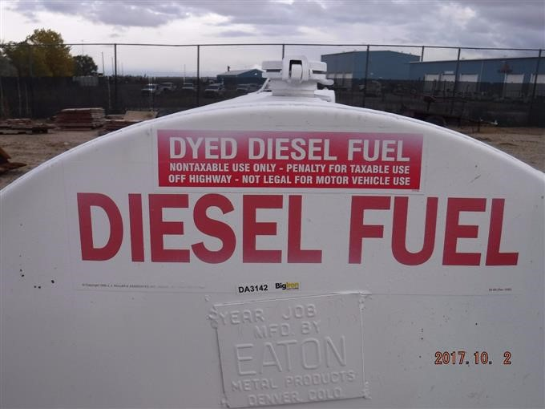
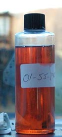
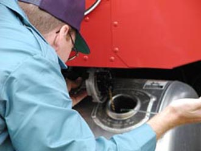

So, you filled your tank with dyed diesel. Now you’re wondering if it can hurt your new diesel engine. If you haven’t accidentally used dyed diesel then you are staring at that price wondering why you just can’t use it. At one place I worked the fuel company had a mix up and they filled a 10,000-gallon tank full of beautiful red dyed diesel. So, what gives? Is it a problem?

Is dyed diesel the same as regular diesel? **Dyed diesel is identical to regular diesel except that it is dyed. The dye is placed in diesel meant for off-road applications so that an inspector can easily tell the difference. Dyed or red diesel is not taxed. Using dyed diesel in over the road vehicles is penalized by a fine of \$10 a gallon or 1000 per violation (whichever is greater) in most states.**

**_Note: In this article you will notice that there are several terms for dyed diesel. Dyed, off-road, non-taxed, and red diesel. I use these interchangeably and hope that doesn’t cause any confusion._**

## Why have diesel just for off-road applications?

Taxes. There is nothing more certain than taxes. The federal highway administration has the laws for each specific state on [this page](https://www.fhwa.dot.gov/motorfuel/sales_taxes_exemptions.htm). The dyed fuel is meant for use in off-road applications like farming, generators, construction equipment and things of that nature. The tax-exempt fuel is meant to ease the tax burden on those working and using diesel equipment off of the road. Since the intent of the tax is to help pay for road maintenance, the tax is lifted from vehicles and equipment not using them.

The federal government decided that famers should not be paying taxes for roads they are not using. Especially since the tractors and other equipment rarely use the roads. So, off-road fuel was separated, and the tax was lifted from those using it for that reason.

Enter “fuel laundering”. A term dubbed by the government for people buying up large amounts of un-taxed fuel and reselling it for a profit. This became a big enough problem so that the congress had to get involved. In 1994 congress passed 26 C.F.R. 48.4082-1](<https://www.govinfo.gov/>) mandating the use of red dyes for tax-exempt diesel fuels including kerosene. They required that the dye be very highly concentrated to make it easy for federal and state regulators to spot it in an inspection.

Out of those decisions was born our current situation. We have dyed diesel available to used widely but no for on road applications. So, we must deal with this temptation for the foreseeable future.

## Dyed diesel color

Dyed diesel is also called “red” diesel because of the distinct color it is mandated to be dyed by the government. It is a special dye called Solvent Red 26 or Solvent Red 164. This gives it that iconic red color that you see. It is also put in at a very high concentration so that it is easy to spot and shows through regular diesel.

## Will red diesel dye my fuel tank (Or any other fuel components)

One thing people worry about is whether or not the DOT or other enforcement agency can detect dye even if you are no longer using it or it was long ago. Do you need to clean it? Is there anything you can do?

So, if you have run some off-road through you fuel system there will be trace amounts left behind. Usually this is most noticeable in the fuel filter. The filter will become stained red after a good amount of dyed fuel passes through it.

So, after you change your filter there is not really much else to worry about. Just keep running regular fuel. After several tanks the trace amounts of dye will be gone. Even if you have clear lines and notice a slight tint to them don’t worry! They are not looking for past use presence when you get inspected. They are more interested in the current tank and what in it.

Please don’t think you can split it. Don’t try to put a couple gallons of dyed with you regular to save a buck. The dyed fuel is so concentrated it will show through the regular. Even if it really diluted it will still be visible. The inspector will also at times use a test strip that will indicate a tiny amount of dyed fuel. Like even 1 gallon in a hundred-gallon tank. Don’t chance it. It’s not that much money! Sometimes we just have to pay the taxes.

## What is the fine for using dyed diesel on the road

Using dyed diesel in over the road vehicles is penalized by a fine of \$10 a gallon or 1000 per violation (whichever is greater) in all states but Alaska. (There are some special rules in Alaska regarding dyed fuel see those at [Alaska.gov](https://dec.alaska.gov/air/anpms/ultra-low-sulfur-diesel)

**So, if you are caught with 30 gallons of dyed diesel in you tank illegally, you will pay a fine of \$1,000.**

If you have two tanks. You guessed it. Double the fine. $2000 unless the amount of $10 a gallon overcomes \$2,000.

If you are a repeat offender, each repeated fine will increase by \$1,000 compared to previous violation. The total amount of penalty will depend on the total number of violations.
.
A person may be charged with a **Class 6 felony** for intentionally using dyed diesel for a taxable use. 😮 Unless the total amount used is under 20 gallons. I don’t think they normally enforce this but, I wouldn’t push it.

A person who attempts to alter the strength or composition of any dye or dye marker in any dyed diesel fuel may be charged with a Class 6 felony. Don’t mess with it. This is meant to deter those pesky “fuel launderers”. **_Say launderers 3 times fast_**.

Inspectors will often be found at weigh stations, safety stations, agricultural shows, truck stops and other places where large amounts of commercial vehicles are found. They have been known to dip tanks in entire parking lots.

Thinking of refusing to be inspected? You will be meet with an automatic \$5,000 dollar fine. It would be better to just take the regular fine if you have less than 500 gallons. Keep this in mind if you are ever in this situation.
Bottom line stay away from using it unless you have a legal reason. Never sell off-road for any reason! This could result in jail time. 👮‍♂️

## Will using dyed fuel void my warranty?

This is not a strait forward answer. My advice is to not risk it. The dealer is looking for a way out of paying for your repair and if they can find it, they will. That being said, it should not void your warranty. After all, dyed/red diesel is still **Ultra Low Sulfur Diesel** (ULSD). There used to be an issue here before 2006 when off-road diesel was mixed in meeting the standards for ULSD but that is no longer the case. Today **no matter whether you get regular or dyed fuel it is ULSD.**

The reason I would say that it shouldn’t be an issue is, there are times especially in an emergency when you may need to run off-road diesel. During hurricanes it is common practice for the governor to allow off-road to be used due to a shortage. A dealer would have a tough time arguing that.

Remember that the dealer does not always reflect the views of the original manufacturer. Since the manufacturer is paying for the warranty repair you may have to take it up with them if you are fighting this fight. The dealership is not your friend when you want something for free. So be careful. If you have a brand-new truck don’t even chance it. Stay away from the red fuel.

Any person who refuses to allow an inspection or collection of a fuel sample is subject to a \$5,000 penalty for each refusal.

## Can you mix red diesel with normal diesel?

As mentioned earlier in the article, there is no chemical difference between dyed and regular diesel fuel. They can be mixed and used just the same. Today they are both ULSD so if the equipment you are wanting to run uses dyed diesel normally it can use regular.

Remember not to mix dyed fuel with your on-road diesel if the vehicle is intended for the highway as even a small amount of dyed fuel can be detected by inspectors.

## Do you need a license to buy dyed/off-road diesel?

No, there is no special licensing needed for the use or buy off-road diesel. The use just needs to be for an off-road application. The seller or station that the fuel comes from is not supposed to sell it knowing it is intended to be used for on-road vehicles or they can get into legal trouble as well.

## How much cheaper is dyed/off-road diesel

It varies by state. Since dyed diesel is just regular diesel with a dye the price is the only real difference. The only difference in the price is the exclusion of tax. So it really depends on how much [your state tax is](https://en.wikipedia.org/wiki/Fuel_taxes_in_the_United_States)

- They vary greatly from 12 cents to 67 cents.
- The one constant will be the federal 24.4 cents per gallon.

So, the price will be whatever the current market price is less these taxes. It can be purchased at most large fueling stations or at farm suppliers. If you have done the math you will realize that over time this could be a huge amount of money but, it is hardly worth the fines and hassle if caught. In case you are wondering California is the state with 67 cent tax 🤑.

## Can you drive on the public roads using dyed diesel?

No, dyed diesel is meant to be used off-road. This defeats the purpose of selling it without the road tax. However, there is a few exceptions to the rule. Tractor and other off-road equipment can be used on the road with dyed diesel but, the vehicle in most cases is supposed to be within 25 miles of the registered address of the vehicle. This provides farmers a way to access land that is not directly attached to them. There are other exemptions for farmers in the event of bad weather depending on the state.

Also, as mentioned earlier, during emergencies like a hurricane dyed diesel is sometimes made available to everyone to combat fuel shortages. So those who are evacuating can get the fuel they need to get out of town. We seen this recently in Florida when then governor Rick Scott lifted all taxes on fuel and made dyed diesel lawful to use while in the state of emergency.

## Heating applications

Dyed diesel and kerosene are also used for a heating fuel. This distinction allows for residence to buy the fuel to heat their homes without paying a highway tax. Diesel is a great option for temporary or emergency heat as it is readily available, and the heaters are reasonably priced.

## Summing up

So, if you accidentally used some off-road diesel no big deal. Just don’t make a habit of it. The fine is just not worth the savings. Always be careful and make sure you are putting in the intended diesel when fueling at a station you are not familiar with. Stick to the green stuff and stay away from the red for your on-road vehicle. By staying with on-road you will ensure that you stay on the right side of the law.
