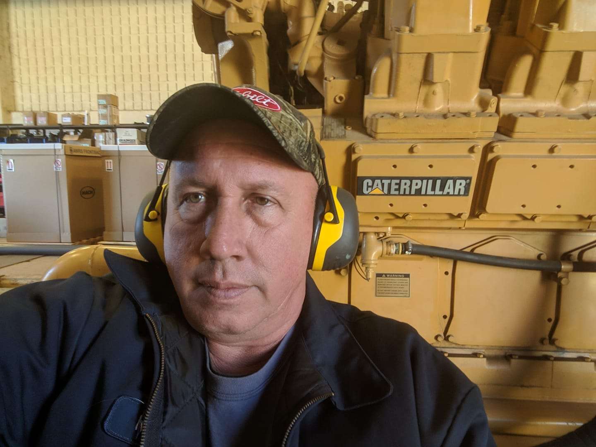
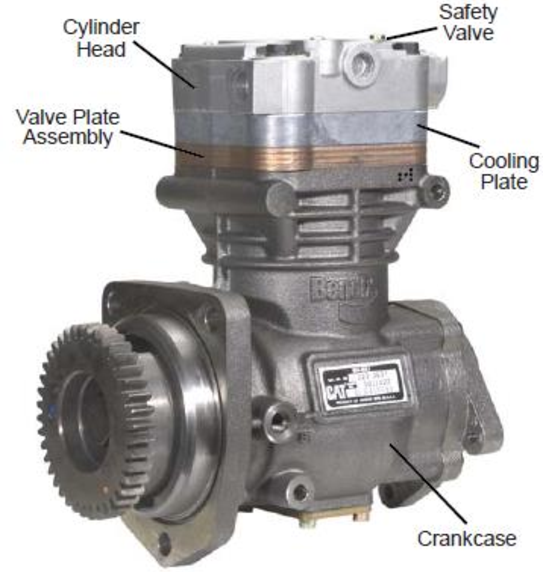
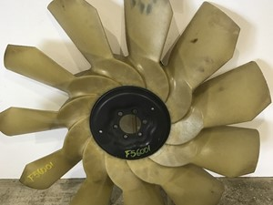

I owe a lot of my hearing loss to loud music, but I will also attribute some to the insanely loud engines I have worked around for years. Today we're going to be talking about a subject that is just deafening 👂 in the diesel community. (Sorry, I am a dad, so it comes naturally.) There are a lot of people who ask, why are diesels so noisy in comparison to gasoline engines. If you are a mechanic, you wonder the same thing when after you shut down the engine your ears ring for the next 5 minutes.

Why are diesel engines so noisy? **Seven reasons diesel engines are loud are: 1. High Compression 2. The Overhead 3. Air Compressor 4. Gear Timing 5. Turbocharger System 6. Diesel Engine Fan 7. Engine brakes.**

Let’s look at this list of 7 reasons diesel engines are so dang loud.

## 1. Diesel Engines Have A High Compression

Let’s start with the basics. One of the biggest reasons that diesel engines are so loud is that they have such a high compression ratio. As you may know, diesel engines rely completely on compression to ignite the fuel. That means that the ignition of the fuel and all the power generated is done completely by the squeeze of the piston.

Where a gasoline engine might have a **10:1 compression ratio**, diesel has a much higher compression ratio of 15 to 18:1. With this Great amount of pressure comes an explosion that generates a lot more noise. If you have ever heard a diesel with the exhaust manifold removed, you know that the noise generated is far beyond what most other motors types produce.

Diesel engines make that iconic sound because there is an almost chaotic **compression that causes the diesel fuel to ignite.** It is not as measured or as exact as a gasoline motor with spark and timing.

You will especially hear louder noises when the engine is cold in the cylinders are not as warm. This is because they are not adequately warm to burn the fuel completely. The engine needs the cylinder walls to warm up and generate heat in order to get to the temperature needed to run efficiently.

## 2. The Overhead On A Diesel Engine Is Heavy and Bulky

The overhead is exactly that. It is the things over the cylinder head. So, the valves, rockers, injectors, push-rods, etc. are all over the head. The valvetrain, cam-rollers, rockers, and injectors on a diesel engine are also going to produce more noise than that of a gasoline engine.

Lifters and valve adjustments on a diesel are normally very heavy duty and are set to a certain gap. The intake, exhaust, and injector will all have a gap setting as with some older gasoline vehicles. **These heavy-duty valves rocker arms and in the overhead cause a much louder sound when the engine is running.**

This is due to the sheer weight of the components, the gap left for clearance and the massive amount of compression these components are holding back.

## 3. The Engine Mounted Air Compressor

Most diesel engines if equipped with air brakes also has an air compressor. The compressor runs on the gearing of the front cover in most applications and is really just a small motor in itself. Complete with a head and valves really the whole works. When the system needs air, the compressor is engaged and runs until the system is satisfied. Then it will disengage and wait until called again.

This adds more noise to the engine itself and the surrounding area. Whenever the compressor is running it will be a noticeable clatter usually on the left side of the vehicle.

## 4. Gear Timing on the diesel

Most diesels are mechanically timed. Meaning that the gearing meshes together so that the crank, cam, and other components run at the correct time. The cam rolls lifting or closing the appropriate valves at just the right time.

This mesh of the gears is usually happening in the front cover or rear of the engine. These large gears produce way more noise than that of a belt-driven engine.

## 5. Turbocharger System

So, you are cruising down the freeway it is a beautiful day and you have the windows downwind blowing in your hair. You start to make your way up a hill and you come upon a semi you notice before you even get there just how loud it is. On the highway and if you are on their passenger side you will notice that there is a screaming loud noise whistling next to your head.

In case you were not aware most diesels have turbochargers. A turbocharger is a kind of like a tiny jet engine. It is a housing that has a turbine in it that uses that high compression to spin at up to and **beyond 100,000 RPMs.** This crazy amount of speed plus the sound of the compressed air moving into the intercooler all make your diesel even louder.

## 6. Diesel Engine Fan

Probably the loudest thing in the engine bay is the **engine cooling fan.** There are many different applications but for the most part, the engine cooling fan is in the front of the engine and shrouded to the radiator in order to pull air across it and cool the coolant.

If equipped, it also engages for the air conditioning with the head pressure rises and needs the temp brought down. The noise difference between running and when the fan engages is very different. The engine fan adds a huge amount of noise and can make being right next to the engine unbearable.

## 7. Jake brake -engine brake – exhaust brake noise

The Jake brake or exhaust brake is yet another reason that diesel engines are so noisy. **Not all diesel engines are equipped with an engine brake** but the ones that are you can tell the difference. The engine exhaust brake sits on top of the valve train and operates the exhaust valves opening and shutting them to cause the engine to retard and slow the vehicle down.

Most of the time these are placed on trucks that travel in mountainous areas. So, when they are going downhill, they don’t have to smoke their brakes trying to stay at a reasonable speed. You have probably seen a sign in a town that said, **“engine brakes prohibited.”** That’s because they are very loud.

The sound from a running engine brake is a super loud gug-gug-gug-gug-gug. The engine brake can be switched on or off from the cab so the truckers can comply with local ordinances.

## Newer diesel engines

I would like to note that today’s diesels are substantially quieter than those from the past. A brand-new diesel built today is very quiet compared to one bought 10 years ago. But diesels are generally louder than gasoline engines.

The reason for this is they have **staged injection.** This means that the fuel pulse broke up into stages with the pilot, combustion, and post-combustion injector pulses. This dramatically reduces the noise. Older diesel burns all the fuel at once. This staging made a major difference in the noise level of diesels.

## Summing up

The noise of a diesel engine is music to the ears of those who love the trade and an annoying deafening blast to those who aren’t. I hope this helps you understand why diesels are so noisy and answer some of those related questions. Check out some of the other articles for more useful information and remember always wear hearing protection!
