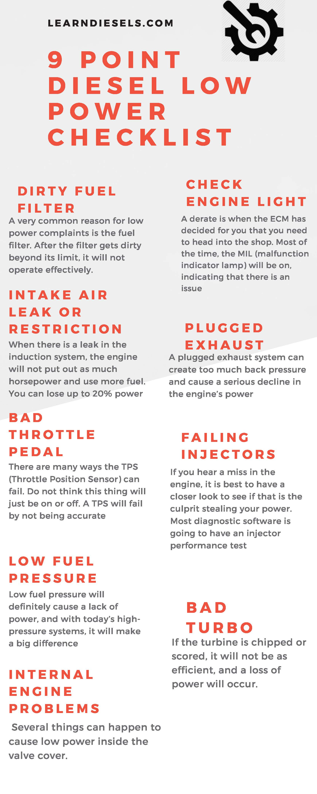

So, your diesel engine has low power. She doesn’t climb the hills like she used to. I have seen this a lot throughout my years as a mechanic when the driver comes in hot because his truck barely made it up a big hill.

This is a common problem with really many different causes **depending on the symptoms**. You might also say it is not pulling under a load. However you describe it, loss of power in an over the road truck or a piece of equipment can be dangerous or even fatal depending on the circumstances.

What causes a diesel engine to lose power? I have found in my years as a heavy equipment mechanic that these 9 things are the most common reasons, **1. Dirty fuel filter 2. Check engine light 3. Intake air leak or restriction 4. Plugged exhaust 5. Malfunctioning throttle pedal 6. Failing injectors 7. Low fuel pressure 8. Malfunctioning Turbo 9. Internal engine problems.**

## 1. Your Diesel Engine Has A Dirty Fuel Filter

A very common reason for low power complaints is the **fuel filter.** After the filter gets dirty beyond its limit, it will not operate effectively. Once it is clogged, it is going to cause you problems.

It is a good idea **with any power complaint to go ahead and change the fuel filters.** You never know what it has got into from the fuel. The tank could have had some water in it or trash stirred up by something hitting the tank. There are all sorts of ways for trash and water to get in, and that is why you have the filters in the first place.

Most diesel engines will have a primary and a secondary filter. I recommend always changing both together. You may be tempted to change just the secondary since it is easier to get to, but it is better to do both, especially when there has been a complaint about power. If that fixes the problem, you should empty the filters and see what was causing the issues. You may need to drain the tank if there is a substantial amount of water or trash in it.

## 2. Your Diesel Engine Has Check engine light

You might be thinking, well, duh! 🙄 Well, read on before you judge. A check engine light indicates that there is an issue with the systems or sensors on your system. If it is on, start here and see why.

As you will see in this article, some problems will not have a check engine. If you have one, that is great news. Determine what it is using your diagnostic software, and then move on.

In case you were not aware, trucks today are equipped with many safety features. Of those features, some are used to protect the engine from damage. In an attempt to do that, newer vehicles have what’s called a **derate**.

A **derate** is when the ECM has decided for you that you need to head into the shop. Most of the time, the MIL (malfunction indicator lamp) will be on, indicating that there is an issue. If this is the case, head on in and see what code is causing the issue.

This is one of the more important checks because even if you are not in derate, a check engine light could indicate that you have another issue causing your power woes. Think about it; you could have a missing injector or stuck turbo actuator. The scenarios are endless. If that lamp is on, this is the best place to start.

## 3. Your Diesel Engine Has Intake air leak or restriction

The next great place to look if your check engine light is not on is the intake air system. In most diesels, there is a turbo, and it is sending compressed air to the engine, creating a boost and giving it that much-needed power.

This air is cooled before it is introduced to the engine, known as the CAC (Charge Air Cooler). It makes sure the engine can perform correctly and with the best efficiency. The CAC is critical in the fight against your engine's worst enemy. **Heat**

When there is a leak in the induction system, the engine will not put out as much horsepower and use more fuel. **You can lose up to 20% power and lose a ½ mile per gallon.**

- **You need to start at the turbo clamps.**

If you are working on a vehicle, you have a lot of vibration, and the clamps will loosen up over time. It is best to find the torque spec for these and check them all. Make sure they are also lined up correctly. Sometimes when they are going back on, they don’t want to fall into place. Clamps will be the culprit of leaks more often than not.

- **Leak down test**

If you are familiar with a CAC leak-down test, you know this is a great way to find leaks in the intercooler itself. This requires a special adapter to charge the intercooler with compressed air.

When you charge the intercooler, the specific amount is given by the manufacture. At that given PSI, you can then allow it to sit for about 30-45 minutes to see if there is a decrease in pressure over that time.

- **Hoses**

Carefully look at all the hoses. Look for any signs of rubbing or chaffing. A lot of times, they can develop pinholes over time. If there is a silicone hose, check to see it is not collapsing when the engine is running.

You can also have a restriction causing that lack of power. If your air filter is clogged or dirty or you have some sort of obstruction in the air intake system, your engine will not be able to breathe and cause a dramatic amount of power to be lost. Make sure there is nothing on the filter, and it is not soiled to the point of clogging.

## 4. Your Diesel Engine Has Plugged exhaust

This is an often-overlooked issue. A plugged exhaust system can create too much back pressure and cause a serious decline in the engine's power. There is an amount of time-based on the manufacture of the muffler to which it should be replaced. If it is ancient, you should think about replacing it. Some signs your muffler or DPF (Diesel Particulate Filter) are clogged are:

- Engine runs ruff
- Bad smell from exhaust
- Condensation from exhaust
- Strange noise from the exhaust

## 5. Your Diesel Engine Has Malfunctioning throttle pedal

Another problem you could have if you are experiencing low power is a malfunctioning throttle pedal. You may think I should have included this in the **_check engine light_** section, but I have seen an electronic throttle pedal often has problems and does not throw a code.

There are many ways the TPS (Throttle Position Sensor) can fail. Do not think this thing will just be **on** or **off**. A TPS will fail by not being accurate, have a dead area in the pedal, bouncing readings, and the hardware itself broken or sticking.

It is best to hook up to the manufactures diagnostic software and look at the TPS operation. I know Cummins Insite has a test you can run, and you can look at it manually. You can move the pedal and see if the software displays the correct percentage. If you have the pedal 50% depressed, the software should indicate that within reason.

## 6. Your Diesel Engine Has Failing injectors

If you have an injector that is not operating correctly, you will have a loss of power. Injector issues do no always throw engine codes. I have seen several times in my career an engine how 1 or even more bad injectors and never turn on the check engine light.

If you hear a **_miss_** in the engine, it is best to have a closer look to see if that is the culprit stealing your power. Most diagnostic software is going to have an injector performance test or diagnostic test. You should run the test on all injectors to single out the issue. Don’t stop when you see one that is out of spec. Keep the test up to the end to make sure that you don’t have more than one failing injector.

It is not unusual to have more than one bad injector. Depending on the vehicle or equipment’s age and maintenance history, I would recommend replacing all 6 if you have issues. You can also have those sent out for testing and even to be rebuilt.

## 7. Your Diesel Engine Has Low fuel pressure

Another place to look at the fuel pressure the engine has. Low fuel pressure will definitely cause a lack of power, and with today’s high-pressure systems, you can definitely have some trouble here.

You should check all the lines in your fuel system. Make sure the lines are tight and not leaking. Any air introduced to the system will significantly reduce your power. With the newer high-pressure systems, even a little looseness cause them to suck air in.

In a lot of diesel engines, this is known as a [**_common rail_**](https://www.cummins.com/components/electronics-fuel-systems/fuel-systems/common-rail-systems). In these systems, the injectors are fueled by individual lines. The system also has a relief valve to protect the system from having excessive pressure. These pressures can be as high as 30,000 PSI! The ECM controls the pressure based on information from several sensors in the system. Bad information for even one can cause all sorts of problems, including low power.

There is also a type of injection called HEUI (hydraulic electronic unit injector). This was a technology invented by Cat. This is the system used in the 7.3L and 6.0L Power Stroke diesel engines. These came with a high-pressure oil pump that will cause an array of problems, including low power, when you have issues. There are many other types of injectors, and they will all have their own set of issues.

If your engine is starved for fuel, a couple of other things to check for are

- **Porous fuel lines** – the braided fuel line soften over time will start to allow air into fuel and cause all sorts of issues.
- **Weak lift pump** – This can cause low power and intermittent hesitations. Even if it sounds fine! It is hard to measure in some applications, but I have seen this on many engines.

## 8. Your Diesel Engine Has Malfunctioning Turbo

The turbo can have issues and cause substantial power loss. Regular inspection of the turbine inside is needed. If any trash enters the turbo, the damage can be catastrophic. If the turbine is **chipped or scored,** it will not be as efficient, and a loss of power will occur.

With today’s emissions systems, we have turbo actuators and VGT (variable geometry turbocharger). Any issues with these systems can cause low power and perhaps derate. I hope to see a stored engine code with these, but a visual inspection is always recommended.

Several diagnostic tests can be run on the turbo and actuator. If you at all suspect the issue is here, run the tests and regroup.

## 9. Your Diesel Engine Has Internal engine problems

The last place I want the problem to happen would be in the internal engine. Problems can be difficult and expensive to fix, but several things can happen to cause low power inside the valve cover.

- Broken rocker
- Poorly adjusted valves or injectors
- Bent/broken pushrods
- Bad valves
- Worn rings/cylinder/liners
- Compromised head or head gasket
- Failed lifter
- Engine brakes malfunction
- Bad cam roller
- Damaged camshaft
- Engine timing misaligned

## Note: You may have more than one problem

If you found an issue and fixed it, and when you got back out on the road, and it still didn’t have the power it needed, you may need to get back in there and go back to diagnostics. It is very common in my experience to have more than one issue causing low power. Do not be surprised if you find a loose clamp **and** a missing injector. Often, a smaller issue won’t be noticed until a domino effect happens, and **two or even three** things happen, affecting your power from the engine. Keep this in mind when you are diagnosing the problem with your engine.

