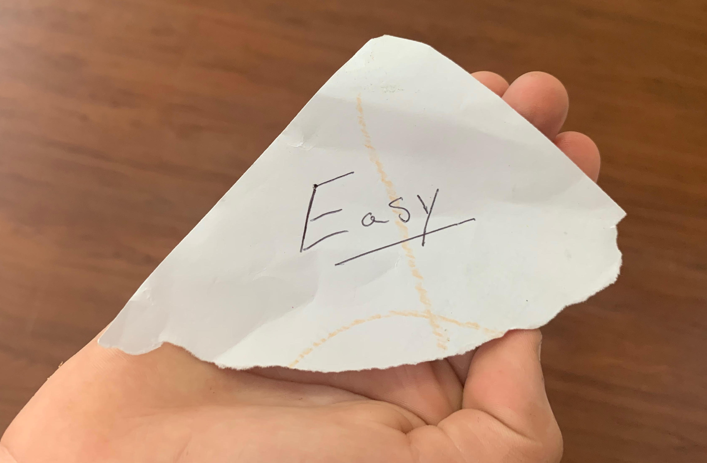

This is a great question. Some people would accuse you of being lazy, but the truth is you need to start somewhere and having a couple of wins early on will give you the encouragement you need to keep going and trying until you get that master! Even if you work for a place that pays for a couple they are great to have and make you more likely to land a better wrenching gig.  

What is the easiest ASE test? **T4/A4: brakes, P1: Heavy Truck Parts Specialist or T7/A7: Heating, Ventilation & Air Conditioning are the easiest tests to pass. They have the highest amount of common sense questions compared to the others.**

ASE tests are no walk in the park overall and you need a good understanding of the ones I have mentioned, but in **my opinion** and of others I have talked with, these tests were the easiest to pass. Let’s have a look at these tests and let me show you why I choose these particular tests.

##T4 or A5: Brakes 

With 45 questions the A5 brakes and 50 questions on T4 these tests come in at my number 1 spot. I really lean toward A4 being the easiest test overall. If you have been around cars which if you are taking an ASE test there is a good chance, then you should be fairly familiar with hydraulic brake systems. Even if you primarily work on air-brakes you still should a decent amount of knowledge about them. Expect questions about the proportioning valve and brake balance. Also, expect questions about calipers and other normal brake components and their functions.

Truck brakes is fairly simple as well if you have done a lot of brake work which is typical for a new guy to most of the brake jobs. They ask simple and mostly straightforward questions. Expect questions usual for air brake and larger hydraulic systems. Read up on brake booster issues, Quick release valves, anti-compounding valve, abs modulators, tractor protection valve and other typical parts in an air brake system. 

###Sample question

A rear wheel drive car is pulling to left when the brakes are applied. Technician A says that the left front brake lines could be restricted. Technician B says you can replace a broken brake line with copper tubing. Who is correct?

- A. Technician A
- B. Technician B
- C. Both A and B
- D. Neither A or B

----

-	**Answer A is correct.** When a brake line is restricted usually there is enough pressure to push past the blockage and apply the brake. After applying the brake, the fluid may not be able to return causing the brake to stick on.

-	Answer B is wrong. You cannot use any other brake line then the one required by the vehicle manufacturer. You should never use copper for brake lines. 

-	Answer C is wrong. Technician A is correct.

-	Answer D is wrong. Technician A is correct.

Here is a link to the study guide for brakes on Amazon -[T4 Brakes guide](https://amzn.to/2N98qF0)- Everyone is different though so you may have more success on another test. This is all the guides, [ASE study guide Bundle](https://amzn.to/32ayKDc) for some help getting started.

 

##P1 – Medium-Heavy Truck Parts Specialist 
 The next test on my short list is the parts specialist. With 70 scored questions, this is a longer than usual ASE test. With that said, a lot of these questions are based on customer service and part systems. This is not a really complicated subject.

If you are in the field and deal with a parts desk or ordering at all this one should not be bad at all. But, depending on what is required for the job you are looking for the test could be useless. Most shops if you are looking to be a mechanic would not consider this test a valid ASE that would apply towards a raise or promotion. 

That being said, if your goal is just to be certified you could take a stab and this one and likely pass. 

###Sample question

You are gathering information about a customer’s fleet. Which of these would not be an important piece of information? 

-	A: Chassis serial numbers 

-	B: List a vehicles by make and model. 

-	C: Number of drivers in their fleet. 

-	D: Location of their maintenance Shop.

____

-	Answer A is wrong. This would be important information.

-	Answer B is wrong. This would be important information. 

-	**Answer C is Correct.  The number of drivers that a shop has would be irreverent when taking parts orders**

-	Answer D is wrong. This would be important information. 

##T7 or A7 – Heating, Ventilation & Air Conditioning (HVAC)
Air conditioning is another test I believe to be a little on the easier side. This test will include 50 questions and will include an array of questions ranging from pressures to temperature. If you have a solid understanding about the fundamentals of HVAC, you should not struggle with this one. 

[T8 AC guide on Amazon](https://amzn.to/34q2wVW).

It is a good idea to go over the principles and correct readings before diving into this one. You should know how expansion valves and orifice tubes work as well as what an evaporator and condenser do. Have the fundamentals nailed down and you will ace this test. 

###Sample question

A technician is recovering refrigerant. The type of refrigerant is the vehicle is unknown. The technician should:

-	A: Recover it and recycle it as R-12
 
-	B: Recover it and recycle it as R-134a

-	 C: Discharge it into the atmosphere

-	D: Recover it and treat it as contaminated 

----

-	**Answer A is wrong. If the refrigerant was not R-12 you would not want to mix it. This could be dangerous and would contaminate the good known refrigerant you have. 

-	Answer B is wrong. If the refrigerant was not R-134A you would not want to mix it. This could be dangerous and would contaminate the good known refrigerant you have.  

-	Answer C is wrong. This is illegal and can be enforced with a fine or jail time. 

-	**Answer D is correct. Anytime you are dealing with an unknown refrigerant you should treat it as if it is not reusable or contaminated.**
 
***Note: remember you need two years of verifiable experience before you are eligible to sit for an ASE exam. You can create a [MyASE account to get started (Link to ase.com)](https://www.ase.com/Tests/ASE-Certification-Tests/Register-Now.aspx)***

##Summing up
Technician A and technician B are **dumb**, and I hope to never meet them. I am frankly sick of dealing with their arguments. The worst part about these types of questions is you can get it incorrect even if you are it half right. I tech A is right, and you say both you get that question 100 percent wrong. So, read very carefully and look for tricks in the way they work questions. A lot of people would say ASE is just as much about your knowledge as it is about your test taking abilities. Good luck!

