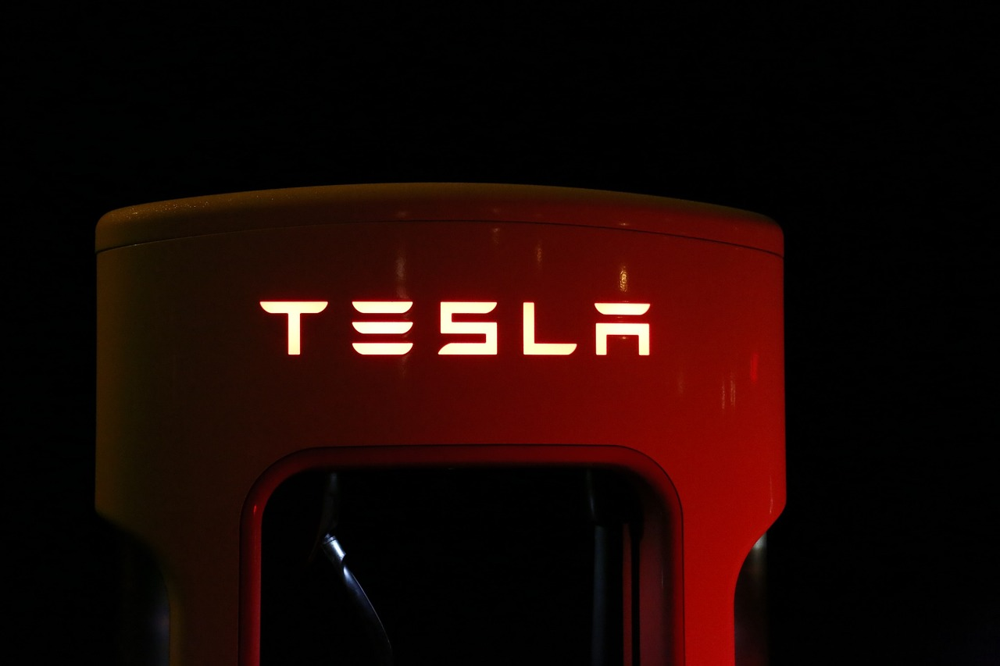

This is an important topic these days. Anyone considering becoming a diesel mechanic or even buying a diesel vehicle or equipment right now is asking, how much longer they will be around. With the rise of electric cars and growing concern for our environment is it smart to invest or bank a career on the diesel industry?

Will diesels be phased out? **While some countries have proposed bans on various types of vehicles in cities, diesels at this time are not in jeopardy. Diesels are actually being utilized more now than ever due to their many advantages and flexibility. Diesel engines have a long future ahead and will remain in use for many years to come**

That is a bold statement! Maybe even a little controversial. Give me chance to show you why I believe that this industry is here to stay.

## Are diesels being phased out

While all the advancements today in transportation this seems like a legitimate fear but, with the sheer size of the diesel market and their flexibility it is very unlikely that we even see the end of diesel engines in the next 50 years.

There are so many diesels out there and so many applications they are used in being bought daily by massive corporations. The reason for this is the no other technology is even close to meeting the needs that diesel engines provide to the market at large. Much less prepared to meet the slew of government regulations that they will inevitably have to face.

Let me give you a list **3 reasons why** it is very unlikely that diesels are going anywhere in our lifetime.

### 1. The size of the market

When you think of diesel engines you often picture a big rig blowing black smoke headed down the highway, but that is not the only application for diesel engines in our modern world.

- **Commercial and personal use vehicles** 🚗/🚚

Of course, diesels are used very widely all over the world in shipping and hauling industries. This has seen no signs of slowing and the diesel engine continues to be the engine of choice for most heavy-duty applications. Companies like BMW and Volkswagen are also heavily invested in diesel for luxury cars. This is not included the many auto makers in Europe and abroad that feature diesels.

In an article about the future of diesels on Forbes it said, **_“Diesels are used in commercial applications – trucking, construction, shipping, farming, buses and more – on a massive scale and there is no feasible alternative available now or on the horizon.“_** ([source](https://www.forbes.com/sites/johnmccormick/2018/05/30/are-diesel-vehicles-on-their-deathbeds-or-still-kicking/#553ef904426d))

It is just not possible to cut all diesels out of our world in the foreseen future. They are going to be hanging around for a long time to come and **That’s not a bad thing**. Diesel engines are great, versatile and do a lot of what the game changers are trying to accomplish anyway.

- **Construction and Farming Equipment** 🚜

Diesel engines are also exclusively used in heavy-duty and a majority of lighter duty equipment. Excavators, tractor, dump trucks, front end loaders, [Farming equipment](12-maintenance-musts-for-farm-equipment/) bull dozers, graters, mining equipment, and other specialized equipment all rely on diesel engines for their power generation.

Companies like John Deere, Komatsu, Osh-gosh and Caterpillar are all manufactures, and users of diesel engines and they continue to make advancements in the industry,

- **Power generation** 🔌

Another huge market for diesels that is little thought of is the power generation arena. Millions of building and public services are backed up in case of a power outage by **diesel engines.** These generators are everywhere hidden right before our eyes all over our society.

The emergency stand-by generators can be found in hospitals, buildings with elevators, municipal services such as lift pumps, sewage and police and fire departments.

Without these necessary generators we would be in some big trouble when the lights go out. We can thank the huge number of generators next time the power goes out while you’re in an elevator.

- **Ships and Trains** 🛳️/🚆

Another couple of areas diesel engines are employed are ships and trains. Large ships like cruise ships and container ships are powered by massive diesel engines. They have to have such a large amount of power to move that nothing, but the diesel can get the job done.

Similarly Trains also use diesels though no in the same way. Most modern locomotives use diesel for power generation. Meaning they have large diesel generators on them.

So next time you book that cruise or you get a toy from a happy meal think about all the diesel engines that had to run to get it to you and you will have an idea of the massive dependence we have on the diesel industry.

### 2. The flexibility of the diesel engine

Perhaps you know that the original diesel engine was intended to run on peanut oil. Rudolph Diesel intended that farmers would have easy access to fuel without the need for oil or refining. The modern diesel engine has evolved to run on many different fuels. I wrote an entire article about [the fuels diesel engines can run on](/what-all-can-a-diesel-run-on/).

The most interesting of these advancements right now is CNG (Compressed natural gas.) Cummins and others are making huge strides in the use of this alternative fuel. The use a CNG **dramatically reduces emissions** and actually is about the same level of efficiency as the diesel. There are entire fleets who have switched to CNG diesel engines.

You may be asking is it still a “diesel” If it runs on CNG and the answer is Yes, of course. The diesel engine was originally designed to run on alternative fuels. That is one of the great qualities of the diesel engine and yet another reason they will evolve and maintain dominance in the market for many years to come.

No matter the type of fuel these engines still require all of the traditional maintenance with some new things learn. So, not only will the engine itself remain but the jobs surrounding it will as well.

### 3. The high cost of alternatives

I’m not saying that diesels will last forever. Every great technology is eventually overtaken by advancement. I am saying that the current diesel engine industry is a safe bet. You can plan a career or buy a vehicle without worry of losing your investment.

Today, the Tesla semi is awesome. It has a price of 150,000 for the 300-mile range and 180,000 for the 500-mile range. [source](https://www.tesla.com/semi) These things are so cool! I would love to have one. I think they are headed in a awesome direction. The issue I have though is people supposing that these and companies like them (i.e. Thor) are going to completely replace the entire diesel industry.

For one the Tesla is going to face the issue of infrastructure. Either truck stops will have to invest in Tesla chargers or stations will have to be set up around town for access. It really depends on the application. **500 miles is not far in the trucking world.** But it is an awesome start! It is something to be very excited about but at the same time realistic.

I am not running out and looking for another career, but I am prepared to learn new technology as it becomes available and feasible. Right now, these things are cool to look at and I can’t wait to see one in action, but I am not threatened at all.

Another thing is the power generation side of the diesel world will obviously never be touched by this. Batteries will be one thing that may in the very distant future but, the point of a generator is to provide power when there is none. A diesel engine can run as long as you have fuel. If they ever consider going to a battery type power generation it will be only as good as the capacity of the battery that is connected to it.

## Is a career in the diesel industry still a good idea

Yes! It is a great idea. The diesel industry needs good people to join in the many different areas of the field. One of the largest needs nationwide is for diesel mechanics. There is a shortage a diesel mechanics that will only get worse over the next few years. This is really the best time to get into the field. Let me list a few reason now is the best time to start out as a diesel mechanic.

### - **Job availability**

At the time of writing this Indeed is showing [13,536](https://www.indeed.com/q-Diesel-Mechanic-jobs.html) open positions and of course not all employers post their job opening on Indeed. This is a huge amount of jobs all over the country! It seems like if there is a shop there is an opening.

[The Bureau of Labor Statistics](https://www.bls.gov/ooh/installation-maintenance-and-repair/diesel-service-technicians-and-mechanics.htm)
(BLS) has estimated that no fewer than 35,000 diesel mechanic jobs will have been added to the field by 2020, leading to a total of at least 277,400 being available in the United States by 2020.

The jobs are plentiful, and many companies are willing to train fresh people to be the next professional techs. This is a huge opportunity for young guys wanting to get into the field. These companies are shelling out for people to be trained and paying you while you learn. It is a great time people to break in.

### - **Job security**

There is a lot to be said for job security. I have never worried about finding work once I had several years of experience under my belt. When I have been involved in interviews, we rarely seen talent under 50. There is a large amount of people retiring or nearing retirement and just not enough new people getting into the field. A good diesel tech will not need to worry about whether or not he will find work and then they will be able to focus on benefits and retirement.

A young person getting in today will enjoy strong job security. With there being such a disparity in the amount of jobs and the amount of available mechanics, companies will not want to lose their talent and even if there is a company that goes under there will be many job opportunities waiting.

### - **Mobility**

Another huge benefit of being a trained diesel mechanic is the mobility as they are needed from coast to coast. A good diesel mechanic can throw a dart on the map and find work. This makes moving for family reasons and other factors a lot easier.

I have worked as a diesel mechanic in 3 states and I can tell you I never had trouble finding a good paying position. This is a huge benefit that not every industry enjoys. While there are differences in pay around the country, the availability of the jobs does not change. They need diesel techs in California just as much as Florida.

### - **Salary**

All of these factors mean that wages will steadily rise as demand rises and there is a short supply. I have seen wages dramatically rise over my career and benefits get better as I moved around.

According to the BLS “The median annual wage for diesel service technicians and mechanics was $47,350 in May 2018. The median wage is the wage at which half the workers in an occupation earned more than that amount and half earned less. The lowest 10 percent earned less than $31,200, and the highest 10 percent earned more than \$72,180.” [source](https://www.bls.gov/ooh/installation-maintenance-and-repair/diesel-service-technicians-and-mechanics.htm)

With the higher earners being in the 70s 💰 I think this is a great amount considering you don’t need a four-year degree for the job. In fact, most techs I know did not even attend a trade school. You will be able to pick a company you like and demand top salary as you become more valuable over time.

## Should you buy a diesel in 2019

Of course! There are no worries in the immediate future about diesels having any issues (at least here in the USA.) The modern diesels are fantastic, and they have great efficiency and reliability. The biggest barrier to purchasing a modern diesel is of course the price. New diesel vehicles can be quite expensive. Let me list a few factors in diesel ownership so you can make the right call.

### - **Price** 💰

Diesels will cost more upfront. Typically, you can expect to pay 10% more for the diesel engine. There is no upside here. They just are more expensive.

### - **Maintenance** 🔧

Diesels will cost more to maintain overall but, there is less maintenance to do. Take the ignition system. Diesels do not need one so, there is some savings there. They are also more reliable and are made more robust, so repairs are generally less often. **_This is a general statement overall. I realize there are exceptions._** Parts will be more expensive and you will generally have more oil and coolant when it needs replaced.

### - **Deprecation** 💸

Diesels in the USA hold their value much better than gasoline engine vehicles. While gasoline vehicles retain around 50% of their value after 5 years, diesels are closer to 60%. This can be a large amount of money depending on the original price of you vehicle.

### - **Reliability/durability** 🔨

Diesels are far more durable and reliable than gasoline engines. With record holding mileage on diesels the body of a vehicle is more likely to wear out before the engine does.

### - **Fuel Cost** ⛽

The cost of diesel in the USA is about 20 to 30 cents higher than that of gasoline. Most diesels will get better mileage than their gasoline powered counter parts so this will likely be a net gain for the diesel owner.

### - **Insurance** 🚚

The insurance will be about 15-20% higher. That is because of the more expensive parts and higher purchase price.

## Summing up

I must say that the Tesla Semi is awesome and a great idea, but I do not believe it will completely replace the diesel engine. While it is obvious that advances are being made in the transportation, construction, farming, automotive and power generation, it is crazy to think that the diesel engine will not remain the primary means of power generation for the foreseeable future. We have so many diesels out there and many more being mass produced by the day. It will be a very long time before diesels are history.
