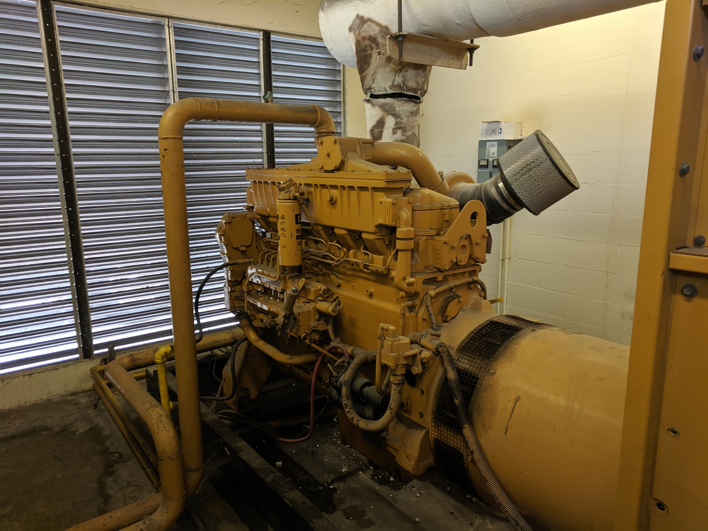
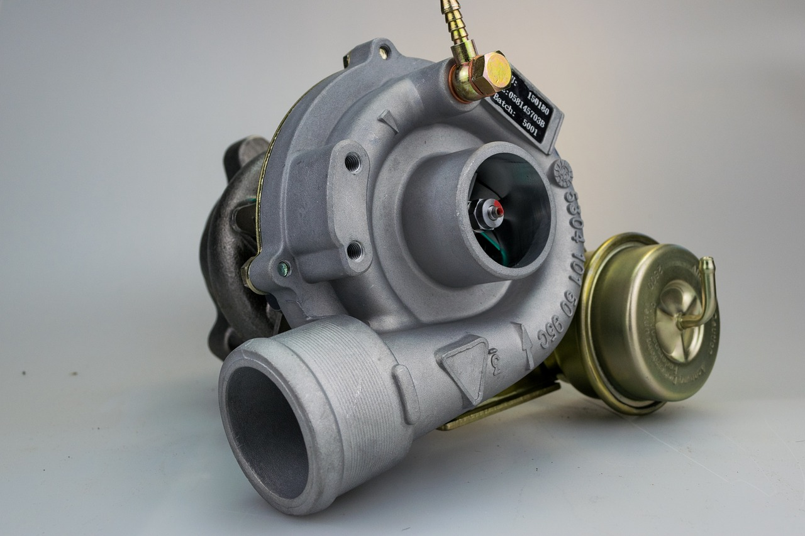

We love our turbos. Nothing like a turbo spinning up and boosting you on down the road. Turbos have been around for many years and have been loved by the diesel community since. I ran across the question the other day and thought it was a good one.

Do all diesel engines have turbos? **No. There are diesel engines that are naturally aspirated. This means that they rely completely on atmospheric pressure for air induction. These engines have substantially less power. But all modern diesel engines have turbos.** 

While not all diesels have a turbo. All modern diesels do. It is given that a diesel will have a turbo in today’s market. They provide modern diesel with a high level of efficiency. A naturally aspirated diesel engine does not have the power needed for many of the demand that is needed in today’s vehicles. Let’s talk about why a diesel needs a turbo in the first place and get into how it works.

## A brief history

The first running diesel engine was created in 1895. That was before the first turbo was invented. They were meant to replace the steam engine. They were no very efficient.

The first Turbo was invented by a Swiss engineer named Dr. Alfred J. Buchi in 1905. They were not developed for road vehicles around 1922. By the late 1920s, turbos began being used in some diesel engines. [Source](https://en.m.wikipedia.org/wiki/Turbo-diesel)

Like many other things, the war helped the advancement of this technology. World war II had a large influence on the development of the turbo diesel. In the 1950s, there began to be turbo diesels and diesel locomotives on the market.

The joining of these two technologies changed the diesel engine's future and made it possible to be used in many new applications and achieve many great things for the world.

## Naturally what? 🧐

Naturally aspirated means that the engine takes in air at whatever the atmospheric pressure is. That is the dormant air around the engine. There is no kind of induction system. The engine simply pulls in the air from around it.

This pull is supplied by the downstroke of the piston. That is the only force that is drawing air into the combustion chamber. When the piston travels down, it creates a small vacuum. This is just enough to bring in air for the next burn.

There are a few benefits to this set-up. The only real benefit of a NA diesel is the throttle response is immediate. There is no turbo lag. Other than that, you lose a lot by giving up compressed air. These engines barely get out of their own way.

## Spinning up

Ever wonder how that turbo works and why it is such a benefit to have one? Let me see if I can explain it. No promises.

What is a turbo anyway? **A turbo is really just an air pump.** It is driven by the exhaust leaving the engine. As the engine begins pumping air out, it turns the turbo, pumps air into the intake.

This air becomes compressed, and it is forced into the combustion chamber. It ends up being above atmospheric pressure. With higher levels of air pressure, more fuel can be introduced. More fuel being burned at once causes a spike in the horsepower that is produced. This provides a boost to engine efficiency.

### Some benefits of the turbocharger

• **Increased fuel economy.** A turbo can increase the fuel economy of an engine by up to 20%

• **fewer emissions.** So, when you run a turbocharger, the vehicle or equipment can be run on a smaller engine. The turbo can actually cause savings in the output of emissions. Less fuel = less emissions

• **Less weight.** For the same reasons, you can shed a few pounds. You don’t need quite as large an engine when the turbo can make up for the power you need

• **Noise reduction.** So, you thought the turbo was loud? Think again that naturally aspirated engine was super loud. The turbocharger actually is a muffler of sorts and quiets the sound of the exhaust.

## Why do diesel engines need a turbo?

Power baby. They need the boost. Diesels are not really that efficient when naturally aspirated. They are dogs. Put the turbo on, and boom, you got some power. Diesels are bent toward having more torque. The turbo allows the diesel engine to have some get up and go under acceleration.

The added horsepower makes the diesel usable on the road. Without it, the diesel would not be fit to drive on the road. It could be very dangerous. You need the power to be able to pull out on the road and not cause an accident.

Without turbos, diesels would not have hardly any horsepower at all. They need help, and together, they become great.

## Back in the day

Before turbo gained in popularity and even some engines with a turbo had a **supercharger (blower)**. This practice is over. You would be hard-pressed to find a diesel that still has a supercharger at this point, but they were used for many years.

Superchargers were a type of compressor that was attached to the crankshaft of an engine. Usually, this was accomplished by a belt drive. So, the supercharger would spin at the same rate as the engine RPM.

The supercharger would suck air in and compress it. This was controlled by the speed of the engine. It used the engine's own power to its advantage. You will still see these on some racing vehicles, but these were let go long ago for diesel engines.

They just simply were not as efficient as the turbocharger and could not produce the same amount of boost.

## Summing up

Not all diesels have a turbo, but all the new ones do. The older naturally aspirated diesels are hard to find anymore and for a good reason. Those days are long behind us. We now enjoy the added efficiency and power provided by our modern turbos.