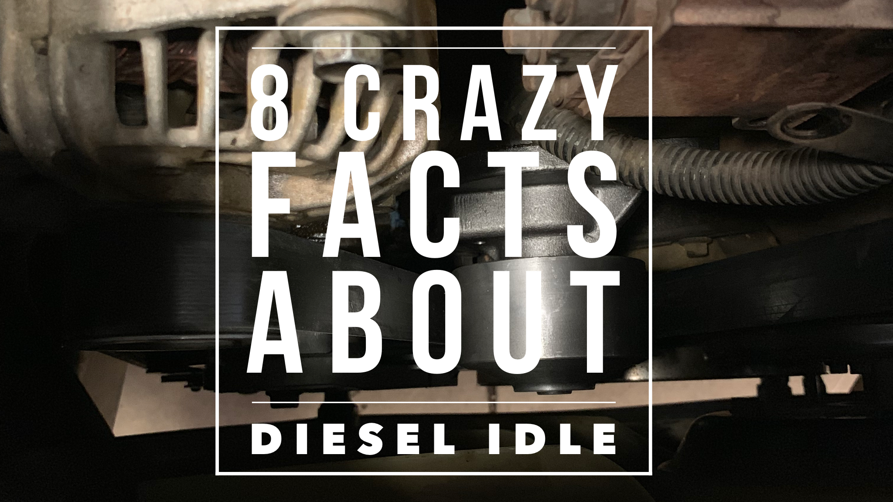
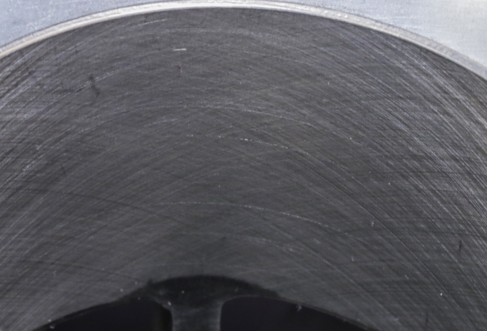

There are many scenarios in the diesel world where the engine will need to idle a while. Whether you are doing a monthly inspection on a generator or a trucker waiting for your load, there are a lot of situations where you will be idle.

So, I wanted to write a little about what the consequences of that are, how much it costs, and if there are reasons why you should avoid it.

## 1. How much fuel am I wasting

Do diesel engines use a lot of fuel when idling? **No. they only use about a gallon an hour.**

How much fuel does a diesel use at idle? **One hour of idle time consumes around one gallon of diesel fuel. This can be calculated into 2.4 oz a minute.**

So, that is a lot of fuel. When you think about that, over time or in the larger scope of a big company, this can add up to millions of dollars wasted.

## 2. What does it cost for diesel to idle?

**The national average as of today in 2021 is 3.67 per gallon. That means you are spending $3.67 an hour or about 4.5 cents per minute to have your truck or equipment running at an idle.**

This is why several manufactures have idled an idle time out where the engine will automatically shut down after a preset amount of time set by the owner. This can be useful and should be implemented.

There really is no need for a truck to idle for long periods of time anymore. Although in some cases it will be necessary, it should be avoided. The same goes for equipment. Why waste fuel? Shut it down.

## 3. Idling harms your engine

Does idling hurt a diesel engine? **Yes. When a diesel engine idles, it does more damage to the engine than normal operation. Operating a diesel engine at a low speed will cause two times the** **wear on the internal components compared to operating at normal load. This will raise maintenance costs and shorten engine life.**

This fact really blows my mind. I can’t believe it really causes **2 times** the [wear on your engine](/10-signs-and-symptoms-of-a-worn-out-diesel-engine) to idle it. That is really crazy when you think about the amount of idling that goes on in diesel applications.

This is why manufacturers usually classify applications with high idle times as **_severe duty_** and recommend a more aggressive maintenance schedule.

Idling actually causes the buildup of carbon in the engine. A high percentage of idle time will also cause mirror glazing in the cylinder walls. **Mirror glazing** Is when there is a mirror-like finish on the walls surrounding your pistons. This will cause more oil to pass by the piston rings and create a large amount of blow-by.

The main reason this causes the damage it does is that diesels need to operate at higher temperatures. To get a complete burn of the fuel, a diesel needs a very high combustion chamber temperature.

Without this temperature, there will be carbon build-up. With that, carbon buildup comes all of the other problems. Diesels need to be run under a load to get the best out of them. Low idle times will cause your engine to last much longer.

## 4. Diesel engines do not need to idle long on cold mornings

Does a diesel need to be started and ran on cold mornings? **No. Modern fuels have solved most of the problems of gelling and water mixture for North Americans unless in extreme temperatures**

There is really no need to crank trucks in the winter if you have done the right things beforehand. In some cases, you want to try to save the batteries, but you should be equipping your equipment and vehicles with **trickle chargers in a harsh climate**. This will maintain the battery without damage. See [The Complete Guide To Starting A Diesel In Cold Weather](/the-complete-guide-to-starting-a-diesel-in-cold-weather)

In harsh winter conditions, the engine should also be equipped with a block heater. This will keep the coolant moving and heat the block to around 150 F, depending on the setting. This will make starting the engine unnecessary.

## 5. Diesel engines do not need 5 minutes of idle time in the morning

Do diesel engines need to warm up? **Yes. Most manufactures recommend idles for 3 minutes before running the engine under a load.**

Always look at your operator’s manual to see the exact specification for your engine.

This is a common misconception. Modern diesel engines do not require the amount of time to warm up as in years past. There are many advancements made to cut this warm-up time down and maintain high levels of durably. You will find that most are down to 3 minutes before you put a load on the engine.

Remember, though, the diesel was meant for a load. Any idle time that is not for maintenance is bad and will cause unnecessary wear on your engine.

## 6. You still should idle down before shutting down

How long should I let my diesel cool down?**3 – 5 minutes. This will allow time for the oil to cool down the turbocharger while the engine idles down.**

If you were to rev up your engine and then shut it off, it will cause damage and wear to the turbocharger as the oil pressure drops with it is still spinning at very high RPMs. Modern turbochargers can have turbine speeds above 100,000 rpm! 😮 Even the older models will have RPMs ranging from 40,000 to 60,000.

At these speeds, lubrication of the turbocharger bearings is super important for your turbo to last. The turbo must be allowed to spin down before the oil vacates. If not, you will be putting another turbo on before long. 💰 Not worth it.

Just let it idle down for a few minutes after you get back or when you're done with the equipment for the day. This is going to save several components premature ware and you the headache of replacing them.

## 7. Never idle directly after an engine rebuild

If you finish up an engine from a rebuild, the worst thing you can do is allow for long idle times. Why? If you run an engine for several hours after a rebuild with no load, it would accelerate the wear on all the internal components.

The engine needs a load to **_break-in_**. They call this **_seating_** the rings. The rings need that high amount of combustion pushing down on them the cause them to expand against the cylinder wall preventing the oil from passing by. Seating the rings will prevent the cylinder wall's glazing and allow for normal wear of the engine.

A cylinder should have what is called **_cross-hatching_** and not be reflective. The cross-hatching allows the rings the seal against the walls of the cylinder or liner.

**_Note:_** There is no way to repair glazing. The liner or block will need to be replaced. So idling can literally ruin your engine.

Most companies and government agencies are now on a big kick to end their vehicles and equipment idle time. This is understandable as the costs add up over time. Especially on a large scale, this can be millions of dollars out of profit or cause taxes to go up.

## 8. **How many miles does one hour of idle time equal?**

Mileage is not recorded by the odometer When a unit idles. One hour of idling is equal to 25 to 30 miles of driving.  
That's right! 30 miles per hour. That can really add up when you think about units like vacuum trucks that have PTO time. it really makes you rethink keeping your cab nice and toasty all night at the truck-stop.

It is best to avoid idling when possible but we know it's not always possible and at that point, we have to keep up with the idle time.

Some manufactures will log the idle time for you if not you can always keep a paper log. That way you can get your service work done at the proper time. Also, you can replace mile sensitive parts in the engine.

###

**An APU can save your engine**

An APU is an auxiliary power unit. This is used mostly for semi-trucks. For drivers who either sleep in their truck or idle for very long periods. With an APU, you can avoid all that engine killing idle time.

An APU provides power to those things the driver might want the engine to idle for. Things like air conditioning, power for phone charging, watch some Netflix, etc. This can take all the component wear away and just run to do all those side things drivers want.

The cost can be quite high for these, though. According to the [North American Council for Freight Efficiency](https://nacfe.org/) (NACFE), APUs cost anywhere from $8,500 to $13,000 per unit installed in the equipment.

This is a high cost, but replacing your engine prematurely can be much worse.

## Summing up

Next time you are sitting longer than just a few minutes, remember this list and the high price to pay for that little bit of AC time in the cab. Is it really worth it? Idle time is the enemy of diesel engines, and avoiding it can add years of life to your engine.

## Want to get your ASE but Hate reading? 📕

You can actually listen to the study guides now with [Audible](https://amzn.to/2K3v96s) Click [Here](https://amzn.to/2K3v96s) to listen to the study guide for free! Courtesy of Amazon. You can literally sign up, study, pass, and then cancel before the free trial ends.

Here is a link to the [ASE Audio Study Guide Audible Audible Audiobook](https://amzn.to/32EcKDy) if you already have an Audible account.
