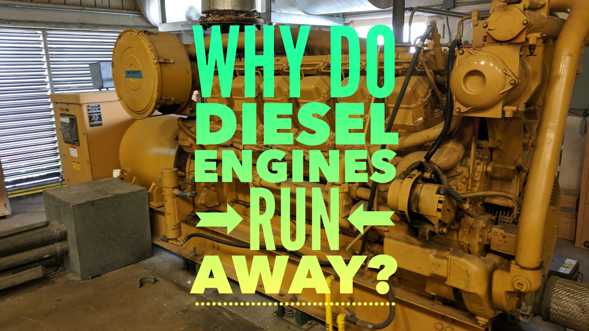

If you work on or own a diesel piece of equipment or vehicle you have likely heard a story about a time when a diesel engine ***Ran Away***. It may have sounded something like this… 

There I was, I was in the shop and cranked up my truck when it started to rev up on its own. I didn’t know what to do and then it started really revving up and getting louder and louder! It must have been running 4000 RPM! I ran and got a bunch of rags and stuffed them in the intake and it bogged down and shut off. 

Well, yes it has happened to me as well. When a diesel ***Runs Away*** it is a scary feeling. It is a very dangerous situation. It can completely demolish an engine, create a fire and cause injury or even death to those around it. 

In this article I want to dive into what is happening to cause a diesel engine to run away. How to avoid it and how to get it shut down. 

What is diesel engine run away? **Diesel engines run away when the RPMs can no longer be controlled. The engine is receiving “fuel” from somewhere and there is no ability to shut off the supply.**

<iframe src="https://www.youtube.com/embed/R0AVSBw4Qq8" width="600" height="400"></iframe>

##It packed its bags and ran away 😢

You have probably heard on a movie or show where an engine continues to run after it is shut off. ***i.e. uncle buck*** So, they call that dieseling. The engine continues running even after it has been shut off.

This can happen to diesels easily because they need nothing but fuel and air to operate. Give a diesel any type of fuel and enough air and it will keep going even if you don’t want it to. 

Modern diesels are less likely to run away based on the diesel because when you turn the key off you kill the supply of diesel to the injectors. This system can still fail, and you can experience problems, but it is not the most common reason for run-away diesel today. 

So why does it cause so much damage when a diesel runs away? **Because the components are so heavy and are designed for low RPM. When these heavy parts get moving too fast, they start banking and breaking things. Valves will make contact with the piston, rods will bend and break eventually components will begin to break out of the case and fly across the shop.** 

##Why do diesel engines run away?

What is the most common cause of diesel run away? **Turbo or crankcase hose leaking oil into the intake.**

That’s right! Your trusty engine lubricating oil can be your own worst enemy. That good old oil in the crankcase can also be burned as a fuel. 

With the turbo as you may know it is spinning at thousands of RPM spooling up boost for you to get out of the way a little quicker. With all the violent movement comes the need for lubrication.

Oil passes through the turbo bearing keeping them cool and letting it run smoothly and keeping it for wearing. The oil is kept inside the turbo by seals on either side of the turbine. 

If the inner seals get old and dry out and start to crack that oil will escape. It will be sucked right into the intake. This will be evidenced by an unexpected rise in RPMs that were not called for. 

I have seen this as a modest rise, a random spike only lasting just a few seconds and I have also seen a huge spike and the engine run away because the turbo was just pouring it on. 

If you suspect this a great way to check is just to pop off the intake hose from the turbo and look for oil residue. Remember that there is a lot of air moving through that pipe. So, even a very small amount of oil residue is significant. 

This is the most common and also the worst type of run away because not only are you operating at speeds over what is rated for the engine it is also draining the life blood of the engine itself. 

As the oil is burned and escapes from the crankcase the engine has less and less oil to lubricate the bearing and all the internal engine components. They eventually dry our and cause catastrophic failure and even catch fire.  

###Older Diesels have different issues

Older diesels with mechanical fuel pumps have different causes of run away. It still can be the turbo but when your fuel pump is mechanical it can fail and supply an unlimited amount of fuel and cause this situation.

With worn out diesel engine a run-away can be caused by high crankcase pressure usually created by worn piston rings. This allows oil to pass through into the combustion chamber. When this oil enters the combustion chamber it is burnt as fuel causing the engine to consume it until its gone. 

 

###Uncommon and not likely but possible

Coal dust and high amounts of propane or CNG can cause a run-away situation in the right conditions. Remember when the diesel engine was invented “diesel fuel” didn’t even exist. Diesel engines can run on lots of alternatives. 

##Overspeed vs. Run-Away

Not all run-away situations are created equal.

- **Overspeed** is when an engine operated at an RPM rate over which is was designed to handle. A common example is when a truck gets stuck in gear headed down a mountain and runs the RPMs so high that the engine is severely damaged. 

So, a run-away can cause an overspeed if the engine is fueled to where is idles up beyond what it is meant to stand. A run-away can happen without causing an over speed. 

I have seen situations where the engine was only running away while operating and it was a random idle up every few minutes. 

##How can You stop a diesel engine run away?

Remember this is a dangerous situation. If you are nervous or not confident you can get it shut down run away yourself! Get out of there. If, however for the brave and knowledgeable you want to stay in there and save the engine I will list the best ways to get the engine shut off.  

The right answer to this depends of the source of the “fuel”. We will go over both options Engine oil and diesel fuel. 

**Remember, you have two choices, remove the air or the fuel. Either will cause the engine to shut down**

-	**Engine oil** 

If the engine is being fueled by engine lubricating oil, then it would be best to go for the air. You need to choke the engine out. 

If your vehicle has a CO2 fire extinguisher this can work well. Spray the CO2 directly into the intake until it shuts down. This works because the CO2 replaces the oxygen and with no air the engine shuts off. 

If you don’t have a CO2 extinguisher handy go for something to choke out the intake. When this happened to me personally, I grabbed a fender cover and some rags and stuffed them into the intake, and it shut down. 

You can remove the intake hose and cover it with a book or something. But be careful it will be moving a lot of air. It will need to be something sturdy. 

This is no joke. The amount of air moving into the intake at a high RPM will be very dangerous. Trying to stuff rags and things into the intake will be very dangerous. You could lose your hand. The engine could just suck whatever you put in there right up. It is better to go for a hard 

If you are running a manual transmission and you are in the cab you have another option. I have witnessed this method although I haven’t done it myself, I know it works well. As soon as it starts to run away you can press the brake pedal and put the transmission in a high gear and release the clutch while still holding the brake.

This will provide enough torque to shut the engine down. You must take cation when attempting this method because the truck will move even with the brake depressed.

Another option is to plug up the exhaust. I have not ever used or seen this method used but it is possible in theory. 

-	**Diesel fuel**

If you are in a situation where the run-away is being caused by over fueling of the diesel fuel I would go after the fuel.  

There are quite a few ways to do this. One is to take the fuel filter off. Note that this will not immediately shut down the engine. It will still have to run out the fuel in the lines before it dies. So, some patience is required. 

Some vehicles have a fuel shut off that can be used. Like a ball valve at the tank or just before a fuel filter. This is a good option if fuel is the culprit. 

-	**Unsure?**

Go for the air. When in doubt the air will shut it down every time. So, if you are not 100 percent certain shutting the air off is a great option. Just get something to stuff or cover that intake up and she will start bogging down. 

##Preventing diesel run away

A great way to stop diesel run away is to never have it. As far as prevention of run-away there are a few good options. 

1.	Regular maintenance. 

Regular maintenance is going to keep you from getting into a situation where things are so wearing down and dilapidated that the begin to wear and allow oil to pass and cause run away. 

2.	Check on the turbo

Another great thing to do is pop off your intake hose every once in a while, and have a gander at the turbine and intake hose. Keeping an eye out for residue or any signs of wear is going to prevent that run-away situation. 

##Summing up

A run away can be a scary situation but if you are experienced you can avoid damage and injury by getting it shut down. Remember though if you are at all apprehensive or nervous to approach it go for help! It is not worth getting seriously injured for a piece of equipment. 

