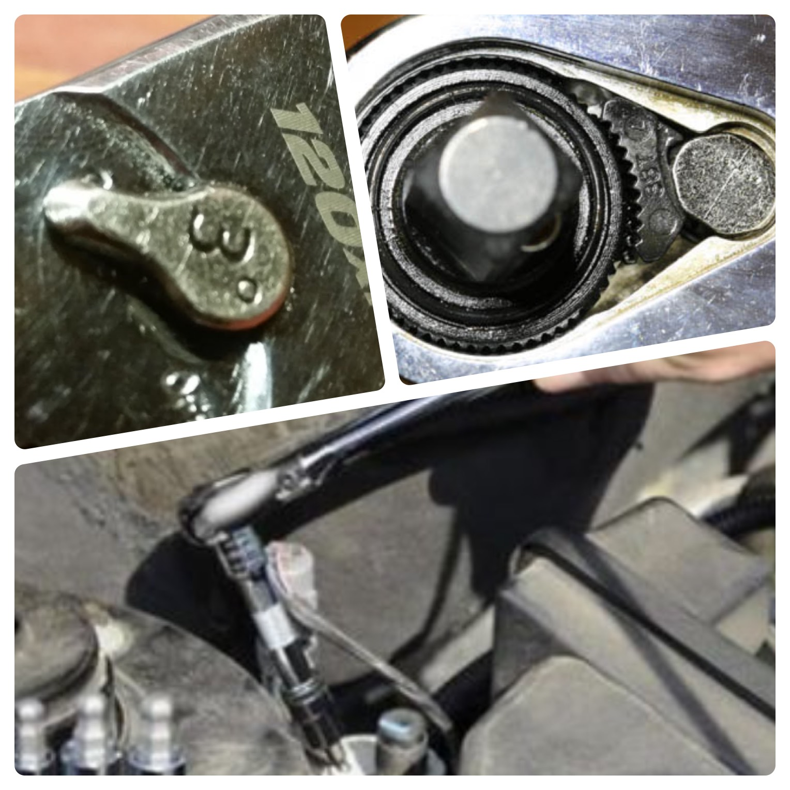
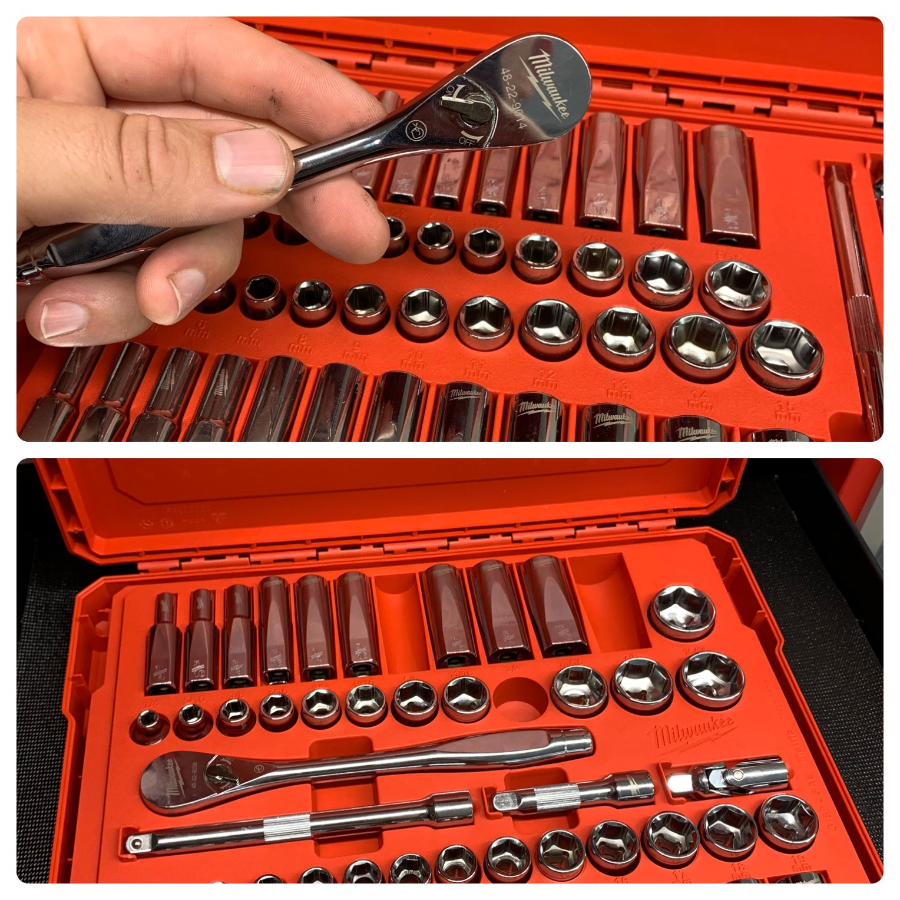

Your ratchet is your most used tool as a diesel tech. Really any mechanic. You develop over the years a certain relationship with your ratchet of choice. You will find that using someone else's will not do. You need your favorite. The one that has got you through thick and thin.

> I have **11** 3/8 ratchets and **I use one.** My favorite.

This is why it is important to think about what ratchet is best, and we will take a look together at all your options. This is also why I am not writing the “best ratchet” because ratchets are a personal choice and different for each mechanic.

You have to get the one that fits you. Sometimes it takes trying some out to find the right one for you. So, I have reviewed 10 different ratchets for professionals. I also wrote a [complete tool guide](/the-tool-guide-for-new-diesel-mechanics/) if you're interested.

They vary in style and price points. **We are only going to look at 3/8” ratchets. All the specs that I compare are explained in the buyer's guide at the bottom.**

## [Skip To The Buyers Guide](#guide)

**The top 3 are my best picks. 1. Best bang for the buck 💰 2. best design 🔧 3. best quality 👨‍🔧**

## 1. GearWrench 81210P - Learn Diesels Top Pick - Best bang for the buck 💰

<iframe src="https://www.youtube.com/embed/DPIap5yO4_0" width="600" height="400"></iframe>

Who makes the best ratchet for the money? Coming in the top spot for me is the **GearWrench 81210P.** This thing is the bomb 💣. I love the feel and design. Watch this YouTube video above 👆 that shows it outlasting the snap-on.

It is super strong. The [pawl system](#guide) they use holds up very well. It has lasted a good long while now and shows no signs of wear. For my money, I think this ratchet is the bee's knees. The one downside is the mail-in warranty. So, If you need the store/truck exchange keep looking. But know I have owned this one for 2 years with no issues with heavy use.

That 3-degree arc really makes this ratchet shine. We have all been in those situations where our ratchet couldn't do a thing. When you are in a tight spot it is awesome to be able to get a click! I have beat and banged this thing in many different situations and it's held strong(I may have even used a pipe on it a few times).

I would recommend these things all day, but the proof is in the pudding, as they say. Try one out yourself. [Check out the latest price on Amazon](https://amzn.to/36sNf8B).

### The Specs

- **Tooth count** - 120 count with a 3-degree arc
- **Pawl design** - double-stacked pawls
- **Handle design** - Chrome vanadium steel. The adjustable flex head has six positions—a rubber handle cushion.
- **Profile** - 0.9 inches flex-head
- **Warranty** - Mail-in
- **Weight and Length** - 15.8 ounces, 15.9 inches
- **Cost** - **$$**

## 2. Milwaukee 48-22-9014 - Learn Diesels Top pick - Best design 🔧

So, if you have seen this list before, this is a new one. I recently bought this awesome Milwaukee set and have used it long enough to review it. It has great ratchets are very durable, and fit in your hand nicely. I love the whole set, and I would recommend them, pro mechanics, as a solid truck tool alternative.

This Ratchet is very impressive and is comparable to high end ratchets. The flat design on the sockets is awesome for stubborn fasteners and put an end to chasing dropped and rolling sockets under the truck! Check these out. You won't regret it.

[Check out the latest price on Amazon](https://amzn.to/2JTkn2K).

### The Specs

- **Tooth count** - 90 count and a 4-degree arc
- **Pawl design** - Patented pawls
- **Handle design** - Chrome. Round.
- **Profile** - Slim profile .5 inches
- **Warranty** - Mail-in. Possible store exchange depending on the particular Home Depot you are dealing with.
- **Weight and Length** - 11-13 ounces, 11 inches
- **Cost** - **$$$**

## 3. Snap-on F80 - Learn Diesels Top pick - Best Quality 👨‍🔧

While Snap-on quality is outstanding, this list is compiled by **value for money.** Some mechanics enjoy that the truck comes to you and saves you the extra hassle of going out. Snap-on counts on it. Just like other popular brand names, you pay a premium to have their stuff.

If you just need the convenience and name brand and are willing to drop some bread, 🍞 this is a great pick. I don’t think that there is enough quality to overcome the 300% price increase you get for the same tool. I do have Snap-on tools and even a ratchet, but I don’t exclusively use them.

This is an awesome ratchet, and you can’t go wrong with it. The only question I have is how much are you willing to pay?

[Check out the latest price on Amazon](https://amzn.to/2r9s4s5).

### The Specs

- **Tooth count** - 80 count and a 4.5-degree arc
- **Pawl design** - Single patented Pawl.
- **Handle design** - Chrome vanadium steel. Round thicker handle
- **Profile** - 0.6 inches
- **Warranty** - Hassle-free. They will rebuild it if the damage is in the gearing and replace if it is in the handle.
- **Weight and Length** - 11-13 ounces, 11.3 inches
- **Cost** - **$$$$**

## 4. Kobalt 737671

Kobalt really makes some great tools. Probably some of my favorite ratchets. They have a great design and easy to hold. Great balance and profile. This one is heavy, and The one knock I have is they don’t seem to last as long for me. I have to get them replaced once every 2 years. Not too shabby considering its full-time use, but others are better.

[Check out the latest price on Amazon](https://amzn.to/2Lf3hg8).

### The Specs

- **Tooth count** - 72 count and a 5-degree arc
- **Pawl design** - Double-sided pawls
- **Handle design** - Natural matte finish. Round thinner handle
- **Profile** - 0.6 inches
- **Warranty** - Hassle free trade out. As long as they have one in stock. I have never had an issue.
- **Weight and Length** - 12-14 ounces, 11.1 inches
- **Cost** - **$$**

## 5. Husky H10038RAT

I have a special place in my heart for Husky tools. I started as a diesel tech with a set of Husky professionals. They lasted me 6 years! I still use some of those today. All kinds of things broke over the years, but the rachets did well.

Everyday use and I seen about 3 years before needing replacement. These are great tools, and their ratchets have gotten better over the years. A solid choice for a professional.

### The Specs

- **Tooth count** - 80 count and a 4.5-degree arc
- **Pawl design** - Double-sided pawls
- **Handle design** - Chrome vanadium steel. Round thicker handle
- **Profile** - 1 inch
- **Warranty** - Depends on the store stock. They will not trade out if it’s part of a set. Mail into Stanley, the principal owner of Husky
- **Weight and Length** - 11-13 ounces, 11.3 inches
- **Cost** - **$**

## 6. Cornwell JR40

Cornwell rounds off this top ten with a decent ratchet. They make tools that are tough as nails, and if you have a decent Cornwell man, this may be a great pick for you. They have never been my favorite, but you still can't go wrong.

[Check out the latest price on Amazon](https://amzn.to/2oMeaLG).

### The Specs

- **Tooth count** - 30 and a 12-degree arc
- **Pawl design** - double pawls
- **Handle design** - Round. Chrome vanadium steel.
- **Profile** - 0.9 inches
- **Warranty** - Hassle-free. They will rebuild it if the damage is in the gearing and replace it if it’s in the handle.
- **Weight and Length** - 8 ounces, 10-1/4 inches
- **Cost** - **$$$**

## 7. Matco BFR188LFM

Matco used to be my favorite “truck” tool. I love their low-profile ratchets. They make excellent ratchet and other things. I began to stray away from them as the quality of normal branded tools became better. Plus, I did not have much luck with keeping a Matco guy. It seemed like the truck was only there once a month at best.

This is an awesome ratchet, and you can’t go wrong with it. The only question I have is how much are you willing to pay and get you to get it replaced if you need to?

You can find these on eBay for around 150 bucks normally.

### The Specs

- **Tooth count** - 88 count and a 4-degree arc
- **Pawl design** - Patented pawls
- **Handle design** - Round. Duplex nickel layer underneath hexavalent chrome with rubber grip
- **Profile** - 1-1.5 inches
- **Warranty** - Hassle-free. They will rebuild it if the damage is in the gearing and replace it if it’s in the handle.
- **Weight and Length** - 15-18 ounces, 18-1/2 inches
- **Cost** - **$$$$**

## 8. Mac Tools

The Mac man! I know a lot of people who swear by their tools. I have no problem with Mac Tools; I have a wrench set and some picks from them. They make solid stuff. Once again, this list is based on value for the money. You can do some price checking and find out that Mac is nowhere near the cheapest, so do you get that kind of value from their tools? That's for you to decide.

Then there is the other variable. Is there a Mac man in your area? They are not near as common as Snap-on and, in my experience, not as reliable in service.

### The Specs

- **Tooth count** - In the 80s and a 4-degree arc
- **Pawl design** - Patented pawls
- **Handle design** - Round. Chrome vanadium steel.
- **Profile** - 1-1.5 inches
- **Warranty** - Hassle-free. They will rebuild it if the damage is in the gearing and replace it if it’s in the handle.
- **Weight and Length** - 15-18 ounces, 18-1/2 inches
- **Cost** - **$$$$**

## 9. GearWrench 81211F

Another solid choice from Gearwrench. This is a nice solid ratchet with no frills. It has a decent arc ratio and is really tough. If you are on a budget, this is a good one.

[Check out the latest price on Amazon](https://amzn.to/36uEZVw)

### The Specs

- **Tooth count** - 84 and a 4.3-degree arc
- **Pawl design** - double pawls
- **Handle design** - Round. Chrome vanadium steel. flex-head
- **Profile** - 0.9 inches
- **Warranty** - Mail-in
- **Weight and Length** - 15-18 ounces, 10-1/4 inches
- **Cost** - **$$**

## 10. Craftsman CMMT81748

I have always been hard on Craftsman. Calling it **_Crapsman_** and such 😆. I'm a funny guy. And I would still say that their lower end ratchets are garbage. They have like 36 teeth. They break constantly and are not meant for professional use. That said, They have moved over to Loews and now have a higher-end ratchet that I would love to give a shot.

I plan on buying one in the next few days to give it a full review. I will update as I have more information. I would say I will give it a shot and see how it goes from just holding one and messing around with it.

[Check out the latest price on Amazon](https://amzn.to/34B7wHx).

### The Specs

- **Tooth count** - 72 count and a 4.5-degree arc
- **Pawl design** - Double-sided pawls
- **Handle design** - Chrome vanadium steel. Round handle
- **Profile** - 0.7 inches
- **Warranty** - Hassle free swap out. Usually for a rebuilt ratchet.
- **Weight and Length** - 11.2 ounces, 9.4 inches
- **Cost** - **$**

## Aspects to consider when shopping for a ratchet

All of the factors are important in Ratchets. Look through and learn all the different aspects. I learned a lot from writing it, and I hope it's helpful.

**Tooth or position count**

The number of teeth on the gear of a ratchet will affect the arc at which you can operate. If you are working in a tighter spot, then the higher tooth count will be beneficial. You will be able to grab more teeth and have the power to turn that bolt loose where others would be stuck, and you would be hunting a wrench that will fit. 🔧

We have seen the race to the highest tooth count over the last few years. In fact, one of my favorite ratchets is the 120 tooth count Gear-wrench. One issue is some of these higher count ratchets can have more chance of slippage. More teeth can equal less strength.

**Pawl design**

The pawl design is not your dad's shirt. The "pawl" is the mechanism that sits against the gear head and interlocks to let you turn in the opposite direction. You want a double pawl or at least a high contacting one. This is usually what snaps if the bit itself does not go.

This is an important factor if you are looking for strength in the ratchet. There are many designs. You can see from the images that everyone has their own take.

**Handle design**

This important factor will make you decide whether or not you enjoy using your ratchet. There are several types. Some ratchets have round handles. Others are more rectangular, and then there are several padded or rubber handle versions. Everyone has a preference. There are ups and downs for all styles. The solid ones are harder to grip than the rubber, but the rubber gets nasty over time, and if you clean with brake cleaner, it breaks it down.

Besides, there are several "head" designs now. There are "flex" heads, "round" heads, and "teardrop" heads, as well as other variations. I prefer a "flex" head, and it allows you to adjust to the plane of a bolt head. As you review the list, you can see, I have included several different types of heads.

**Profile**

The thickness of a ratchet is critical. There is always a space to be gotten into. Most of the time, you need a thinner ratchet, right? The thickness of ratchets greatly varies and is an important aspect to consider when looking for your ratchet.

**Weight and length**

It is nice to have a lighter ratchet, but I would never sacrifice that for quality as for length. This will vary by your needs. I recommend a medium length but, you really need several lengths if you do this for a living.

**Warranty**

All the tools nowadays seem to have a lifetime warranty, but it is important to note that **_not all are hassle-free._** Depending on the company is a measure of how good the process is. Some will do an instant swap out, and some will require you to mail them in. This can be a very easy or frustrating process. So, it is an important aspect to consider.

**Cost**

This is really up to you and your pocketbook. Willing to pay a bit more? You can have one that will last and become one of your favorite things. That's what you need to do. Don't cheap out. I understand if things are tight and there are some less expensive options for you.

## Summing up

Your ratchet is probably the most important tool in your box. You use it so often, and your knuckles are constantly in jeopardy. You will notice a huge difference between a cheap one and one made for pros.

I have taken the time to check out 10 different ratchets that I believe are made for pros. Remember, just because I recommend one doesn’t mean it would be perfect for you and your job. It really is a personal experience.

You need to try and see with tools like this. They really are like boots. Lots of boots are great, but I like certain ones. So, take my list as a great starter and find the awesome ratchet that works for you.
