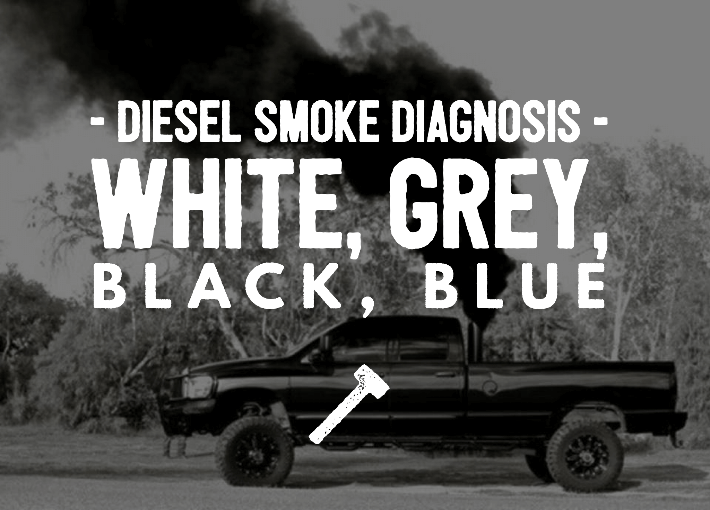
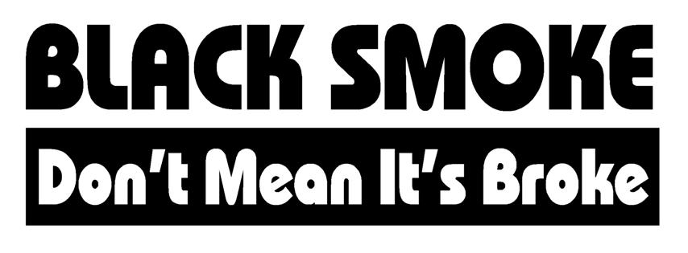
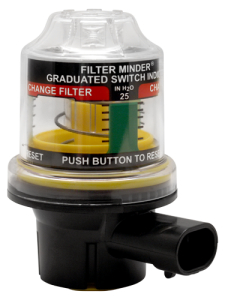
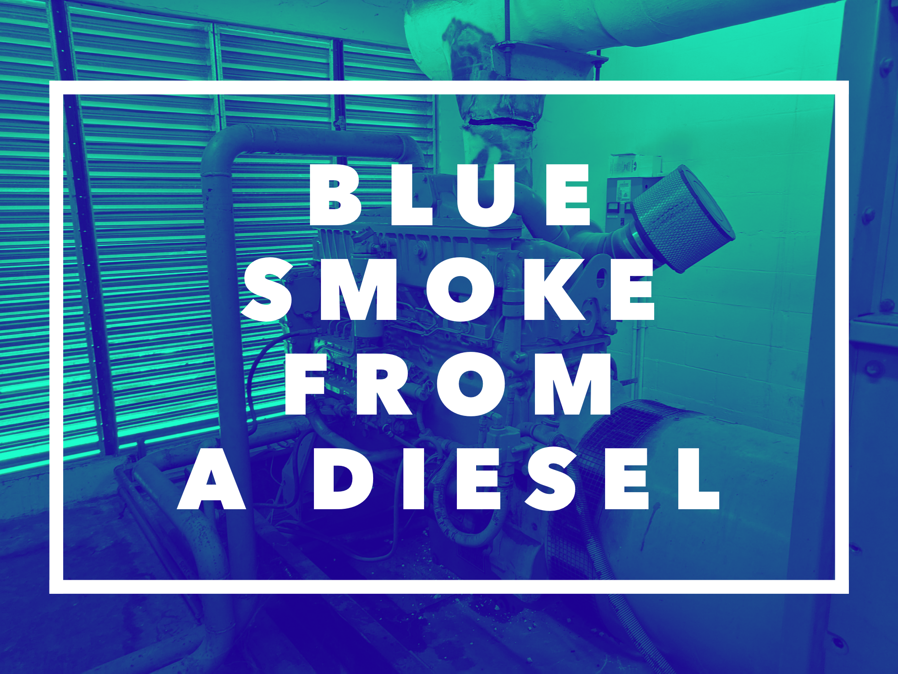
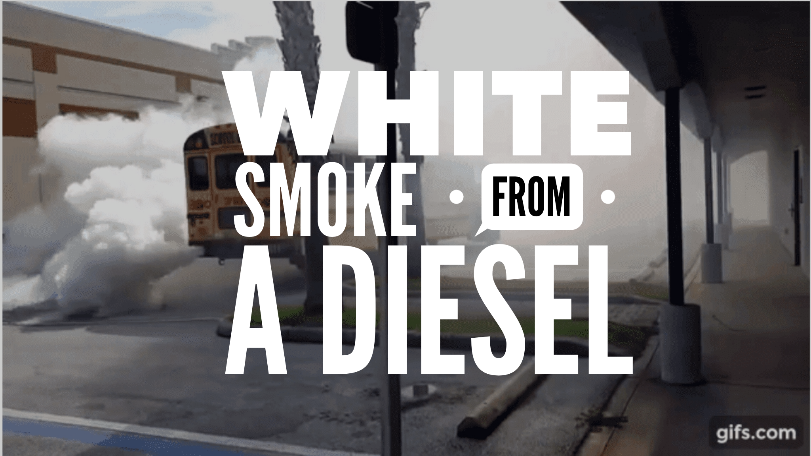

We are going to cover the **three** main types of diesel smoke and the causes in this article. If you are trying to diagnose an issue take a look at the reference to dash down to your particular problem. If you are here to learn let's get after it.

# Table of Contents

1. [Black Smoke](#black)
2. [Blue Smoke](#blue)
3. [White/Grey Smoke](#white)

## Black Smoke 

So, you have some black smoke billowing out of your exhaust. Otherwise known as "rolling coal". Nothing more fun to a diesel guy than seeing a Prius with the windows down and blowing a bunch of black smoke that way. Diesel engines are known for blowing black smoke during acceleration but, is that bad? Is it a sign of trouble? What causes black smoke? Let's answer those questions and more.

What does Black smoke from a diesel engine mean? **Black smoke occurs when partially burned fuel passes through the combustion chamber. Normally, an engine burns fuel completely and emits water and CO2. Black smoke indicates that something is causing the fuel to only burn partially. It is an air/fuel mixture problem**

Whether or not is bad for your engine depends on what the cause of the black smoke is. **A little black smoke is normal on a properly functioning diesel engine**, but if the amount of smoke changes at different RPMs and loads you have an issue. Here are the things it could be and then we will go into what to look for and steps to diagnose the problem...

## Causes of black smoke (In no particular order)

* Incorrect timing
* Dirty, worn, or malfunctioning injectors
* Over-fueling
* Faulty turbocharger
* Incorrect valve clearance
* Incorrect air/fuel ratio
* Low cylinder compression
* Dirty air cleaner
* Restricted induction system
* Carbon in intake manifolds
* Incorrect engine tune
* Poor quality fuel
* Excessive carbon builds up in the combustion chamber
* Cool operating temperatures

## Let's start as always with the most likely problems first 🕵️‍

## Air Restriction

There is a delicate mixture of air and fuel that needs to be achieved in order to have a clean burn from your diesel engine. When you are having black smoke, the balance has not happened. **Air restriction is the most common cause of black smoke.** So, where is the restriction?

**1. Air filter**

How dirty is it? When is the last time you opened it up and looked at it? Sometimes there is what is called an "air minder".  It is an indicator for your air filter and should be changed when it reaches a specified mark. That could be it! and a majority of the time this is the problem.

**2. Inlet restriction**

Check your inlet piping. Is one collapsed? Look for anything abnormal in the hosing. Run the engine while you are looking like a weak hose may suck together when operating. What about that missing shop rag 🧐. Anyway, you get the idea. Look for obstructions to air freely flowing into the engine intake.

**3. Leaks or damage around or in the turbocharger**

Look at all the piping around the turbocharger and intercooler. Listen when the engine is under a load and sometimes it will squeal and let you know that there is a leak somewhere. Tighten all the connections. They can always use a little quarter turn. Listen for abnormal noise from the turbo itself. When you have the hose removed give the turbine and wiggle. It should have only a small amount of 'play'.

**4. Exhaust or DPF damaged**

Inspect the entire exhaust and DPF system. Look for any crushed or damaged parts. Look at the muffler if it's under the vehicle. It is easy to damage when you have a driver who likes running over things.

**5. Sensor faults**

Modern engines have control units that actively measure air mass and make appropriate adjustments. You could have a sensor giving bad information to the module.

## Fuel or Tune

**1. Poor Driving**

You are going to see this in manual transmission vehicles. If the gear is too high for load and the driver attempts to just give it more fuel the engine will inject more diesel and there will not be enough air for the engine to burn the diesel fully. This doesn’t mean that the engine is malfunctioning; it just means that the driver needs training.

**2. Bad Fuel**

Check your fuel quality. Bad fuel can cause all sorts of issues. Be careful where you fuel up and pay attention as best as you can to the fuel you are putting in. It is no fun draining tanks. A great place to check fuel quality is to drain your fuel filter. Note: kerosene emits black smoke

**3. Bad tune**

Has your fancy tune betrayed you? You may just need to reset your tune if you are not intending to blackout everyone at every stoplight. Maybe you lost power and it reverted to an incorrect tune. Worth looking into if you are having issues.

## Mechanical Issues (So much for the easy stuff)

**1. Injector timing**

It could be that your injector timing needs adjusting.

**2. EGR issues**

Look at the specific steps to inspect and test your EGR system. Make sure the EGR valve doesn’t need to be replaced.

**3. Faulty injectors**

Dirty, sticking, or leaking injectors. Common rail injectors staying open for too long giving the engine too much fuel. One thing you can do to determine this is measure the temperature of the exhaust manifold at each cylinder. You are looking for cooler temperatures in certain cylinders to indicate the fuel is passing through unburnt.

**4. Incorrect Valve Lash**

This can happen when you have had damage to the top of the engine or a recent repair where the overhead was run. This can be indicated by a "rattle" 👂under the valve cover. It is easy enough to pop the cover off and have a look.

**5. Cylinder problems**

Worn or sticking rings can cause low cylinder compression, excessive carbon built up in the combustion chamber can all be the cause. This can be indicated by excessive blow-by. Diesel engines are prone to this over time because they typically run for longer periods of time and diesel fuel doesn’t include any detergent from the refinery. This can be avoided by adding a [detergent additive (Link to Amazon)](https://amzn.to/2pBLzcl) to your diesel fuel on a regular basis.

**6. Incorrect pistons**

It's on here because I have seen it first-hand. Continuous black smoke and just could not diagnosis it. Turns out the company we bought a short block from had installed the incorrect pistons. Go figure.

**_Note: Some systems are intentionally set up with chips/programs to blow black smoke on demand. While this is not recommended it will not necessarily hurt any of your engine components and can be fun if that's your thing._**

## Summing up

Black smoke can be difficult to diagnose but, if you follow the signs and look at the simple things first you can get to your answer fairly quickly. As with any repair be careful to think about what's going on before you act. The damages that can occur from the problems denoted by blue smoke can be catastrophic but, if you can catch it early you can likely avoid even more costly repairs.

## Related Questions

#### Does Black Smoke Cause poor fuel economy?

Yes. If you are having black smoke as mentioned in this article, it is caused by a poor air/fuel mixture. Too much fuel or too much air will cause poor fuel economy. Your engine needs the right mixture in order to achieve a clean burn and produce the intended amount of power. If your blowing black smoke, it does not mean more power, it means more wasted fuel.

#### Black smoke from diesel engine when starting

If this is a modern engine you likely have an injector problem. On older engines, this can happen. On older or worn engines blow smoke when the turbo is still spooling up because the amount of air has to catch up to the amount of diesel being injected.

#### My diesel has random puffs of black smoke

I would say this is caused by turbocharger Lag. If you have a large turbocharger this can happen when there is an acceleration from a stop. Larger turbochargers that take more time to “spool up”. While this is happening, the engine will be “rolling coal” waiting for the turbocharger to get up to speed. Fuel is injected into an engine that is turning at low RPM. It is possible to prevent this by adding a [combustion catalyst (Links to Amazon)](https://amzn.to/2NcMEQY) to the fuel to improve the amount of that diesel burned at low RPM.

***

## Blue Smoke 

So, you have some blue smoke billowing out of your exhaust. Well, you think it's blue. Does it look like a blue haze? 😕 What is the cause? Maybe you are like me and have to look it up every time. No shame here. This is the complete guide to blue smoke from a diesel.

Why would a diesel have blue smoke? **Blue smoke only occurs for one reason, excess lubricating oil within the engine cylinders during combustion. When this oil is burnt it will come out of the exhaust as blue smoke.**

Your burning oil. That part is simple. Understanding all the different reasons you can have oil in the cylinders is not. Here are the things it could be and what to look for...

## 1. Is it really blue

Spotting blue smoke can be difficult if you don't know what to look for. The "blue" color is often faint. You should be able to see a blue haze to an overall "grey" kind of smoke. You can often smell 👃 the difference. Oil smoke has a distinct smell, like an asphalt parking lot or roofing tar on a hot day. If it is blue, I should say that **_blue smoke should not be happening at any time._** It is evidence of a problem and should be investigated.

I have seen some dismiss it as normal. **No amount of blue smoke is normal.** A new engine may burn oil without any evidence of blue smoke because of the good compression it can burn oil cleanly. However, it is not acceptable for any engine to burn large amounts of lubricating oil.

A great thing to do as a preventive for your diesel engine is an oil and fuel additive. Check out [This stuff (link to amazon)](https://amzn.to/30RdaDo) it is the best in my opinion.

Let's take a closer look at what blue smoke could really mean and where to start the hunt for the issue.

### Blue Smoke is caused by engine burning lubricating oil but, that oil can enter the combustion chamber from several sources

* **Worn valve guides or seals** - They can be letting oil pass through to the cylinder.
* **Cylinder wear** - A worn cylinder will allow enough space for the oil to pass by the rings whether the rings are worn or not.
* **Piston ring wear** - Again, creating a gap allowing oil to get into the combustion chamber.
* **Cylinder glaze** - When the cylinder is glazed the rings cannot do their job of wiping the oil on the way back down and oil will pass by.
* **Leaking turbocharger seals** - which are allowing oil into the intake and/or exhaust system Excess engine oil in the sump, which is getting splashed up into the bores.
* **Restricted turbocharger drain** - If the oil has nowhere to go it will pass into the intake.
* **Incorrect oil** - Oil that is too thin will get past rings or valves guides
* **Fuel dilution of the oil** - A good way to check for this is just to pull the dipstick. If you have an injector stuck open and it is leaking fuel into the crankcase it will dilute the oil and cause it to pass by and be burnt. This may be caused by a faulty injector pump and/or lift pump.
* **Too much oil in the crankcase** - You overfilled it. Too much oil is not a good thing. If you have overfilled it simply remove the extra oil.
* **Clogged oil drain lines in the head** - If the head is clogged and the oil does not have a place to go it will likely make its way out the exhaust.
* **High crankcase pressure** - Too much pressure in the crankcase. Check the old crankcase breather. Keep an eye out for clogs or debris in the tube.

**_If blue smoke is only happening on a cold start, it is likely that it is a piston/cylinder problem._**

With so many different causes of blue smoke, it can be a daunting task to begin to diagnose the issue. I decided to give you a little nudge in the right direction. Take a look at the list to follow.

## Do the easy things first

A lot of times less experienced mechanics can jump to the **worst-case scenario** when most of the time the problem is something much less complicated. I learned an acronym that has really helped me in my career. It is KISS. **Keep It Simple Stupid.** Most of the time the answer is right in front of you. When you are approaching a seemingly difficult diagnosis remember to look at the simplest explanation first.

1. Check the oil

Make sure the level is correct and there is no smell 👃 of fuel in the oil. Make sure it's not "thin". Dripping like water off the dip-stick. You could have just put too much oil in the engine! wouldn't take be a relief? Or there can be fuel in the oil causing it to pass by.

1. Remove the intake CAC hose from the turbo

It is the tube from the turbocharger to the intercooler. Look for signs of oil. It will be wet or have some residue on the inside of the pipe. It is good also to look beyond the CAC pipe into the intercooler itself and over to the EGR and intake hoses continuing to inspect for that **slick** oil residue.

1. Check the crankcase breather for obstructions.

Look at the blow-by tube and breather filter element (if equipped). Sometimes there can be an obstruction or it can get clogged causing all kinds of issues in your crankcase.

1. Perform a cylinder compression check to isolate the source.

Now you are in the more advanced inspection. This will require more time and you will be able to pinpoint which cylinder is allowing oil to pass by. If you have got to this point things can get hairy and expensive. Remember to always have the maintenance manual to find disassembly instructions for your specific engine. these can be extremely useful if you don't have it down to a science. Nothing wrong with looking at the instructions guys.

## Summing up

Blue smoke can be difficult to diagnose but, if you follow the signs and look at the simple things first you can get to your answer fairly quickly. As with any repair be careful to think about what's going on before you act. The damages that can occur from the problems denoted by blue smoke can be catastrophic but, if you can catch it early you can likely avoid even more costly repairs.

***

## White/Grey Smoke 

So, you have some white smoke billowing out of your exhaust. What is the cause? Maybe you are like me and have to look it up every time. No shame here. This is the complete guide to white smoke from a diesel.

What causes white smoke from a diesel? **White smoke occurs for one of three reasons 1. Raw diesel comes through the exhaust completely unburned 2. Water entering the combustion chamber. 3. The temperature in the combustion chamber is too low.**

Now, let's look at three scenarios. What is wrong really depends on the "type" of white smoke you have. Let's break down the different ways white smoke presents itself and where to go from there. Here is how to read the smoke...

## 1. White smoke on a cold start, and then it disappears as the engine warms up

This is very common. It will happen often at startup in cold weather with lower compression engines. As you start running the engine at idle (around 650 or 750 rpm) you will achieve a more effective compression ratio and the smoke clears. White smoke has a lot to do with the temperature in the combustion chamber.

**_If the smoke is really just a puff there is not much to worry about. Especially if it has been sitting. It could just be built up condensation._**

If it lasts a few minutes after the engine is started and there is a **rich diesel smell 👃** they may be some cause for concern. Some of the likely causes include,

* Faulty injectors - stuck open
* Worn piston rings or cylinder glazing
* If equipped with glow plugs could be faulty plugs or module

Remember, if you have an older engine with really low compression and bad timing or low injection pressure, you are more likely to have white smoke.

## 2. A thick cloud a white smoke

Red alert 🚨 This is the danger zone. Water or coolant can cause white smoke from diesel as well. This is a symptom of a bad problem. You are getting coolant or water in the combustion chamber and If you know anything about compressing water you know this is no going to end well. Spoiler - water does not compress. So, if you have this problem be careful running it for any period of time. Once you are sure it's a water stop and fix it.

This will be a steady stream a smoke after starting up. Usually, you will see the smoke will be a "thick" smoke (Like in the gif at the top of the page). It will also be noted by a sweet 🍫 smell. Some likely causes include,

* Blown head gasket
* Cracked block or head
* Contaminated fuel
* leaking Oil cooler (Through most of the time the oil passes into the coolant)

Remember, significant damage will occur if you run the engine with water in the combustion chamber.

## 3. Continuous "light" white smoke

In order to run correctly, a diesel engine needs precise timing of the injector pump and proper pressure. Any decrease in the pressure or delay in the delivery of the fuel to the combustion chamber will cause incomplete combustion and you will have white smoke.

This is a steady stream of lighter white smoke. Can even be a random but, often "puff". Some likely causes include,

* A clogged fuel filter
* Low pressure in the fuel pump (Air in the fuel)
* Faulty or damaged injectors
* Incorrect injection timing (Worn timing gear or damaged crankshaft keyway).
* Low cylinder compression (caused by leaking or broken valves, piston ring sticking, cylinder ring wear, or cylinder glaze)

## **_Important note for modern diesel engines_**

**Modern diesel engines are designed to deliberately over-fuel the engine (or just one cylinder) for brief periods in order to create heat to burn carbon off of the Diesel Particulate Filter or DPF. If this over-fueling operation is not operating properly it can cause white smoke and damage to the engine.**

***

## Summing up

White smoke can be difficult to diagnose but, if you follow the signs and look at the simple things first you can get to your answer fairly quickly. As with any repair be careful to think about what's going on before you act. The damages that can occur from the problems denoted by white smoke can be catastrophic but, if you can catch it early you can likely avoid even more costly repairs.

## Related Questions

#### Can bad fuel cause white smoke?

Yes. If the fuel is contaminated with water or some other foreign material it is possible that it will produce white smoke. The best way to test the fuel is to pull the filter and put it in clear glass. Wait a few minutes and see if there is any separation.

#### Can air in fuel cause white smoke?

Yes. This is another common cause of white smoke. Check all the lines and injector supply lines to see if there is anything loose. Air can pass through any loose connections. Especially in today's high-pressure systems, you need to make sure that it's all tight and sealed.

**_See something I missed? Help me make it better, send me a message. Thanks!_**

<a href="#top">Back to top</a>