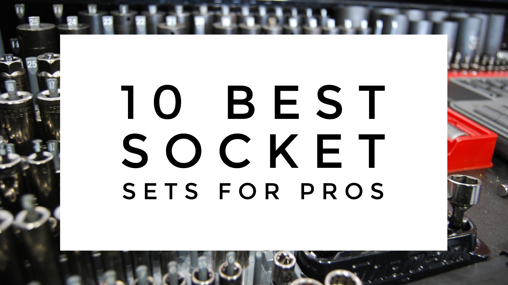
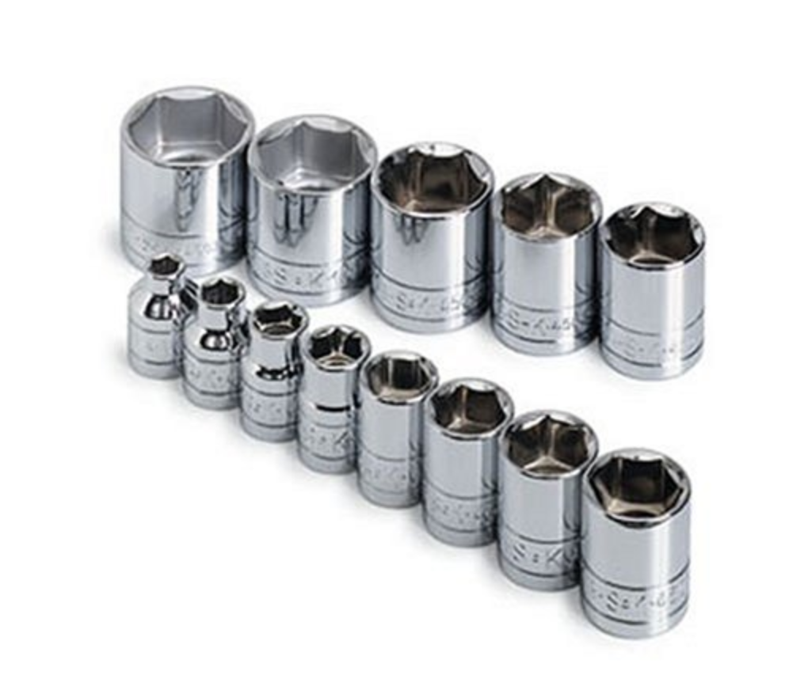
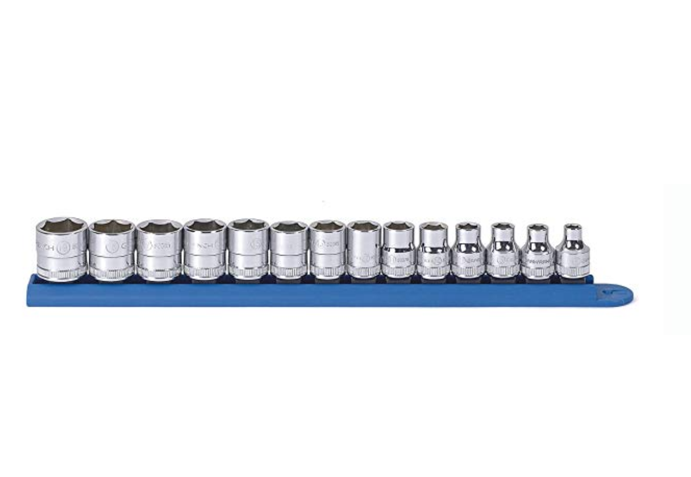
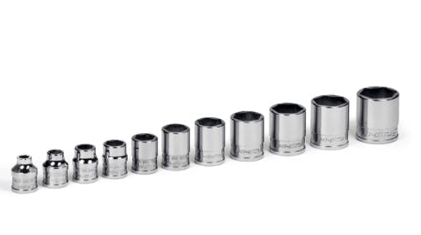
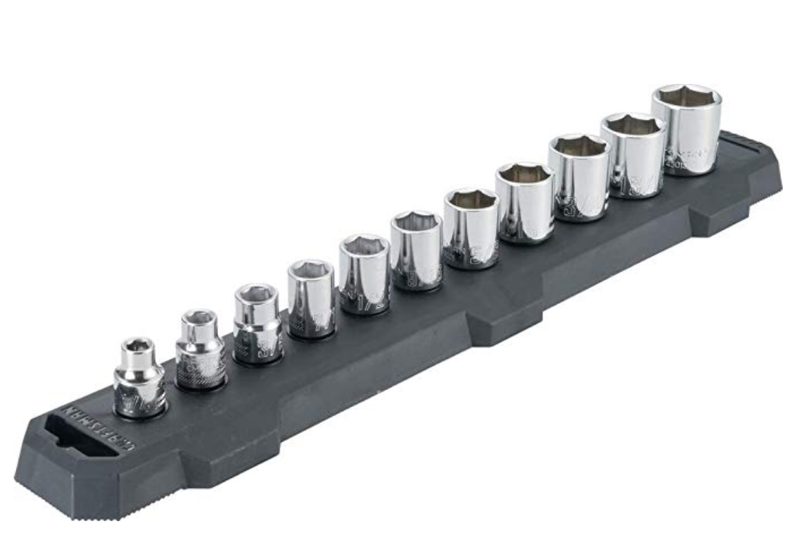

As a profession mechanic your sockets are important. You should invest in some good ones. Let's break down what makes a good socket and then look at a couple of good options to add to your toolbox. 

We are going to use **Standard 6 point 3/8 socket sets** as our baseline in this list. You can bet if this set is good the 12 point and 1/4 and 1/2 will be the same.

##What makes a good socket?
 
###Durability 

This is possibly the most important feature in a good socket. As a pro you need a socket that is going to last. The last thing you want is cracking or wear making the socket not fit right.

###Accurate sizing

That Chinese set you bought may have been cheap but sometimes you get what you pay for. Take the time to find sockets that are sized correctly 

###Finish 

Different finishes will translate to different wear and usability. 

###Thickness

This will not only make a huge difference in wear it will also make it more or less difficult to get in to tight areas depending on the thickness

###Warranty 

Almost all tools now-a-days will proclaim their lifetime warranty but it is important to note that not all are **hassle free.** I will note in each tool how good the process is. Some will do an instant swap out and some will require you to mail them in.

##List disclaimer 

This list is based on value for the money. You may see some that surprise you but remember this list is compiled to give you the best socket for the money. So don’t get upset when snap-on isn’t number 1. 😆

##1. SK Professional Tools 4613 13-Piece 3/8 in. Drive 6-Point Standard Socket Set

Best tools for the money? The survey says SK! 

[Check out the latest price on Amazon](https://amzn.to/2PquXxP)

###The Specs

* **Durability** -This set is manufactured to give superior service year after year and to last a lifetime with proper care. Quality tools manufactured for the American technician

* **Finish** -High polish “SuperKrome” plating results in a showroom finish, providing long life and maximum corrosion resistance for your 6-Point Chrome Socket

* **Design** - This set has SK's “SureGrip” hex drive design, it drives the side of the fastener, not the corner. This gives you increased strength and keeps you from rounding of rusted or damaged fasteners, which can occur when using a sharp-cornered hex tool
 
* **Thickness** - Typical Profile

**Warranty** - Mail in. It is a decent process.

* **Where is it made?** - USA with American Steel

##2 Gearwrench 80552 14 Pc. 3/8" Drive 6 Point Metric Standard Socket Set

[Check out the latest price on Amazon](https://amzn.to/38FAk3K)

###The Specs

**Durability** - The most used sockets will for years if you keep them out of your impact. 

* **Finish** -Bright, full polish chrome finish easily wipes clean and resists corrosion

* **Design** -Off-corner loading design reduces fastener rounding. Chamfered opening quickly guides fasteners into socket

**Thickness** - Thinner profile

* **Warranty** - Mail in. Decent process. 

##3. Snap-on 211FSY 11pc 3/8" SAE Shallow Socket Set 6pt 1/4"-7/8"

The only reason this snap-on set is not at the top of the list is price. They make very good tools. No one questions this. Is it worth the 300% higher price than other tools? Doubtful. 

This set is great and the only way I recommend buying it is off Ebay. Above is a link to a eBay set for around 120 bucks. Check it out. If it's not still there, there are always sets around. 

One thing to note is if you haven’t bought anything from your Snap-on guy they don’t like to warranty stuff. I have been told by some that they won’t replace tools they didn’t sell. But not all are jerks lie that. 

[Check out the latest price on Ebay](http://rover.ebay.com/rover/1/711-53200-19255-0/1?ff3=4&pub=5575572689&toolid=10001&campid=5338659351&customid=&mpre=https%3A%2F%2Fwww.ebay.com%2Fitm%2FSNAP-ON-211FSY-11pc-3-8-Dr-SAE-Shallow-Socket-Set-6pt-1-4-7-8-SEE-AD-INFO%2F254517791989%3Fepid%3D1411826649%26hash%3Ditem3b42714cf5%3Ag%3AD8gAAOSwbjpeTbMM)

###The Specs

 **Durability** - Last a lifetime. One of the best in the business

* **Finish** -Full polish chrome finish easily wipes clean and resists corrosion

* **Design** -Snap-on patented design. Tough made for pros

***Thickness** - Typical profile

* **Warranty** - Truck trade out. Super easy process if you have a good owner. 

##4 Craftsman CMMT12042 11-Piece SAE, 3/8-Inch Drive, 6-Point Socket Set

So last and least. This Craftsman set has been used in shops. I have seen a couple guys give them a shot. Some lasted quite a while. 

You can save some bucks here and the warranty is great. So if money is tight 💸 This may be your set. You could do worse. They are at least made in the USA. 

[Check out the latest price on Amazon](https://amzn.to/2OZYrCI)

###The Specs

* **Durability** - Medium at best
* **Finish** - Full polish chrome finish for corrosion resistance

* **Design** - No special design. 

* **Thickness** - Thicker profile

* **Warranty** - Walk in to any Loews. Easy Process.  

##Summing up

Your sockets are important tools in your box. You use them so often and your knuckles are constantly in jeopardy. You will notice a huge difference between a cheap one and one made for pros.

I have taken the time to check out 10 different ratchets that I believe are made for pros. Remember just because I recommend a set doesn’t mean it would be perfect for you and your job. It really is a personal experience. 

You need to try and see with tools like this. They really are like boots. Lots of boots are great but I like certain ones. So, take my list as a great starter and find your awesome sockets that work for you. 
