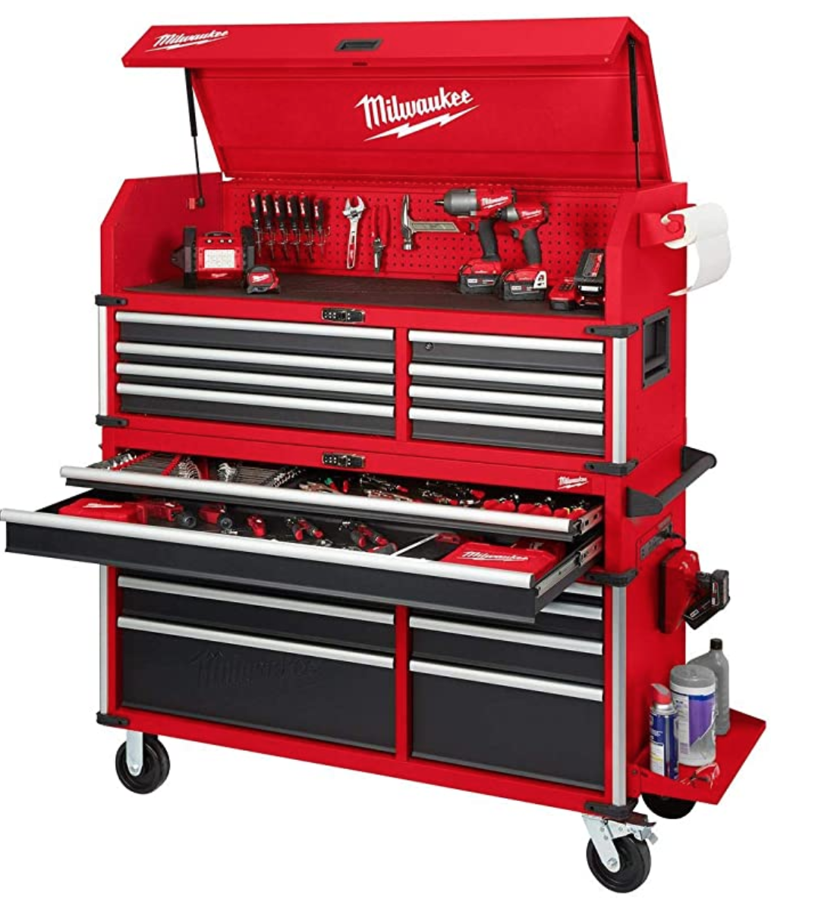

As a profession mechanic your toolbox is important. You should invest in a good one. Let's break down what makes a good toolbox and then look at a couple of good options to aid you in your search. 

##What makes a good toolbox?
 
### Durability 

This is possibly the most important feature in a good toolbox. As a pro you need a box that is going to last. The last thing you want drawlers falling out after 6 months.

The main thing that kills chrome sockets is using them in an impact. Chrome sockets are made for hand tools and will last a long way if used properly. 

### Security 

That Chinese box you bought may have been cheap but sometimes you get what you pay for. If a flathead can be used in lou of a key this is not good. Beware if your box is in a high traffic area you need to pay attention to the security of your toolbox.

### Dimensions 

It need to fit in your spot. Also you need anough space to store that massive collection of yours. 

### Max Load 

You need to know how many pounds or kgs you can stuff in there before it starts to buckle. Tools get heavy quick. 

### Warranty 

Almost all tools now-a-days will proclaim their limited lifetime warranty but it is important to note that not all are **hassle free.** I will note in each toolbox how good the process is.

## List disclaimer 

This list is based on value for the money. You may see some that surprise you but remember this list is compiled to give you the best socket for the money. So don’t get upset when snap-on isn’t number 1. 😆

##1. Milwaukee 56" Premium 18-Drawer Tool Box Chest and Cabinet Combo with Electronic Keypad Lock

Best toolbox for the money? The survey says Milwaukee! Milwaukee has been around a long time and they have hung around for a reason. Their stuff lasts! 

Thats right, they don't only make your favorite electric impact. They also make a sick toolbox! This thing is bad to the bone. For the money hands down the best box for a pro. 

This thing is Loaded with features, the Milwaukee High Capacity is deeper than most other boxes. The 150 lbs. rated, soft-close drawler keep from accidental opening or slamming shut. The chest has an extensive list of features

pullout work surface drawer and security drawer which can be locked separately from the rest of the drawers. Check it out!  

#### Additional features 

* Integrated peg wall in the chest
* Paper towel holder 
* 2 J-hooks to store your hoses and cords
* Long tool holder 
* Folding side shelf 
* Bottle opener
* Aluminum edge guards with rubber corner bumpers  
* Integrated power strips, each with 6 outlets and 2 USB ports
* Pullout work surface drawer and security drawer which can be locked separately from the rest of the drawers. 
* Removable power tool organizer
* Digital Locks

[Check it out on Amazon](https://amzn.to/38A6htG)

### The Specs

* **Durability** -This set is manufactured to give superior service year after year and to last a lifetime with proper care. Quality tools manufactured for the American technician

* **Security** -Electronic lock. Secure your tools without the need for keys.

* **Dimensions** - 56" wide, (extra deep) 22" deep, 64" tall - 44055 cubic inches.

* **Max load** - 150 lb rated, soft-close ball bearing drawer slides. 3000 lb weight capacity.

* **Warranty** - Mail in. It is a decent process.

* **Where is it made?** - USA with American Steel

## Toolbox Set-up and Maintenance

Once you have invested all that money into your tools, you need a plan to take care of them and organize them. You need to keep your tools in great condition, so they work great. Ever tried to open a pair of rusted pliers? No fun. Likewise, when your favorite ratchet is missing you are not a happy camper 🏕️

# Overloading you drawlers.

It really doesn't matter what box you buy. If you go way over the max load of your drawlers you are going to have problems. 

##Summing up

Your toolbox is important. You use it everyday. You will notice a huge difference between a cheap one and one made for pros.

I have taken the time to check out 10 different socket sets that I believe are made for pros. Remember just because I recommend a one doesn’t mean it would be perfect for you and your job. It really is a personal experience. 

They really are like boots. Lots of boots are great but I like certain ones. So, take my list as a great starter and find your awesome toolbox that work for you. 
