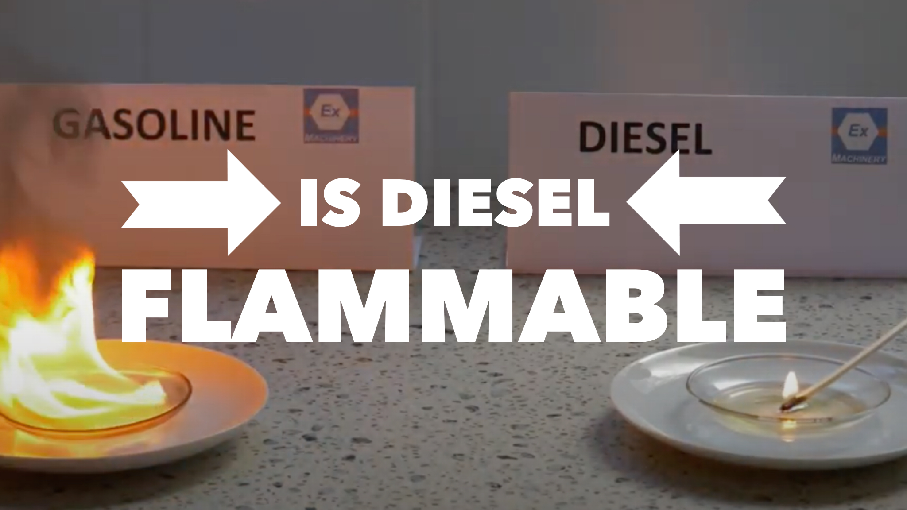
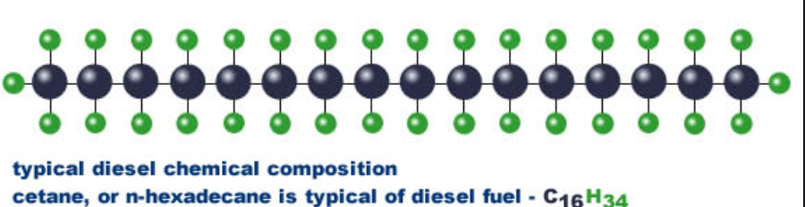

Here is a burning question for you 🔥. Some articles out there got this wrong. So let's set the record straight.

_Is diesel fuel flammable?_ Yes.

Diesel is flammable, according to the U.S. Department of Labor. See the following standard: [Section 1926.155(h)](https://www.osha.gov/laws-regs/standardinterpretations/2000-06-09-0#:~:text=The%20common%20grades%20of%20diesel,is%20subject%20to%20this%20rule) defines a flammable liquid as any liquid having a flashpoint below 140°F and having a vapor pressure not exceeding 40 pounds per square inch at 100°F. Diesel fuel's common grades have flash points below 140°F; therefore, diesel fuel is considered flammable liquid and is subject to this rule.

## Here are the specifics

The most commonly used grade of diesel fuel is #2 grade. It is what you see in the regular diesel pumps. So we will use the information for this grade.

The flashpoint is an important aspect in considering how flammable fluid or material is.

> The **flash point** of a volatile material is the lowest temperature needed to evaporate enough fluid to form a combustible concentration of gas.

For instance, the flashpoint of [gasoline -45°F.](http://large.stanford.edu/courses/2014/ph240/ukropina2/) The Department of Labor classifies any material that has a flashpoint below 125°F as flammable.

**According to the MSDS sheet from Citgo, the flashpoint of #2 diesel fuel is**[**: ≥52°C (≥125.6°F)**](http://www.docs.citgo.com/msds_pi/AG2DF.pdf)

Of course, we all know that diesel is nowhere near as flammable as gasoline. I have seen a guy put out a cigarette in a can of diesel (do not try that). But diesel itself is dangerous and combustible.

It will still cause a fire and should be stored in a proper container following OSHA guidelines and the Department of Labor.

## Can You Light Diesel fuel with a Lighter?

Yes, you can. But you will need the fuel temperature to be above the flashpoint. The fuel will begin to give off flammable diesel fumes. After that, it will ignite with a spark or flame.

<iframe width="560"  height="315"  src="https://www.youtube.com/embed/7soVqyGq4i4"  frameborder="0"  allow="accelerometer; autoplay; clipboard-write; encrypted-media; gyroscope; picture-in-picture"  allowfullscreen></iframe>

You can toss a match right into a puddle of diesel fuel, and it'll go out.

That's because diesel the temperature of the fuel itself has to be above 125°F. In a diesel engine, it heats the fuel by creating an immense amount of pressure, causing ignition. That same match in gasoline won't even touch the ground. It will ignite the vapors in the air before it gets there.

If your fuel temperature is below 125°F, the diesel will not react to a flame or spark.

This is why you will see people put diesel on a bonfire, and when it is burning and heats the fuel, it will burn hot and for a long time.

## The science of diesel flammability

Let's have a little shift in the question, _"How does diesel even burn?_

Diesel is a combination of carbon chain molecules known as carbon strings with hydrogen atoms surrounding them. The chains may be between 8 and 21 carbons, with hydrogen at each carbon. There are 2 hydrogen atoms for every 1 carbon plus two more hydrogen atoms on the chain's ends.

At the ends of the chain, there are two carbons and another ten at the center. To make a carbon atom work, all four of its binding sites must be together in the center. Each atom is attached to two other carbons, and in the case of this chain, only two additional atoms required hydrogen. The ends are only equipped with one carbon. The best thing to do here is to pound out another hydrogen.

Combine diesel with ample atmospheric oxygen and add some energy to get it moving, and CO2, water, and loads of heat and light will become carbon, hydrogen, and oxygen. You can always get water, heat, and light if you combine it with insufficient oxygen to make all the atoms in the fuel happy.

The most reactive factor in this region is hydrogen, which takes the oxygen it needs. Carbon continues to form carbon dioxide before the supply of O2 starts to decline, and carbon monoxide begins to grow.

When you slam in oxygen, the remainder of the carbon blows out the exhaust as soot. Therefore all modern diesels have a turbocharger. This is why they attempt to bind so much air in the engine. A lot of oxygen is required to transform all the carbon into CO2.

## Diesel is safer than most fuels

Think about it. Being less flammable and less toxic than gasoline, propane, ethanol. It makes diesel a pretty safe option as far as fuels go.

## Use a B class extinguisher on a diesel fire

Suppose you get in a situation at your shop where you need to put out a diesel fire. Remember to call the fire department first. After that, if it's safe, grab a B class fire extinguisher. All shops are required to have multiple extinguishers in the area accessible to your work area.

Be familiar with where your fire extinguishers are. **Water should not be used on a B class fire. It can make things worse.** The goal of the B class extinguisher is to remove the oxygen from the fire. Smothering it out. Most use baking soda or potassium to accomplish this.

Be prepared. Always look around your work area to know where they are so you can react fast. Remember, never put yourself in a bad position. Better to let it burn down and wait on the fire department than risk your life. Unless, of course, you're superman.

## Summing up

Diesel fuel is flammable, but not near as flammable as gasoline and other fuels. Still, you should respect it as a dangerous material. In the right conditions, it can create a life threatening situation. Be careful out there and know where your safety equipment is.
