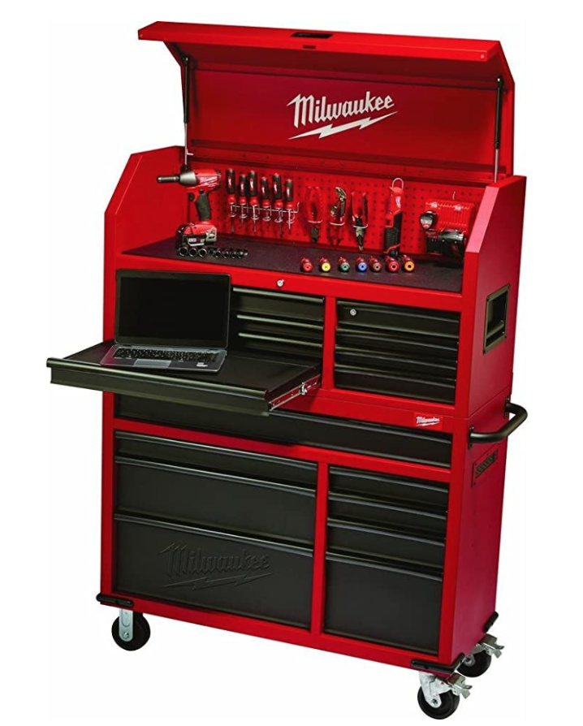

As a professional mechanic, your box plays an important role in your life. You touch it every day. Is it _really_ just bent metal and slides? It holds your tools, keeps them in order, and keeps them safe. So, in this article, I want to answer "what makes a good toolbox". Then I will give me my list that my friends and I have compiled as the best toolboxes for your hard-earned money.

We are going to look at tool chests under $2,000. That means they won't be "off the tool truck". But that's ok. They will all be American steel and lifetime warranty. Boxes are **bent metal and sliders.** You don't have to get _the brand_ to get a good one.

I also wrote a [complete tool guide](/the-tool-guide-for-new-diesel-mechanics/) if you're interested.

## What makes a great toolbox? 👇

### Durability

This is possibly the most important feature in a toolbox. As a pro, you need a tool chest that is going to last. The last thing you want is problems with sliders or rusting. That Chinese box you bought may have been cheap but sometimes you get what you pay for.

### Gauge

The thickness of the metal used to assemble the tool chest is going to have to weigh on how the box works. (Pun intended) Not only is it more sturdy the thicker the steel but you have more security knowing not just anyone with a pryer can pop it open.

### Top

Every good box needs a great top. I mean, after all, this is where you pile your junk. I mean or down useful work. Some boxes will come with a top and for others, you have to purchase one. You can go with stainless, wood, or even a hutch.

### Security

A very important factor in a toolbox. You need your tools to stay in your box. Some places we work have people walking by all the time when we are not there. This keeps our friends from taking what they want.

### Capacity - Dimensions

You need room for what you have and room to grow.

### Warranty

Almost all tools nowadays will proclaim their lifetime warranty but it is important to note that their toolboxes DO NOT CARRY THAT WARRANTY. You will see that 5 years is high for tool chests. Some warranty their slides longer but no lifetime. Also, not all are **hassle-free.** I will note in each tool how good the process is.

### List disclaimer

This list is **_based on value for the money._** You may see some that surprise you but remember this list is compiled to give you the best toolbox for the money. So don't get upset when snap-on isn't number 1. 😆

## 1. Milwaukee 46" Tool Chest Rolling Cabinet With Hutch

This I think is the best you can do for under 2k because of the quality of this box. But also depends on what your needs are. It's well under 2,000 at 1299.99. But you might catch it on sale. Milwaukee makes some great boxes. I like the style of this box and the extras. It has a power bank and steel pegboard on the back. Makes organizing your chargers and keeping batteries up a breeze. The drawers guide really nice and easy. It is a textured powder coated and painted finish to increase resistance to corrosion, weather, and staining. It has a better barrel key lock system for added security. This box also has a large one drawer across the bottom box which is nice from mechanics because of the ease of storing sockets and larger items.

[Check out the latest price on Amazon](https://amzn.to/34uZjXV)

### Specs

**Durability** 20-gauge all-welded steel

**Capacity** 27,223 cu. In. 16 Drawers

**Weight/Size** 386 pounds, 23 x 49.25 x 62.5 inches

**Top** Hutch. Steel Pegboard from the tool mounting

**Warranty** Limited - 3 years

## 2. Husky 72" Mobile Workbench with Solid Wood Top

This Husky is a solid option for any mechanic. I think they have came along way. This is a great box. The top long drawer and three bottom drawers have double 100 lbs. soft closing drawer slides for increased weight capacity up to 200 lbs. Each top drawer has the 100 lb. slides. The full-length drawer so nice for sockets and longer items, and the small drawers keep smaller items in a confined space. Drawer liners are included to protect and keep your tools in place. The built-in full-length power strip includes 6 outlets and 2 USB ports. This box has an internal keyed locking system. This chest runs somewhere around 1300 bucks on amazon but as always shop around to be sure you get the best price.

[Check out the latest price on Amazon](https://amzn.to/31ICHBm)

### Specs

**Durability** 21-gauge all-welded steel

**Capacity** 22,956 cu. in. - 18 drawers

**Weight/Size** 460 pounds, 72 in. x 31 3/4 in. , 24 in.

**Top** Wood - Chop Block

**Warranty** Limited - 3 years

## 3. Husky 56" Tool Chest and Rolling Cabinet with Hutch

This Husky is a solid option for any mechanic. This is a mans box. 💪 The extra-deep bottom drawers have double 100 lb. slides. Each top drawer has the 100 lb. slides. The full-length drawer so nice for sockets and longer items, and the small drawers keep smaller items in a confined space. Drawer liners are included to protect and keep your tools in place. The built-in full-length power strip includes 8 outlets and 2 USB ports. Hey, they even throw in a rechargeable magnetic LED work light. It also has a barrel key lock system. This chest runs somewhere around 1600 bucks on amazon but as always shop around to be sure you get the best price.

[Check out the latest price on Amazon](https://amzn.to/3iPLxmz)

### Specs

**Durability** 18-gauge all-welded steel

**Capacity** 21,930 cu. in. - 23 drawers

**Weight/Size** 624 pounds, 64 in. x 56 in. , 22 in.

**Top** Hutch

**Warranty** Limited - 3 years

## 4. U.S. General 72" Triple Bank Roller Cabinet

This is exactly what you come to expect from Harbor Freight. The maker of disposable tools. 😆 But really this box is decent. Not my go-to choice but I have a U.S. General Cart that has lasted for about 10 years now. After all, a box is just bent metal and slides. This box will get you there just fine and at about 6k cheaper than the Snap-on equivalent. Hey, can't beat it.

[Here it is at Harbor Freight](https://www.harborfreight.com/72-in-x-22-in-triple-bank-roller-cabinet-black-64003.html?cid=paid_google%7C%7C%7C64003&utm_source=google&utm_medium=cpc&utm_campaign=&utm_content=&gclid=Cj0KCQjw59n8BRD2ARIsAAmgPmKTIy1EEHxuQyUEDbfyY8N2hL0fVNpY2IUEZ0FYT-c26nHalgoIDfYaAmx6EALw_wcB)

### Specs

**Durability** 20-gauge all-welded steel

**Capacity** 29,500 cu. in. 18 Drawers

**Weight/Size** 683.43 lb., 76-3/8 in. x 44 in. x 22-3/8 in.

**Top** Steel with rubber mat

**Warranty** Limited - 90 Days 😅

## 5. Montezuma Tool Chest Rolling Cabinet

Montezuma makes some gorgeous boxes. THEY ARE FROM CHINA. Their customer support from the manufacturer is terrible. Buy from amazon so at least you have the warranty from them. But if you have any issues you will up a creek. It has some very heavy-duty casters. It also has built-in power and USB outlets. It also has the tumbler locks for more security. It's kind of risky but you can check out the reviews and watch some YouTube see the buying process.

[Check out the latest price on Amazon](https://amzn.to/3lH7tCa)

### Specs

**Durability** 20-gauge all-welded steel

**Capacity** 22,967 cu. in. 11 Drawers

**Weight/Size** 284.4 Pounds, 41.75 in. x 25.75 in. x 43.875 in.

**Top** Steel with rubber mat

**Warranty** Limited - 5 years

## 6. Extreme Tools EX 41" Professional Series Tool Cart

This Steel Sliding Top Tool Cart is a cool combo of a cart with the storage capacity of a cabinet. The stainless steel top slides open to all your tools in the top drawer as well as the pry-bar and driver holders on the sides of the cart. Quick Release self-latching drawer pulls keep drawers closed until you are ready to open them. The drawers use heavy-duty ball bearing slides load rated 200\* lbs. per drawer. The cart's corners are covered in impact-resistant non- marking bumpers. The cart also includes a bonus power tool rack accessory that hangs off the side of the tool cart and keeps your power tools within easy reach. Overall this thing is pretty sick. You could definitely get away with it as your main box with maybe a small cart. At around 1500 it's a great deal compared to the "off the truck equivalent". Keep an eye out on the warranty though. Why would they not support their product better? 🤔

[Here it is at Northern Tool](https://www.northerntool.com/shop/tools/product_200788888_200788888)

### Specs

**Durability** 20-gauge all-welded steel

**Capacity** 27,223 cu. In. 6 large Drawers

**Weight/Size** 344.4 Pounds, 46.06 x 41.14 x 24.61 inches

**Top** Stainless steel sliding top

**Warranty** Limited - 1 year

## Summing up

Your tool chest is important. You will notice a huge difference between a cheap one and one made for pros.

Remember just because I recommend a box doesn’t mean it would be perfect for you and your job. It really is a personal experience.

You need to try and see what kind of box you like. They really are like boots. Lots of boots are great but I like certain ones. So, take my list as a great starter and find your awesome box that work for you.

## Want to see articles on the best tools for diesel pros? 👇🔧

[See the best ratchets for professional mechanics](/the-best-ratchet-for-professional-mechanics/)

[How about the best ratchet wrenches for a pro](/best-rachet-wrench/)

[The best sockets for a pro](/the-best-sockets-for-professional-mechanics/)

Just getting into being a diesel tech? [See my complete tool guide](/the-tool-guide-for-new-diesel-mechanics/)
