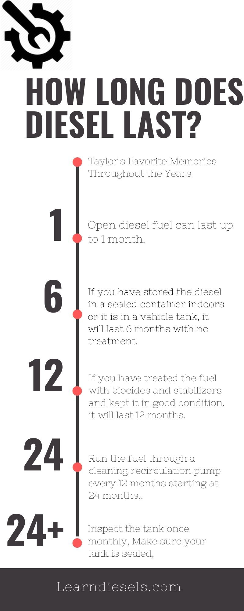

So you've got some fuel you want to hold onto. Or... maybe you've found an old barrel tucked away that Y2K preppers hid. **Diesel fuel DOES have a shelf life.** So, let's answer that question. After that, look for the guide on how to store it properly.

_How long can you store diesel?_

**As a general rule, open diesel fuel can last up to 1 month. If you have stored the diesel in a sealed container indoors or it is in a vehicle tank, it will last 6 months with no treatment. If you have treated the fuel with biocides and stabilizers, it will last 12 months. Longer than 12 months, it will require more maintenance.**

## Reasons not to use old diesel fuel

### High fuel pressure

One of the reasons diesel has a shelf life is the engines and fuel are different than days past. You may not know it, but modern diesel engines are quite complicated. From the high-pressure injection to the DPF after-treatment systems, things can get pretty hairy pretty fast.

This is one of the reasons you can hold onto old fuel. As the fuel separated and breakdown via the bacteria and mold is becoming impossible to pass through the low microfilters and the high-pressure fuel systems. For a good reason! These systems can be some cray high pressures upwards of 20,00 psi.

You can't even have tiny microscopic trash in the fuel at those levels. You might get away with it with that old tractor, but no way with a modern diesel. Even with older units - do you really want to pull the injectors out instead of going to get some good fuel? Important questions when you're about to pour in some "free" fuel. Not so free when you think about repair costs.

### Engine breakdown

Not only is it bad for the fuel pump and injection system, but it's generally bad for all your internal engine parts. When dirty fuel combusts, it just creates a mess.

It's not a complete burn and most likely contains trace amounts of water, which can really do some damage. Not only is water not compressible, which makes the inside of a combustion chamber a terrible place. It also cools the burn temps and makes all kinds of havoc on rings and sleeves. Please get some new fuel. 🙏

## How to know when Diesel Fuel Has Gone Bad

- **It will be discolored.** The fuel you get from the pump is notably green. If you notice your fuel is looking dark or discolored, it likely has some problems.
- **It is like gel or has sludge at the bottom**. When you see this, the molecules are bunching up and making these areas of grossness. If you see this, discard the fuel.
- **You have to change your fuel filters too often**. Seen this a time or two. Are the filters only lasting a month or two? It's likely bad fuel.
- **You're getting bad fuel mileage**. Another way you can tell is you are not getting the miles per gallon you should. After all, the fuel is not just fuel anymore.
- 👃**The fuel is smelly.** Bad diesel fuel stinks! In more than one way. Diesel breaks down, and as bacteria and separation occur, a rotten smell ensues.
- **Slow to start.** Bad fuel will cause a slow start situation.
- **Fuel pump clogged or malfunctioning.** This is an obvious place to look when you have a malfunctioning fuel pump.
- **Black or White Smoke**. Black or white smoke can let you know you have some bad fuel in the tank.

## Keeping up with diesel fuel is like maintaining the worst swimming pool ever. Let me offer you some pointers to make it as painless as possible

If your storing fuel, the best stuff I ever used was [BioBor](https://amzn.to/2U5AEn2). I used it in the city. I worked for our generators and fire department fuel tanks for many years. It works very well.

It's not super expensive and goes a long way. The stuff kills and prevents bacteria and fungi and prevents corrosion. It will also keep the fuel filters from plugging. It reduces tank cleaning and protects injectors and pumps.

Its also recommended by major diesel engine OEMs - Military Spec MIL-S-53021A. Great stuff!

### A guide to getting the most time out of your stored diesel

**Let's look at how you should keep diesel stored. It does matter just how long you want to keep the fuel. So I will give you some recommendations for less than 12 months and more than 12 months.**

#### Less than 12 months

- **Treat your fuel with biocides/stabilizers**. Biocides keep bacteria in check. It would be best if you had this, especially with new fuel, because it has some biodiesel that contains more water. If you don't start this right away, you may never get control of the tank.
- **Keep your tank full**. This staves off condensation and less area for water to be present.
- **Keep a check on the Temperature.** Diesel typically freezes around temperatures of -8.1 °C (17.5 °F). You will want the temp above that. Diesel can flash between 52 and 96 °C (130 - 204 °F) [source](http://knowhow.napaonline.com/at-what-temperature-does-diesel-fuel-gel/#:~:text=It's%20right%20at%20the%20freezing,how%20colder%20weather%20affects%20fuel). Diesel shouldn't be subjected to sunlight or low temperatures.
- **Keep the fuel covered**. The main enemy of diesel fuel storage is the elements. You need to keep the tank indoors if you don't have one meant for outdoors.

#### More than 12 months

- **Inspect the tank once monthly**. Make a schedule and keep an eye on the fuel. Some water indicator and dipstick will be necessary. You can dip down and make sure no water is at the bottom. Test the fuel for degrading with a fuel test kit. Add Biocides and treatment as needed.
- **Make sure your tank is sealed**. This will prevent water from getting in and evaporation from getting out.
- **Run the fuel through a cleaning recirculation pump every 12 months**. You need to completely clean the fuel for diesel sitting this amount of time. Some companies will come out and do this for you, but you can also purchase a pump and filter for this at a pretty reasonable amount.

## Summing up

Bad diesel fuel can stink - literally. But it doesn't have to cause damage to your engine. Keep an eye on the fuel in your tanks and the fuel you have lying around. Never use the fuel you are suspicious of. It's not worth it.

