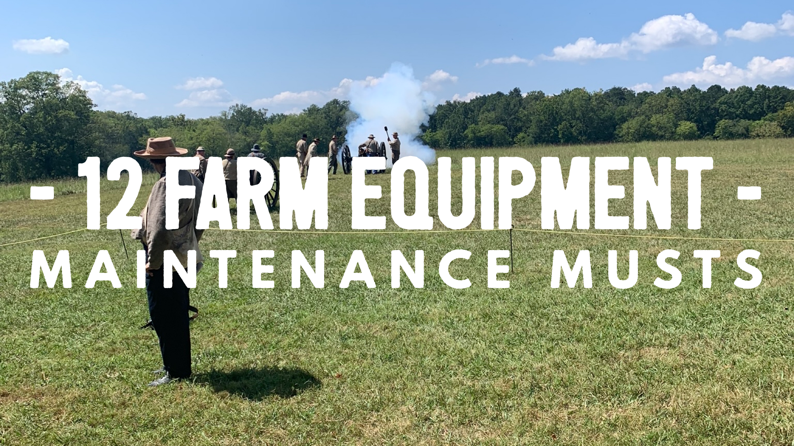
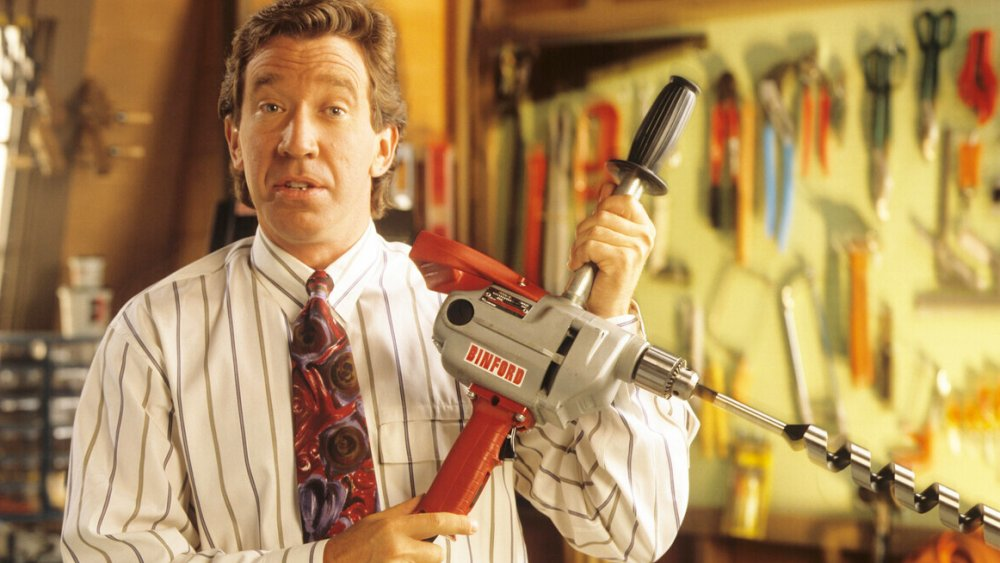

It gets busy on the farm. Whether it's feeding or fencing you can get distracted. I work on lots of farm equipment that has been neglected and ended up costing the farmer more than it would if they would have followed this list. Let me save you some time, headache, and money.

**12 Farm Maintenance Musts**

You have heard it said your whole life, **_Spend a little now to save a bunch later._** This old saying rings very true with farm equipment.

We need our equipment to last to get our investment back. We abuse our tractors, bush-hogs, combines. Use them expecting that they last forever. And then they don't.

So, print this out and post it somewhere you can see it.

## A simple daily equipment inspection

Look these things over every day you use the equipment.

- Check the oil and other fluid levels

- Look for loose clamps and fittings and seals as needed
- Inspect filters for tightness and age
- Look for debris and chaffed hoses/lines
- Inspect the fire extinguisher

## **Keep your unit greased and lubed up**

Dead simple. CHECK THE OIL LEVEL. In all the places you can. Engine, hydraulic tank, differential, other oil holding things. Know the unit has lubrication before using it.

I can't tell you the number of times I have fixed issues for systems running low on lube for long amounts of time.

Especially at the beginning of the season make a thorough inspection. You are getting ready for a large load on the unit to make sure and take the extra time to look it over very well.

Also, please great every point you can find ONCE A MONTH. A seized bearing is the worst and will cost you a couple of hours more labor to fix. Just take care of it. This stuff ain't cheap.

## **Clean up the equipment after each use.**

It gets dirty on the farm. Yes, I know you have better things to do. But this simple task is going to help you a lot. Not only are you better off because you can catch small issues because you will see them as you wash them, but You also will be removing dirt and debris that can damage the engine and hydraulic parts.

## Read the manual on the unit

I know this is a long shot but hear me out. You need to know the specification and how to operate the machine/vehicle anyway. Take an afternoon and a glass of sweet tea 🍹and just go over the manual.

Look for:

- Schedule for maintenance
- Fuel and oil recommendations
- Filter list. Go ahead and order them.
- Safety features
- Warranty

After you have all that information you can do a better job taking care of your unit. Take the spare key and manual and put them in a safe spot.

## **Have replacement parts on hand**

You know there are certain belts, hoses that are going to wear and need replacing. Why not go ahead and keep them on hand? Go ahead... Order them.

Look over your unit, what will wear? What is likely to break? Order it now and save the time when it goes down. Or better yet, replace it when it looks like it may go.

## Don't modify your farm equipment

I know we all like to supercharge our engines, equipment, flashlights you know. Make it go faster! That is not such a great idea when it comes to your expensive equipment.

Think twice before voiding the warranty or damaging your engine. It's not worth it. If you really want to make the unit better talk to the dealer or your mechanic for options that don't void the unit. Don't weld anything 🤣

## **Write it all down**

You need to keep detailed records of maintenance. Some of the equipment in the agricultural inset can be hundreds of thousands of dollars. Protect your investment.

A file cabinet is a great investment for storing your records. It's important that you be organized if you have multiple pieces of equipment.

Later when you go to sell it or when you are having an issue that is complicated you will be thankful you did.

## **Put a maintenance book on the unit**

There is not always a place to do this but it is best you keep your record book right on the machine. This keeps you from hunting for it and also, being able to send anyone to work on it and have the latest info.

You can usually find a spot on the unit somewhere. Look for a dry area if possible. You can put it in a zip-lock back and use a small chain or large zip-tie to hold it in place.

## **Make a PM plan and put it in that book**

There are actually a bunch of free apps to help you track and stay up to date with your maintenance. They handy you can snap a picture, write down all the particulars to your unit and it will remind you when it's time for maintenance.

A good local mechanic will help you as well. Ask if they offer a PM service plan and they can keep up with it.

A PM sheet is a handy thing to have and you should keep it right in the book on the unit.

Consult your manufactures manual for the exact PM specs for the specific equipment.

## Send your oil off for analysis

You may think it's overkill but talk to your mechanic about sending the oil out to CAT or someone who dies oil analysis. They can catch problems very early and save you thousands. It's a very small investment with a great up-side. They can detect trace amounts of say coolant in the oil before catastrophic damage to your engine. It's a no brainer to me.

## Winterize your equipment

When it gets cold things chance. Not only for us but for our equipment. If you are storing your unit outside keep that in mind.

If your storing things outside or anywhere get below 32 F You need to take great care of your battery and fuel. Check out my article on [cold where for diesel for more info](/the-complete-guide-to-starting-a-diesel-in-cold-weather/).

You will need to prepare your batteries, fuel, and filters as you get ready for cold weather.

## Reasons you should store your farm equipment indoors

This can save you so much money time and headache. Of course, this is not possible for everyone.

One thing you may not have thought of is trade-in value. According to Purdue's Cooperative, values are often [**10-15 times**](https://www.extension.purdue.edu/extmedia/ae/ae-115.html) higher on tractors stored indoors than equipment stored outside. For equipment such as planters and harvesters, they see up to [**25 times**](https://www.extension.purdue.edu/extmedia/ae/ae-115.html) higher. Don't throw away a pile of money if you have the option. For some this may even justify building a storage shed.

But there is more than just trade-in value. Think about security. Way less chance of it being messed with locked in a building. You also can think less about winterization if you're in a moderate climate. Indoors is all-around better if you have the means.

## Summing up

You need your equipment to last as long as humanly possible. Don't make the mistake of ignoring these simple things to get the most out of your investment. Money doesn't grown on trees but your harvest does. Get out ahead of the trouble that is bound to come along.
