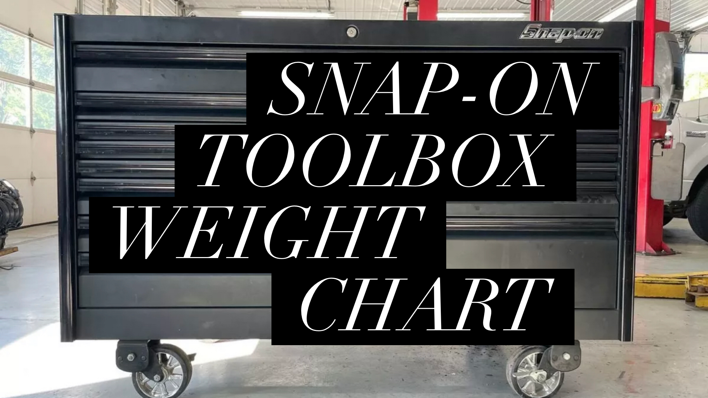
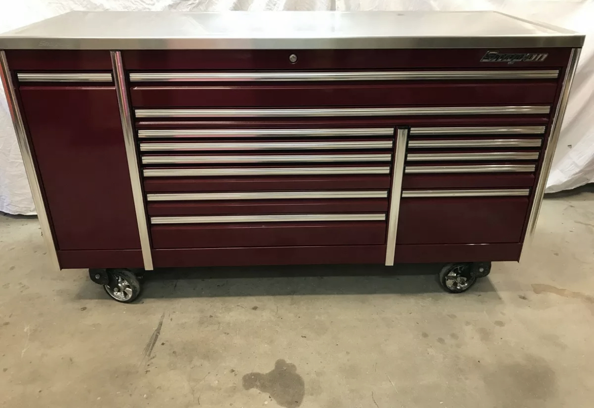
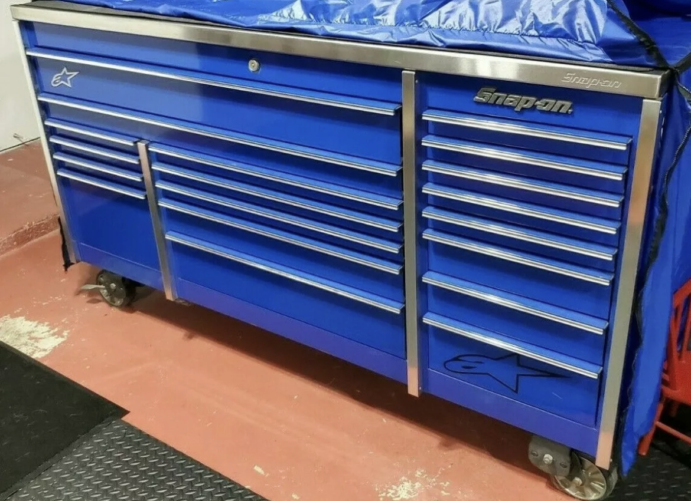

Snap-on makes some great tool boxes and because they are made well they can be very heavy. I personally owned the Classic 96 72" and full of tools that sucker was a beast.

**The average weight of an empty Snap-on toolbox is 876 Pounds. The specific weight depends on the model and series of the toolbox you have. The lightest full size box is 349 pounds and the heaviest is 1,970 pounds.**

Below 👇 is a helpful table for Full Size Roll Cabs. I scoured [Snap-on's website](https://shop.snapon.com/categories/629047)
to find you all the weights and put them in the chart below. I hope it helps you and provides the info you need.

## Full Size Roll Cabs

| Toolbox 🧰 Series     | Width📏       | Empty weight | Max Loaded Weight 🏋️‍♂️ |
| --------------------- | ------------- | ------------ | -------------------- |
| Classic 96 KRA2432PC  | 73" - 2 Bank  | 547 lbs      | 3,043 lbs            |
| Classic 96 KCP2423BQD | 73" - 3 Bank  | 625 lbs      | 3,025 lbs            |
| Classic KRA2411PC     | 55" - 2 Bank  | 412 lbs      | 2,812 lbs            |
| Masters KMP1163WFS7   | 72" - 3 Bank  | 1,052 lbs    | 7,852 lbs            |
| Masters KRL722BPCM    | 54" - 2 Bank  | 489 lbs      | 4,089 lbs            |
| Heritage KRA5318FPBO  | 53" - 3 Bank  | 371 lbs      | 2,771 lbs            |
| Heritage KRA5311FPC   | 53" - 2 Bank  | 349 lbs      | 2,749 lbs            |
| EPIQ KETN682C0PWT     | 68" - 2 Bank  | 832 lbs      | 8,832 lbs            |
| EPIQ KERN602C0PC      | 60" - 2 Bank  | 774 lbs      | 8,774 lbs            |
| EPIQ KERN842C0PBO     | 84" - 2 Bank  | 1,165 lbs    | 9,165 lbs            |
| EPIQ KEXP603A0PWZ     | 120" - 3 Bank | 1,970 lbs    | 17,970 lbs           |
| EPIQ KEXN724A0PWZ     | 144" - 3 Bank | 1,925 lbs    | 17,925 lbs           |

## Explanation of Catagories

### 1. Toolbox series

This is the series and model of the you specific tool chest. Snap has 4 different series in full size boxes.

1. Classic Series
2. Heritage Series
3. Masters Series
4. EPIQ Series

Snap-on made these series to give you options in pricing. Each series has its pros and cons and is quality based on value for money. The classic and Heritage Series are the lower tier Boxes and the Masters and EPIQ are the higher tiers. They have different options and features based on the one you have.

### 2. Width/Number of Banks

This is simply the width of the box and the number of banks. The banks are the drawers divided by the sides. You may have a single, double or triple bank box.

### 3. Empty weight

This is the weight of the box with nothing in it at all. Easy enough.

### 4. Max Loaded Weight

This is the weight of the box plus the highest amount Snap-on recommends it can hold. If Snap-on recommends 3000 lbs and the weight of the box is 500 lbs then the Max Loaded Weight of that box would be 3500 pounds.

## Want to see articles on the best tools for diesel pros? 👇🔧

[See the best ratchets for professional mechanics](/the-best-ratchet-for-professional-mechanics/)

[How about the best ratchet wrenches for a pro](/best-rachet-wrench/)

[The best sockets for a pro](/the-best-sockets-for-professional-mechanics/)

[Best Tool chests online for a pro](/5-best-toolboxes-for-mechancis-under-2k/)

Just getting into being a diesel tech? [See my complete tool guide](/the-tool-guide-for-new-diesel-mechanics/)
