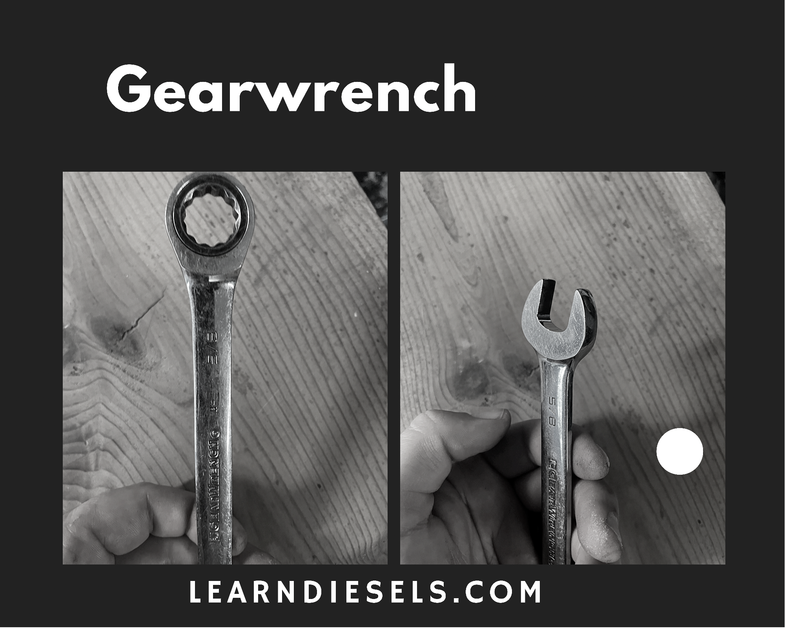
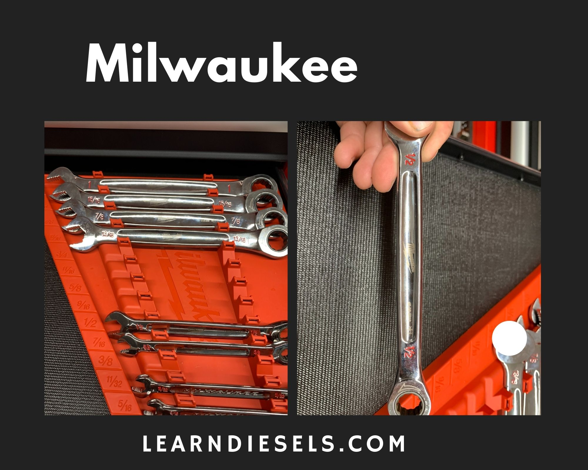
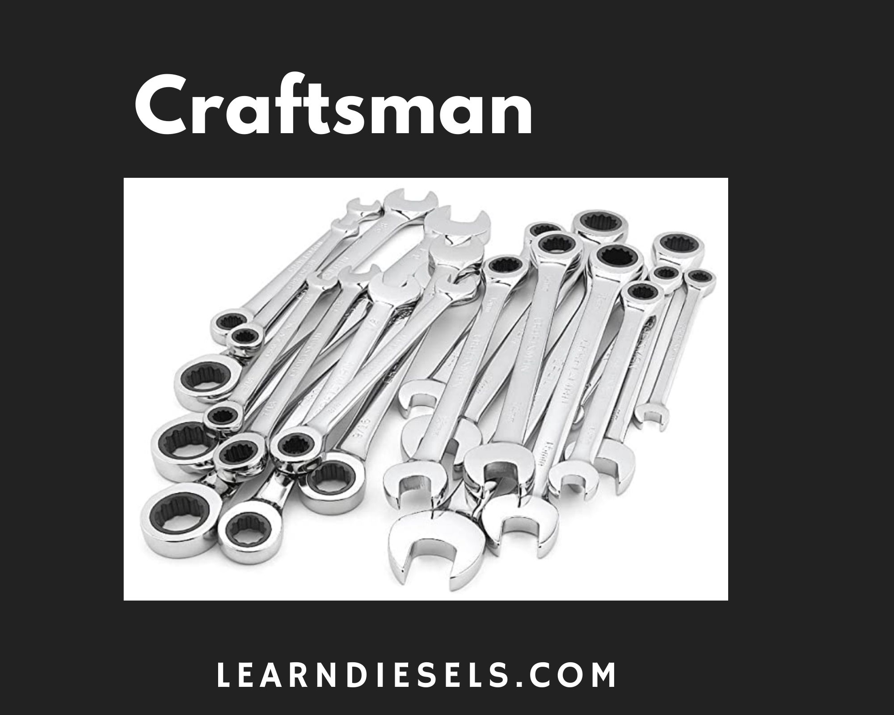

Ratcheting wrenches are a great invention! These things are so useful. But when you cheap out and buy a garbage set you will be frustrated. When your a pro you need a good set because this is a daily use tool. Don't believe these other lists out there telling you to buy these **off brand amazon specials.** Let me give you the the top ones for pros and you decide which one is for you.

I am not writing the “best ratchet wrench” because tools are a **personal choice** and different for each mechanic. Pick your favorite. **But when you can buy American!** All these tools are made well and have a lifetime warranty.

This list is compiled from a survey of 25 diesel techs and their favorite brands. I also wrote a [complete tool guide](/the-tool-guide-for-new-diesel-mechanics/) if you're interested.

These ratchet wrenches will vary in style and price points. **All the specs that I compare are explained in the buyer's guide at the bottom. [Skip To The Buyers Guide](#guide)**

## **The top 3 are my _best_ picks. 1. Best bang for the buck 💰 2. best design 🔧 3. best quality 👨‍🔧**

## 1. GearWrench 35720A-02 - Learn Diesels Top Pick - Best bang for the buck 💰

Who makes the best ratcheting wrench set for the money? Coming in the top spot for me is the **GearWrench 35720A-02.** This set is really reliable. I love the feel and design. I have had this exact set for years and I have yet to break one. I may have even abused them once or twice. 😅

You really can't beat the original. GearWrench started this and really provides a good tool. I would recommend these things to anyone, but the proof is in the pudding, as they say. Try one out yourself. Watch this YouTube video below 👇 that shows it in comparison to the snap-on set.

`youtube: https://www.youtube.com/embed/vhsYiOQWmtI`

Ok, go investigate further. 👉 [Check out the latest price on Amazon](https://amzn.to/2Xdyiab).

### The Specs

- **Tooth count** - 72 count with a 5-degree arc
- **Handle design** - Chrome vanadium steel.
- **Profile** - 0.7 inches
- **Warranty** - Mail-in or email and take pictures and they ship a new one.
- **Length** - Typical Length
- **Cost** - **$$**

## 2. Milwaukee 48-22-9416 - Learn Diesels Top pick - Best design 🔧

I bought this awesome Milwaukee set and I have to say, they are really cool. It has great ratcheting wrenches and they are very durable. They fit in your hand nicely. They have an odd shape in the middle which makes them easy to hold. I love the whole set, and I would recommend them to pro mechanics as a solid truck tool alternative. They are really shaking the market with their awesome design. The only thing that kept them out of the #1 spot was price.

This set is very impressive and is comparable to high end ratcheting wrenches like snap-on macco and Mac. Check these out. You won't regret it.

[Check out the latest price on Amazon](https://amzn.to/3lmIhTk).

### The Specs

- **Tooth count** - 72 count and a 5-degree arc
- **Handle design** - Chrome
- **Profile** - Slim profile
- **Warranty** - Mail-in. Possible store exchange depending on the particular Home Depot you are dealing with.
- **Length** - Longer than typical
- **Cost** - **$$$**

## 3. Snap-on SOXRR707 - Learn Diesels Top pick - Best Quality 👨‍🔧

While Snap-on quality is outstanding, this list is compiled by **value for money.** Some mechanics enjoy that the truck comes to you and saves you the extra hassle of going out. Snap-on counts on it. Just like other popular brand names, you pay a premium to have their stuff.

If you just need the convenience and name brand and are willing to drop some bread, 🍞 this is a great pick. I don’t think that there is enough quality to overcome the 300% price increase you get for the same tools. I do have Snap-on ratchet wrenches, but I don’t exclusively use them.

This is an awesome ratcheting wrench, and you can’t go wrong with it. The only question I have is how much are you willing to pay?

This is both metric and standard 👉[Check out the latest price on Amazon](https://amzn.to/3hmWX3i).

### The Specs

- **Tooth count** - 72 count and a 5-degree arc
- **Handle design** - Chrome vanadium steel. thicker handle
- **Profile** - 0.6 inches
- **Warranty** - Hassle-free. They will rebuild it if the damage is in the gearing and replace if it is in the handle.
- **Length** - longest in industry
- **Cost** - **$$$$**

## 4. Kobalt ‎87717

Kobalt really makes some great tools. They have a great design and easy to hold, great balance and profile. The one knock I have is the same as usual with some of the less expensive tools, they don’t seem to last as long for me. I have to get them replaced once every 2 years. Not too shabby considering its full-time use, but others are better. The box end on these wrenches feature built-in 90-tooth ratchets that only need a 4-degree arc swing to function. The 12-point design allows the wrench to work on 6-point, 12-point, star, square, and even rounded fasteners

[Check out the latest price on Amazon](https://amzn.to/2XbN95G).

### The Specs

- **Tooth count** - 90 count and a 4-degree arc
- **Handle design** - Polished Chrome finish
- **Profile** - 0.6 inches
- **Warranty** - Hassle free trade out. As long as they have one in stock. I have never had an issue.
- **Length** - typical
- **Cost** - **$$**

## 5. Husky 1001 380 415

I have a special place in my heart for Husky tools. I started as a diesel tech with a set of Husky professionals. They lasted me 6 years! I still use some of those today. All kinds of things broke over the years, but the rachets wrenches did well. I only lost a couple due to a pipe breaker bar.

Everyday use and I seen about 3 years before needing replacement. These are great tools, a solid choice for a professional on a budget.

### The Specs

- **Tooth count** - 100 count and a 3.6-degree arc
- **Handle design** - Chrome vanadium steel. Round thicker handle
- **Profile** - .6 inch
- **Warranty** - Depends on the store stock. They will not trade out if it’s part of a set. Mail into Stanley, the principal owner of Husky
- **Length** - Typical
- **Cost** - **$**

[Check out the latest price on Amazon](https://amzn.to/3k0lpcK)

## 6. DeWalt DWMT74733

DeWalt made this top ten with a decent ratchet wrench. They make tools that are tough as nails, and if you have a decent home depot close by, this may be a great pick for you. They have never been my favorite, but you still can't go wrong.

[Check out the latest price on Amazon](https://amzn.to/3k4Ozax).

### The Specs

- **Tooth count** - 72 and a 5-degree arc
- **Handle design** - Round. Chrome vanadium steel.
- **Profile** - 0.7 inches
- **Warranty** - Hassle-free. Mail in or try the local Home Depot
- **Length** - Typical
- **Cost** - **$$$**

## 7. Mac Tools

The Mac man! I know a lot of people who swear by their tools. I have no problem with Mac Tools; I have a wrench set and some picks from them. They make solid stuff. Once again, this list is based on value for the money. You can do some price checking and find out that Mac is nowhere near the cheapest, so do you get that kind of value from their tools? That's for you to decide.

Then there is the other variable. Is there a Mac man in your area? They are not near as common as Snap-on and, in my experience, not as reliable in service.

### The Specs

- **Tooth count** - In the 72 and a 5-degree arc
- **Handle design** - Round. Chrome vanadium steel.
- **Profile** - .6 inches
- **Warranty** - Hassle-free. They will rebuild it if the damage is in the gearing and replace it if it’s in the handle.
- **Length** - Typical
- **Cost** - **$$$$**

## 8. Craftsman CMMT12078

I have always been hard on Craftsman. Calling it **_Crapsman_** and such 😆. I'm a funny guy. That said, They have moved over to Loews and now have a higher-end ratcheting wrenches that I would love to give a shot. I think they deserve a spot although on the bottom for now.

[Check out the latest price on Amazon](https://amzn.to/3lkkX8I)

### The Specs

- **Tooth count** - 72 count and a 5-degree arc
- **Handle design** - Chrome vanadium steel. Round handle
- **Profile** - 0.7 inches
- **Warranty** - Hassle free swap out at Loews. Mail in as well.
- **Length** - Typical
- **Cost** - **$**

## What makes a good ratcheting wrench?

All of the factors are important for Ratchet Wrenches. Look through and learn all the different aspects. I learned a lot from writing it, and I hope it's helpful.

**Tooth or position count**

The number of teeth on the gear of a ratchet wrench will affect the arc at which you can operate. If you are working in a tighter spot, then the higher tooth count will be beneficial. You will be able to grab more teeth and have the power to turn that bolt loose where others would be stuck. 🔧

We have seen the race to the highest tooth count over the last few years. In fact, one of my favorite ratchets is the 120 tooth count Gear-wrench. One issue is some of these higher count ratchets can have more chance of slippage. More teeth can equal less strength.

**Handle design**

This important factor will make you decide whether or not you enjoy using your ratchet wrenches. There are several types. Everyone has a preference. There are ups and downs for all styles.

**Profile**

The thickness of a wrench can be critical. There is always a space to be gotten into. Most of the time, you need a thinner ratchet, right? The thickness of ratchets greatly varies and is an important aspect to consider when looking for your ratchet.

**length**

This will vary by your needs. I recommend a medium length but, you really need several lengths if you do this for a living.

**Warranty**

All tools today seem to have a some kind of "lifetime warranty", but it is important to note that **_not all are hassle-free._** Depending on the company is a measure of how good the process is. Some will do an instant swap out, and some will require you to mail them in. This can be a very easy or frustrating process. So, it is an important aspect to consider.

**Cost**

This is really up to you and your pocketbook. Willing to pay a bit more? You can have a set that will last and become one of your favorite things. That's what you need to do. Don't cheap out. I understand if things are tight and there are some less expensive options for you.

## Summing up

I hope this article was helpful and you got one of the sets from this list. I mean really, these are the best. I didn't set out to write the most okay ratchet wrench sets. Look at these and make a decision already. You need them for work. 😆

## Want to see articles on the best tools for diesel pros? 👇🔧

[See the best ratchets for professional mechanics](/the-best-ratchet-for-professional-mechanics/)

[The best sockets for a pro](/the-best-sockets-for-professional-mechanics/)

[Best Tool chests online for a pro](/5-best-toolboxes-for-mechancis-under-2k/)

Just getting into being a diesel tech? [See my complete tool guide](/the-tool-guide-for-new-diesel-mechanics/)
