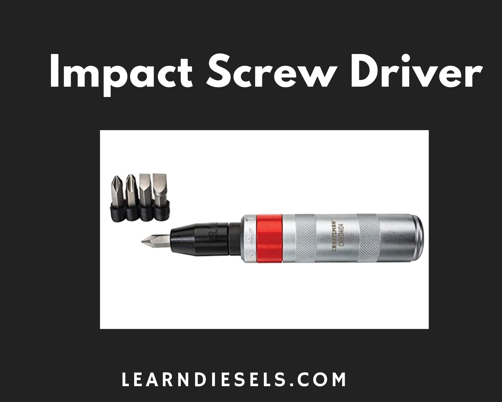
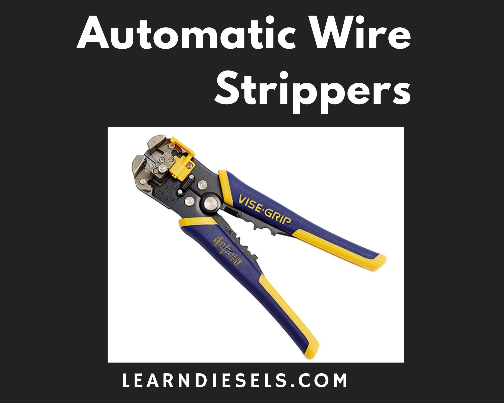
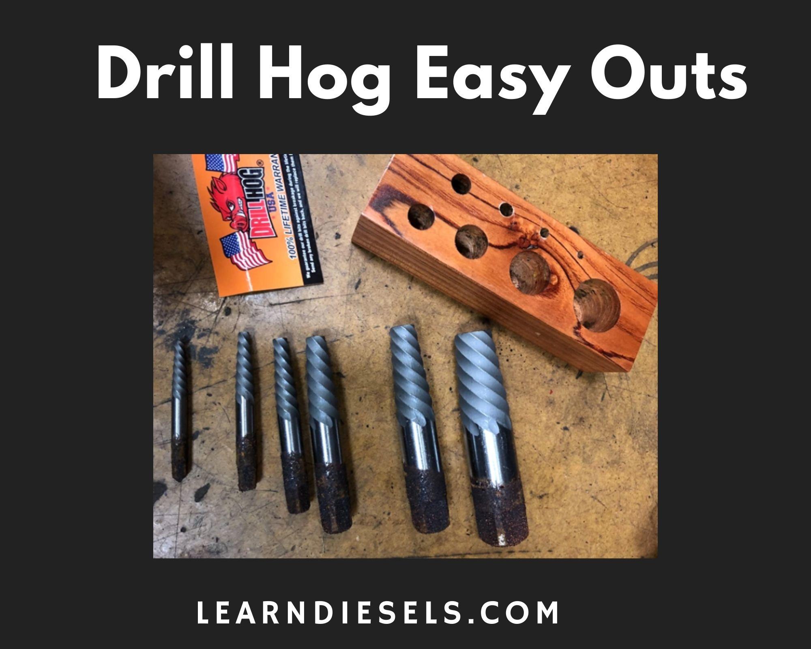

Specialty tools are very important important part of your tool inventory. They can make your life so much easier. You don't need every single specialty tool they make. For this reason I took a survey of 25 mechanics and complied their favorite and most useful specialty tools and I placed it here for you.

Remember as you look at these and my recommendations that all tools are a **personal choice** and different for each mechanic. Pick your favorite. **But when you can buy American!** All these tools are made well and have a lifetime warranty.

There is no order of these tools all of them are useful and cool. Scroll through them all and enjoy. I also wrote a [complete tool guide](/the-tool-guide-for-new-diesel-mechanics/) if you're interested.

## Hand Impact Driver

This is a neat tool. In case you haven't used one, you smack this thing with a hammer and it turns just a bit. One good smack and it transfers 200 foot pounds of torque to that stubborn screw or bolt.

This is a nifty tool can really come in handy in a tight spot. You know you run into screws and bolts all the time that the screw driver just can't get. Ok, go investigate further. 👉 [Check out the latest price on Amazon](https://amzn.to/3EHGXDl).

### The Specs

- **Warranty** - Mail-in or email and take pictures and they ship a new one.
- **Cost** - **💰**
- **Usefulness** - **🔧🔧🔧🔧**

## Irwin Vise-Grip Wire Stripper

A Self-Adjusting Wire Stripper strips wire from 10-24 AWG easier than ever before. If you do a lot of electrical work like me this thing is super helpful. It really makes a difference in comfort and reduced hand fatigue.

The crimper is useless. You need a set of good crimpers anyway. These are good for stripping wires quickly and efficiently. POP and its done. [Check out the latest price on Amazon](https://amzn.to/3lFXoXO).

### The Specs

- **Warranty** - Mail-in. Possible store exchange depending on the particular Home Depot you are dealing with.
- **Cost** - **💰**
- **Usefulness** - **🔧🔧🔧🔧🔧**

## Hose Clamp Pliers

A often overlooked tool the hose clamp pliers can make your life so much better. We all have removed and installed hose clamps with a set of channel locks. It sucks. But we just keep doing it for years. Knowing good and well there is a tool out there,

Do yourself a favor a grab this set. It includes all the pliers you need even those cool ones you cans stretch down and grab the clamp. 👉[Check out the latest price on Amazon](https://amzn.to/3ACJI6w).

### The Specs

- **Warranty** - Hassle-free. Amazon return policy.
- **Cost** - **💰💰💰**
- **Usefulness** - **🔧🔧🔧**

## Zip Tie Gun

If you have never seen one of these you are in luck. They are cheap and they are very useful! We all have been cut and ripped up by zip ties. I even knew a mechanic that cut them like razor blades on purpose. This tool not only cuts them evenly but applies some tightness as well.

You line these things up with the tie wrap and POP its cut and tight. That is super helpful in tight spots too. [Check out the latest price on Amazon](https://amzn.to/2Xw6nm9).

### The Specs

- **Warranty** - Hassle free - Amazon Returns policy.
- **Cost** - **💰**
- **Usefulness** - **🔧🔧🔧🔧**

## Power Probe III

This thing changed my troubleshooting career! I used to use a test light for everything, but as you know you are still in the dark with no read out for voltages. The Power Probe 3 allowed me to get rid of my multi-meter for the majority of repairs and actually speed up the troubleshooting process.

What does it do? Well With the press of a switch you'll have an instant 12 volts or ground. Use the probe tip and ground lead simultaneously to power up components right in your hand. Instantly check components for continuity as well as identify positive, negative and open circuits. Locate shorts without wasting fuses or blowing your DVOM.

I honestly feel this is a must have product for any electrical job, even for a DIY mechanic but for sure for the pro. [Check out the latest price on Amazon](https://amzn.to/3EJgpBB)

### The Specs

- **Warranty** - Hassle free Mail in.
- **Cost** - **💰💰💰**
- **Usefulness** - **🔧🔧🔧🔧🔧**

## Quick Release Pliers

Quick connect air line connections are great to install and some time terrible to remove. We all know abou those quick connect fittings in teh frame rail that are terribly difficult to get to are just so difficult to remove. Next time you go to remove one and you have these pliers you will thank me.

These special pliers work great! They are going to save your fingers and knuckles. The pliers work exactly as they were intended to do remove air hose lines from quick release fittings. Try them out. [Check out the latest price on Amazon](https://amzn.to/3o6Kx45).

### The Specs

- **Warranty** - Hassle free Mail in.
- **Cost** - **💰💰💰**
- **Usefulness** - **🔧🔧🔧**

## Hose Clamp Pinch Off Pliers

I needed these to clamp fuel hoses when replacing a fuel filter. I've done this in the past with vice grips. The advantage of these tools is they are smooth and do a great job of pinching the hose without damaging it.

I know you can think of jobs that these would be useful like transmission lines, fuel ines or coolant lines. Do your self a favor and check them out. [Check out the latest price on Amazon](https://amzn.to/3AFY1af).

### The Specs

- **Warranty** - Hassle free Mail in.
- **Cost** - **💰**
- **Usefulness** - **🔧🔧🔧🔧**

## Drill Hog Easy Outs

Every broke a drill bit off in the engine block? These things saved my day. I had to put the whole job on hold and waited for them to come in and when they arrived it took my about 30 minutes to get everything clear. Saved my butt.

Drill Hog USA Easy-outs are a great set of extractors worth a shot if your in a bad situation. [Check out the latest price on Amazon](https://amzn.to/3ABQcCD)

### The Specs

- **Warranty** - Hassle free Mail in.
- **Cost** - **💰💰**
- **Usefulness** - **🔧🔧🔧**

## What makes a good specialty tool?

I learned a lot from writing this, and I hope it's helpful.

**Warranty 🤝**

All tools today seem to have a some kind of "lifetime warranty", but it is important to note that **_not all are hassle-free._** Depending on the company is a measure of how good the process is. Some will do an instant swap out, and some will require you to mail them in. This can be a very easy or frustrating process. So, it is an important aspect to consider.

**Cost 💰**

This is really up to you and your pocketbook. Willing to pay a bit more? You can have a set that will last and become one of your favorite things. That's what you need to do. Don't cheap out. I understand if things are tight and there are some less expensive options for you. 5 💰💰💰💰💰 being the most expensive.

**Usefulness 🔧**

All of the tools I have on this list are useful but some are more than others. We all have that set of tools collecting dust at the bottom of our toolbox. Some though are so useful you can't get rid of them like pulley pullers and such. These tools could be optional but some are very useful. We measure this in wrenches 5 🔧🔧🔧🔧🔧 is the most a tool can get.

## Summing up

I hope this article was helpful and you got one of the tools from this list. I mean really, these are the best. I didn't set out to write the most okay specialty tools. Look at these and make a decision already. You need them for work. 😆

## Want to see articles on the best tools for diesel pros? 👇🔧

[See the best ratchets for professional mechanics](/the-best-ratchet-for-professional-mechanics/)

[The best sockets for a pro](/the-best-sockets-for-professional-mechanics/)

[Best Tool chests online for a pro](/5-best-toolboxes-for-mechancis-under-2k/)

Just getting into being a diesel tech? [See my complete tool guide](/the-tool-guide-for-new-diesel-mechanics/)
